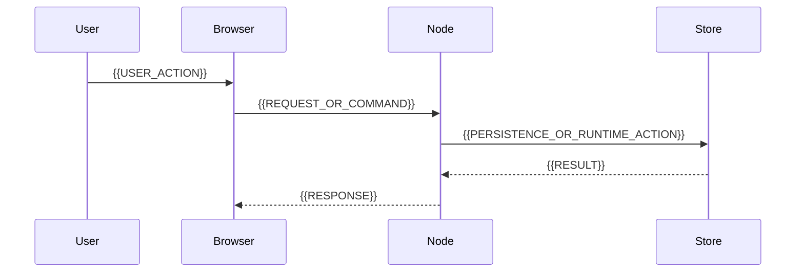

# Design Document

## Overview

{{OVERVIEW}}

### Goals

- {{GOAL_1}}
- {{GOAL_2}}
- {{SUCCESS_CRITERIA}}

### Non-Goals

- {{NON_GOAL_1}}
- {{NON_GOAL_2}}

## Boundary Commitments

### This Spec Owns

- {{OWNED_CAPABILITY_1}}
- {{OWNED_DATA_OR_CONTRACT_1}}

### Out of Boundary

- {{OUT_OF_BOUNDARY_1}}
- {{OUT_OF_BOUNDARY_2}}

### Allowed Dependencies

- {{UPSTREAM_DEPENDENCY_1}}
- {{SHARED_INFRASTRUCTURE_1}}

### Revalidation Triggers

- Contract shape changes.
- Source-of-truth or persistence ownership changes.
- Viewer/runtime startup prerequisite changes.
- Cross-scope, cross-map, or sync behavior changes.

## M3E Operating Context

- **Related strategy IDs**: {{RELATED_S_IDS}}
- **Active development target**: `beta/`
- **Worktree expectation**: product implementation runs in `$HOME/dev/M3E-<task>` on `codex/<task>`.
- **Primary source of truth**: {{PRIMARY_SOURCE_OF_TRUTH}}
- **Affected product terms**: {{GLOSSARY_TERMS}}
- **Data safety concerns**: {{DATA_SAFETY_CONCERNS}}
- **Browser-visible verification needed**: {{YES_NO_AND_REASON}}

## Architecture

### Existing Architecture Analysis

- Current pattern: {{CURRENT_PATTERN}}
- Integration points: {{INTEGRATION_POINTS}}
- Constraints to preserve: {{CONSTRAINTS}}

### Architecture Pattern and Boundary Map


- Selected pattern: {{SELECTED_PATTERN_AND_RATIONALE}}
- Existing patterns preserved: {{EXISTING_PATTERNS_PRESERVED}}
- New components rationale: {{NEW_COMPONENTS_RATIONALE}}

### Technology Stack

| Layer | Choice / Version | Role in Feature | Notes |
|-------|------------------|-----------------|-------|
| Browser / UI | {{BROWSER_TECH}} | {{BROWSER_ROLE}} | {{BROWSER_NOTES}} |
| Node / Service | {{NODE_TECH}} | {{NODE_ROLE}} | {{NODE_NOTES}} |
| Data / Storage | {{DATA_TECH}} | {{DATA_ROLE}} | {{DATA_NOTES}} |
| Tests | {{TEST_TECH}} | {{TEST_ROLE}} | {{TEST_NOTES}} |

## File Structure Plan

### New Files

- `{{NEW_FILE_PATH}}` -- {{NEW_FILE_RESPONSIBILITY}}

### Modified Files

- `{{MODIFIED_FILE_PATH}}` -- {{MODIFICATION_RESPONSIBILITY}}

### Ownership Rules

- Each file has one primary responsibility.
- Shared contracts live under `beta/src/shared/` when used by both Node and browser code.
- Node filesystem/database/server logic stays under `beta/src/node/`.
- Browser DOM/viewer logic stays under `beta/src/browser/`.

## System Flows



## Requirements Traceability

| Requirement | Summary | Components | Interfaces | Verification |
|-------------|---------|------------|------------|--------------|
| 1.1 | {{SUMMARY}} | {{COMPONENTS}} | {{INTERFACES}} | {{VERIFICATION}} |

## Components and Interfaces

| Component | Layer | Intent | Requirement Coverage | Key Dependencies |
|-----------|-------|--------|----------------------|------------------|
| {{COMPONENT}} | {{LAYER}} | {{INTENT}} | {{REQ_IDS}} | {{DEPENDENCIES}} |

### {{COMPONENT_NAME}}

**Responsibilities**

- {{RESPONSIBILITY_1}}
- {{RESPONSIBILITY_2}}

**Interfaces**

```typescript
interface {{INTERFACE_NAME}} {
  {{FIELD_NAME}}: {{FIELD_TYPE}};
}
```

**Failure Modes**

- {{FAILURE_MODE_1}} -- {{HANDLING_1}}
- {{FAILURE_MODE_2}} -- {{HANDLING_2}}

## Testing Strategy

### Unit

- {{UNIT_TEST_1}}

### Integration

- {{INTEGRATION_TEST_1}}

### Browser / Visual

- {{BROWSER_TEST_1}}

### Manual or Runtime Verification

- {{MANUAL_CHECK_1}}

## Risks and Mitigations

- {{RISK_1}} -- {{MITIGATION_1}}
- {{RISK_2}} -- {{MITIGATION_2}}

## Supporting References

- `docs/00_Home/Glossary.md`
- `docs/00_Home/Current_Status.md`
- `docs/06_Operations/Worktree_Separation_Rules.md`
- {{FEATURE_SPECIFIC_REFERENCE}}
