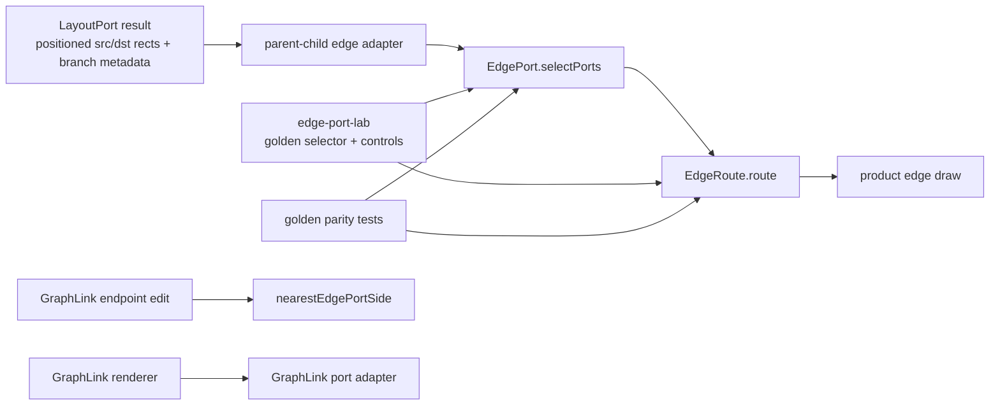

# Design Document

## Overview

`edge-port-seam` は、parent-child edge の endpoint selection と route generation を `EdgePort` / `EdgeRoute` の pure typed seam として切り出すための spec である。

この design は implementation ではなく、最初の切り出し単位を定義する。中心は次の 5 点:

1. `EdgePort.selectPorts`: `srcRect + dstRect + branchDirection -> EdgePorts` の typed pure contract。
2. `EdgeRoute.route`: `EdgePorts + EdgeRouteStyle -> EdgePath` の typed pure contract。
3. `nearestEdgePortSide` quarantine: GraphLink endpoint edit 専用 helper を branch edge から隔離する。
4. `edge-port-lab`: Surface View / direction / route style ごとに port connection を見る standalone lab。
5. `golden + EN ratchet`: 実 layout から採取した samples と dependency-cruiser / jscpd / typecheck / EN5 composition で bypass と copy を塞ぐ。

### Goals

- Tree right 以外の branch direction でも parent-child edge が正しい side に接続される contract を定義する。
- Port selection と route path generation を分離する。
- parent-child edge、route style、GraphLink を型で分離する。
- `nearestEdgePortSide` を GraphLink endpoint edit 専用に隔離する。
- `edge-port-lab` と product が同一 shared module を import する設計にする。
- lab green ではなく `lab + golden parity + exclusive seam + EN5 composition` を昇格条件にする。

### Non-Goals

- この spec draft で implementation code を書かない。
- LayoutPort algorithm を実装または変更しない。ただし Tree `both` の branch assignment を `LayoutResult` に載せる最小 contract 追加は EdgePort seam の dependency として明記する。
- GraphLink の data model を全面変更しない。
- Node drawing / label drawing / full RenderGraph seam はこの unit では所有しない。
- Surface View の新しい分類名を増やさない。
- `final/` へ同期しない。

## Boundary Commitments

### This Spec Owns

- `EdgePort` public contract。
- `EdgeRoute` public contract。
- branch direction / Surface View direction から port side への決定表。
- `nearestEdgePortSide` の quarantine rule。
- `edge-port-lab` の minimum inspection surface。
- edge-port golden sample schema / capture / parity flow。
- EdgePort boundary の dependency-cruiser / jscpd / EN5 ratchet。

### Out of Boundary

- product node drawing style。
- GraphLink endpoint UI の detailed interaction design。
- `LinkPort "auto"` data migration。
- Layout algorithm の配置品質。
- app-wide command seam / render graph seam。
- mutation API 追加。

### Revalidation Triggers

- `docs/03_Spec/map_layout_modes.md` の Surface View / direction 正本が変わる。
- `LayoutResult.branchSide` または positioned nodes の shape が変わる。
- `GraphLink` / `LinkPort` shared type が変わる。
- `viewer.ts` の edge / GraphLink rendering path が分割される。
- dependency-cruiser / jscpd / TypeScript config が変わる。

## Dependencies

### D1: LayoutPort branch side contract

Tree `both` の branch assignment は LayoutPort が所有する。EdgePort は placement result を受ける側であり、`srcRect` / `dstRect` center position から branch assignment を再導出しない。

Implementation dependency:

```typescript
export type LayoutBranchSide = "left" | "right";

export interface LayoutNodePosition {
  x: number;
  y: number;
  w: number;
  h: number;
  depth: number;
  branchSide?: LayoutBranchSide;
}
```

If current `LayoutResult` does not expose `branchSide`, the EdgePort implementation must first add this minimal contract to LayoutPort output for Tree `both`. The layout algorithm owns the decision; EdgePort only consumes it.

This dependency is intentionally smaller than a LayoutPort redesign. It is a contract extension required to avoid two sources of truth.

## Existing Architecture Analysis

Current `dev-beta` has the relevant pieces in `beta/src/browser/viewer.ts`:

- `edgePortForSide(rect, side, pad)` and `edgePorts(rect, pad)` calculate side midpoint ports.
- `edgePortPairBetweenRects(fromRect, toRect, pad, opts)` scores all port pairs when source / target side is not fixed.
- `treeRightEdgeEndsBetween(parentPos, childPos)` calls `edgePortPairBetweenRects(...)` with source `right`, target `left`.
- `edgeEndsForGraphLink(sourcePos, targetPos, link, ...)` uses `GraphLink.sourcePort` / `targetPort`.
- `nearestEdgePortSide(rect, point)` chooses the nearest side to a point and is suitable for GraphLink endpoint edit, not branch edge routing.

The failure being closed is:

```text
Tree right branch edge     -> source right / target left       OK
Tree left/up/down/both     -> missing branch-aware rule        broken or accidental
GraphLink endpoint editing -> nearest side from user point     valid only for edit handle
Branch edge using nearest  -> layout intent replaced by point  wrong port
```

The seam must make this invalid path impossible:

```text
branch edge renderer -> nearestEdgePortSide(...)
```

and replace it with:

```text
branch edge adapter -> EdgePort.selectPorts(...) -> EdgeRoute.route(...)
```

## Architecture

### Boundary Map



Forbidden:

```text
parent-child edge adapter / renderer / lab -> nearestEdgePortSide
edge-port-lab -> src/browser/viewer.ts
GraphLink endpoint edit -> EdgePort.selectPorts for edit handle choice
```

### Module Plan

Proposed file structure for implementation phase:

```text
beta/
  src/
    shared/
      edge_port.ts                  # public selectPorts contract
      edge_route.ts                 # public route contract, or same public module
    browser/
      edge_adapters/
        parent_child_edge_adapter.ts # App/LayoutResult -> EdgePort inputs
        graphlink_endpoint_edit.ts   # nearestEdgePortSide quarantine owner
    labs/
      edge-port/
        edge-port-lab.tsx
        edge-port-lab.css
        edge_port_samples.ts
        edge-port-lab.html
  tests/
    fixtures/edge-port-golden/
      *.json
    unit/
      edge_port_contract.test.ts
      edge_port_golden.test.ts
      edge_port_composition_api.test.js
  dependency-cruiser.config.cjs
  jscpd.config.json
  tsconfig.edge-port.json
  tsconfig.labs.json
```

Exact filenames can change during implementation, but ownership cannot:

- public branch edge port selection is in shared `edge_port`.
- public route generation is in shared `edge_route`.
- GraphLink endpoint edit nearest helper is not in the branch edge module.
- lab imports shared contracts, not product browser implementation.

## EdgePort Contract

The public contract should be narrow and product-independent:

```typescript
export type EdgePortSide = "left" | "right" | "top" | "bottom";

export interface EdgeRect {
  x: number;
  y: number;
  w: number;
  h: number;
}

export interface EdgePortPoint {
  x: number;
  y: number;
  side: EdgePortSide;
}

export interface EdgePorts {
  source: EdgePortPoint;
  target: EdgePortPoint;
  branchDirection: EdgeBranchDirection;
}

export type SurfaceViewName = "Tree" | "Axial" | "Radial" | "Disperse" | "System";

export type PrimaryDirection = "right" | "left" | "up" | "down";
export type TreeDirection = PrimaryDirection | "both";
export type RadialDirection = "clockwise" | "counterclockwise" | "balanced";
export type DisperseDirection = "free";
export type SystemDirection = "right" | "down" | "free";

export type TreeBranchSide = "left" | "right";

export type EdgeBranchDirection =
  | { view: "Tree"; direction: Exclude<TreeDirection, "both"> }
  | { view: "Tree"; direction: "both"; branchSide: TreeBranchSide }
  | { view: "Axial"; direction: PrimaryDirection }
  | { view: "Radial"; direction: RadialDirection; radialVector?: { x: number; y: number } }
  | { view: "Disperse"; direction: DisperseDirection; vector?: { x: number; y: number } }
  | { view: "System"; direction: SystemDirection; vector?: { x: number; y: number } };

export function selectPorts(
  srcRect: EdgeRect,
  dstRect: EdgeRect,
  branchDirection: EdgeBranchDirection,
): EdgePorts;
```

`selectPorts` does not accept:

- `GraphLink`
- `LinkPort`
- mouse / pointer coordinates
- DOM elements
- viewState globals
- route style

The branch adapter constructs `EdgeBranchDirection` from LayoutPort / Surface View state. For Tree `both`, `branchSide` must come from `LayoutResult`; the pure function only sees rectangles and the typed direction.

### Branch Direction Rules

| Surface View | Direction | Source side | Target side | Notes |
|---|---|---:|---:|---|
| Tree | `right` | `right` | `left` | current right-tree contract |
| Tree | `left` | `left` | `right` | mirror of right |
| Tree | `down` | `bottom` | `top` | vertical org/tree |
| Tree | `up` | `top` | `bottom` | vertical inverse |
| Tree | `both`, right branch | `right` | `left` | `branchSide` from `LayoutResult` |
| Tree | `both`, left branch | `left` | `right` | `branchSide` from `LayoutResult` |
| Axial | `right` | `right` | `left` | sequence / timeline left-to-right |
| Axial | `left` | `left` | `right` | reverse sequence |
| Axial | `down` | `bottom` | `top` | vertical pipeline |
| Axial | `up` | `top` | `bottom` | reverse vertical pipeline |
| Radial | any | outward vector side | opposite side | vector from source center to target center |
| Disperse | `free` | vector side | opposite side | no nearest click fallback |
| System | `right` | `right` | `left` | module flow |
| System | `down` | `bottom` | `top` | containment/down architecture |
| System | `free` | vector side | opposite side | free module placement |

For vector rules:

```text
dx = dst.center.x - src.center.x
dy = dst.center.y - src.center.y
if abs(dx) >= abs(dy):
  source side = dx >= 0 ? right : left
else:
  source side = dy >= 0 ? bottom : top
target side = opposite(source side)
```

Tie-break is horizontal first. This is deterministic and independent of pointer position.

For Tree `both`:

1. `branchSide` is required.
2. `branchSide` must come from LayoutPort output (`LayoutResult`), not from EdgePort geometry inference.
3. If `LayoutResult` lacks `branchSide`, implementation must add the minimal LayoutPort contract extension from D1 before EdgePort can be marked complete.
4. `up` / `down` branchSide is invalid for Tree `both` in the first unit and should fail fast in tests unless LayoutPort later introduces vertical split semantics.

This keeps the first unit consistent with Surface View `Tree(direction=both)` as left/right split.

## EdgeRoute Contract

The public route contract:

```typescript
export type EdgeRouteStyle = "orthogonal" | "line" | "curve" | "force-link";

export type EdgePathCommand =
  | { op: "M"; x: number; y: number }
  | { op: "L"; x: number; y: number }
  | { op: "C"; x1: number; y1: number; x2: number; y2: number; x: number; y: number };

export interface EdgePath {
  d: string;
  commands: EdgePathCommand[];
  source: EdgePortPoint;
  target: EdgePortPoint;
  style: EdgeRouteStyle;
}

export function route(ports: EdgePorts, style: EdgeRouteStyle): EdgePath;
```

Route generation rules:

- `route` must preserve `ports.source` and `ports.target`.
- `route` must never call `selectPorts`, `nearestEdgePortSide`, or a side scoring function.
- `line`: `M source L target`.
- `curve`: cubic bezier using source / target side outward normals.
- `orthogonal`: axis-first path using the source side axis, then target axis. Rounded corners can be a later visual enhancement if commands remain testable.
- `force-link`: direct or lightly curved path suitable for Disperse force style; it still uses selected source / target ports and does not imply GraphLink. Visual distinction from GraphLink is expressed by product/lab style tokens such as color or stroke width, not by this pure contract.

### Outward Normals

```text
left   -> (-1, 0)
right  -> ( 1, 0)
top    -> ( 0,-1)
bottom -> ( 0, 1)
```

`curve` control points should be:

```text
span = max(40, min(180, distance(source, target) * 0.45))
c1 = source + sourceNormal * span
c2 = target + targetNormal * span
```

Exact constants can be adjusted during implementation if golden is updated explicitly, but they must be deterministic.

## Type Separation

### Parent-child edge

```typescript
export interface ParentChildEdgeRef {
  kind: "parent-child";
  parentNodeId: string;
  childNodeId: string;
}
```

This is the structure/spine relation. It is not a `GraphLink`.

### Route style

```typescript
export type EdgeRouteStyle = "orthogonal" | "line" | "curve" | "force-link";
```

This is visual path style. It is not relation semantics.

### GraphLink

Existing shared `GraphLink` remains a cross relation with `sourceNodeId`, `targetNodeId`, `relationType`, `style`, `sourcePort`, `targetPort`.

GraphLink adapter rules:

- GraphLink rendering may use fixed `sourcePort` / `targetPort` if present.
- GraphLink endpoint edit may use `nearestEdgePortSide(rect, pointerPoint)`.
- Parent-child edge adapter must not read `GraphLink.sourcePort` / `targetPort`.
- Parent-child edge adapter must not import GraphLink endpoint edit module.

### `LinkPort "auto"`

`LinkPort "auto"` belongs to GraphLink. The EdgePort side type does not include `"auto"`.

Spec-level interpretation for first unit:

```text
GraphLink LinkPort "auto" / undefined = endpoint is not fixed by stored data.
Parent-child EdgePortSide = always concrete left/right/top/bottom after selectPorts.
```

GraphLink `auto` -> fixed side migration is out of boundary for EdgePort seam and must be handled as a separate task if needed.

## `nearestEdgePortSide` Quarantine

The quarantine target is explicit:

```text
nearestEdgePortSide(rect, point) is GraphLink endpoint edit only.
```

Recommended extraction:

```text
src/browser/edge_adapters/graphlink_endpoint_edit.ts
  export function nearestEdgePortSideForGraphLinkEdit(rect, point): EdgePortSide
```

Allowed importers:

- GraphLink endpoint drag / edit controls.
- GraphLink-specific tests.

Forbidden importers:

- parent-child edge adapter.
- parent-child edge renderer.
- `src/shared/edge_port.ts`.
- `src/shared/edge_route.ts`.
- `src/labs/edge-port/**`.
- golden capture code for branch edge, except when capturing GraphLink edit samples in a separate GraphLink spec.

If first implementation cannot extract `viewer.ts` immediately, the first task must at least add failing tests and then extract before marking the seam complete. Intra-file calls cannot be enforced by dependency-cruiser; completion requires module boundary or private non-export path plus grep/manual negative inspection.

## Edge-port-lab Design

The lab is a small inspection surface, not product renderer.

### UI Capabilities

- sample selector for initial golden samples.
- Surface View selector: `Tree / Axial / Radial / Disperse / System`.
- direction selector based on selected Surface View.
- route style selector: `orthogonal / line / curve / force-link`.
- branch side display/edit for Tree `both` as explicit sample input. Product path must source it from `LayoutResult`, not lab-side geometry inference.
- canvas with:
  - source rectangle,
  - target rectangle,
  - selected source / target port dots,
  - expected side markers,
  - route path,
  - mismatch highlighting.
- side panel with:
  - input rects,
  - `EdgeBranchDirection`,
  - selected ports,
  - expected sides,
  - path commands,
  - geometry check result.

### Mechanical Checks

The lab and tests should expose these checks:

| Check | Rule |
|---|---|
| side match | selected source / target side exactly equals golden expected side |
| endpoint match | path first command equals source port; path final command equals target port |
| no side flip | source side is not opposite of branch direction unless expected by target |
| rect boundary | endpoint lies on the matching rectangle boundary midpoint |
| no through-node path | for orthogonal / line, path does not enter source or target rect except at endpoint |
| no obvious crossing | in multi-edge samples, route segments do not cross unrelated target rects |

The first unit can keep crossing detection simple and deterministic. It should catch wrong-side / wrong-target errors, not solve full graph routing.

### Build Strategy

- Place lab under `src/labs/edge-port/`.
- Reuse React/Vite stack where practical.
- Add lab entry / tsconfig under the same labs home introduced by `layout-seam-lab`.
- Do not import `viewer.ts`.
- Do not use `window` globals from product.
- Load golden JSON through a typed loader.

## Golden Sample Design

### Fixture Shape

```typescript
interface EdgePortGoldenSample {
  schema_version: 1;
  sample_id: string;
  source: {
    map_id?: string;
    scope_id?: string;
    product_path: "parentChildEdgeAdapter" | "surfaceDiagnostic";
    captured_at: string;
    surface_view: SurfaceViewName;
  };
  input: {
    relation: ParentChildEdgeRef;
    srcRect: EdgeRect;
    dstRect: EdgeRect;
    branchDirection: EdgeBranchDirection; // Tree both includes LayoutResult.branchSide.
    routeStyle: EdgeRouteStyle;
  };
  expected: {
    ports: {
      sourceSide: EdgePortSide;
      targetSide: EdgePortSide;
      source?: EdgePortPoint;
      target?: EdgePortPoint;
    };
    path?: {
      d: string;
      commands: EdgePathCommand[];
    };
    checks: {
      noWrongSide: true;
      noThroughNode: true;
      noWrongTarget: true;
    };
  };
}
```

### Initial Golden Set

Required first-unit samples:

| sample_id | Purpose |
|---|---|
| `tree-right-basic` | current working baseline, right→left |
| `tree-left-basic` | mirror, left→right |
| `tree-both-left-branch` | both mode left branch |
| `tree-both-right-branch` | both mode right branch |
| `tree-up-basic` | vertical inverse |
| `tree-down-basic` | vertical org/tree |
| `axial-right-sequence` | Axial horizontal direction |
| `axial-up-sequence` | Axial vertical reverse |
| `radial-balanced-quadrants` | vector rule over all quadrants |
| `disperse-force-vector` | Disperse free vector with force-link route |
| `system-right-module` | System module flow |
| `system-down-containment` | System containment/down |

Optional later samples:

- `system-free-vector`
- `radial-clockwise-ordering`
- `radial-counterclockwise-ordering`
- GraphLink endpoint edit samples in a separate GraphLink port spec.

### Capture Mechanism

Implementation phase should add explicit commands, for example:

```text
npm run edge-port:capture -- --sample tree-right-basic --surface Tree --direction right --out tests/fixtures/edge-port-golden/tree-right-basic.json
npm run edge-port:capture -- --sample tree-both-left-branch --surface Tree --direction both --branch left --out tests/fixtures/edge-port-golden/tree-both-left-branch.json
```

Capture must:

- run through product layout / edge adapter, not hand-authored geometry only;
- capture Tree `both` `branchSide` from `LayoutResult` and fail if it is absent;
- sanitize labels and personal content;
- write deterministic JSON;
- require explicit output path;
- not update fixture during normal test.

### Comparison Rules

- `sourceSide` / `targetSide`: exact.
- port midpoint coordinates: exact if derived from fixed rects; tolerance only for floating layout source.
- path endpoints: exact against selected ports.
- path commands: exact for deterministic route; tolerance allowed only with documented numeric precision.
- crossing / through-node checks: boolean exact.

## EN5 Composition Test Design

EN5 should use real app startup path, following the LayoutPort pattern:

```text
process.env.M3E_DATA_DIR = tmpdir
process.env.M3E_DB_FILE = "edge-port-composition.sqlite"
require("../../dist/node/start_viewer.js").createAppServer()
server.listen(0, "127.0.0.1")
seed or load a map through real API / fixture data path
fetch existing viewer diagnostic if it can return edge port snapshot
otherwise fetch narrow read-only diagnostic route for edge port snapshot
compare snapshot to edge-port golden
server.close()
```

Rules:

- Do not use `beta/test_server.js` or static fixture port `14174` as promotion gate.
- Prefer existing diagnostic route if it can return edge port snapshot.
- Add only a narrow read-only route if needed.
- Do not add mutation API for EN5.
- Keep pure EdgePort / EdgeRoute tests runnable without server listen.
- If local sandbox blocks listen or native binding fails, report exact blocked reason.

## Enforcement Harness Design

### Typecheck

`npm run typecheck` must include:

- shared `edge_port.ts` / `edge_route.ts`,
- parent-child edge adapter,
- GraphLink endpoint edit adapter,
- `src/labs/edge-port/**`,
- edge-port unit tests or type contract tests where configured.

### dependency-cruiser rule sketch

```javascript
module.exports = {
  forbidden: [
    {
      name: "edge-port-lab-must-not-import-browser-implementation",
      severity: "error",
      from: { path: "^src/labs/edge-port/" },
      to: { path: "^src/browser/" }
    },
    {
      name: "parent-child-edge-must-not-import-graphlink-endpoint-edit",
      severity: "error",
      from: { path: "^src/browser/(edge_adapters/)?parent_child" },
      to: { path: "graphlink_endpoint_edit" }
    },
    {
      name: "shared-edge-port-must-not-import-browser",
      severity: "error",
      from: { path: "^src/shared/edge_(port|route)\\.ts$" },
      to: { path: "^src/browser/" }
    },
    {
      name: "edge-port-internals-are-private",
      severity: "error",
      from: { path: "^src/(browser|labs|shared)" },
      to: {
        path: "^src/shared/edge_.*internal",
        pathNot: "^src/shared/edge_(port|route)\\.ts$"
      }
    }
  ],
  options: {
    tsConfig: { fileName: "tsconfig.edge-port.json" }
  }
};
```

Actual path regex should match the implementation filenames. The rule must be negative-tested by adding a temporary bypass import during implementation and confirming `lint:deps` fails.

### jscpd rule sketch

`jscpd` should scan TypeScript sources and exclude generated output / fixtures:

```json
{
  "threshold": 0,
  "minLines": 20,
  "minTokens": 120,
  "reporters": ["console"],
  "pattern": "src/**/*.ts*",
  "ignore": ["dist/**", "node_modules/**", "tests/fixtures/**"]
}
```

If existing unrelated duplication requires baseline ignores, the implementation may baseline unrelated paths. It must not ignore duplicated EdgePort / EdgeRoute logic between product and lab.

## Why Lab Green Implies Product Confidence

Lab green alone does not imply product green. The guarantee is a chain:

1. **Type contract:** lab and product compile against the same `EdgePort` / `EdgeRoute` types.
2. **Reference composition:** lab and product import the same pure functions.
3. **Golden parity:** real product edge adapter captures inputs/outputs; lab renders those same samples; tests compare `selectPorts` / `route` output to expected.
4. **Exclusive seam:** dependency-cruiser and module privacy prevent branch edge from importing GraphLink nearest helper.
5. **EN5 composition:** `createAppServer()` exercises real product startup/data path and snapshots edge ports.

Therefore:

```text
edge-port-lab green
  + same EdgePort/EdgeRoute import
  + golden parity green
  + nearestEdgePortSide quarantine green
  + createAppServer composition green
  => product edge-port seam is green for the first ratchet scope
```

## Requirements Traceability

| Requirement | Design Element | Verification |
|-------------|----------------|--------------|
| R1 | `selectPorts` public contract | type contract tests, pure unit tests |
| R2 | branch direction table and LayoutResult `branchSide` dependency | matrix unit tests, golden samples, LayoutPort contract test |
| R3 | `route` public contract | route unit tests, path metadata assertions |
| R4 | typed separation | TypeScript types, adapter tests, dependency-cruiser |
| R5 | nearest quarantine | dependency-cruiser, negative import test, manual grep |
| R6 | golden sample schema | golden parity tests, explicit capture command |
| R7 | edge-port-lab | lab build/smoke, visual approval, lab mechanical checks |
| R8 | EN ratchet | `typecheck`, `lint:deps`, `lint:copy`, pure tests, EN5 composition |

## Risks and Mitigations

| Risk | Failure Mode | Mitigation |
|------|--------------|------------|
| Tree `both` lacks explicit branch metadata | EdgePort implementation cannot consume authoritative branch assignment | add minimal `LayoutResult.branchSide` contract before EdgePort completion; no center fallback |
| nearest helper remains intra-file in `viewer.ts` | dependency-cruiser cannot block calls | extraction or private quarantine is required before completion |
| route style reselects ports | branch direction silently ignored | route contract forbids side selection and tests assert endpoint identity |
| lab imports product browser code | lab green becomes coupled to implementation | dependency-cruiser blocks `src/labs/edge-port/** -> src/browser/**` |
| GraphLink `auto` ambiguity leaks into EdgePort | parent-child side becomes non-concrete | `EdgePortSide` excludes `"auto"`; GraphLink auto migration is out of boundary |
| force-link looks like GraphLink | semantic confusion in System/Disperse views | type separation remains in contract; visual distinction uses style tokens decided in edge-port-lab approval |
| EN5 blocked locally | composition not verified in sandbox | pure tests remain runnable; report exact blocked reason; CI/non-sandbox remains gate |

## Director Resolved

1. **B-Q1 Tree both branch assignment:** LayoutPort output (`LayoutResult`) must carry explicit `branchSide` for Tree `both`. EdgePort consumes it and must not rederive branch assignment from rectangle centers. If missing, add the minimal `LayoutResult.branchSide` contract before EdgePort completion.
2. **B-Q2 force-link visual policy:** `force-link` remains a parent-child `EdgeRouteStyle`. GraphLink distinction is represented by style tokens outside the pure contract; final visual treatment is decided through `edge-port-lab` approval.
3. **B-Q3 LinkPort auto:** `EdgePortSide` excludes `"auto"`. `auto` remains GraphLink-only. Any GraphLink auto-to-fixed migration is out of boundary and belongs to a separate task.
