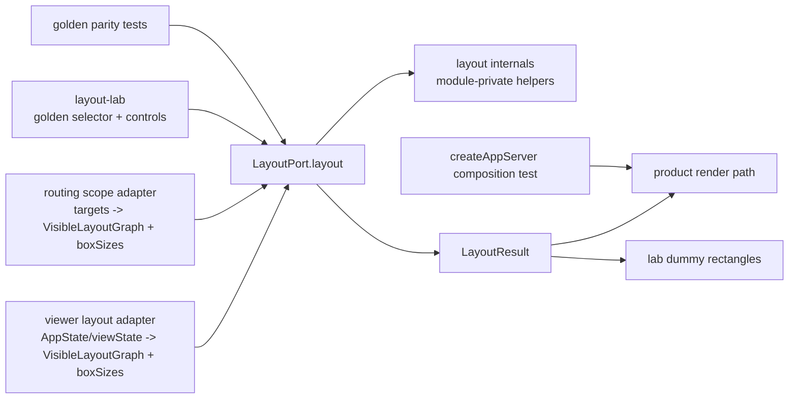

# Design Document

## Overview

`layout-seam-lab` は、`viewer.ts` 内の layout process を `LayoutPort` として外に出し、lab / product / tests が同一 contract module を参照するための first ratchet spec である。

この design は implementation ではなく、最初の切り出し単位を定義する。中心は次の 4 点:

1. `LayoutPort`: `VisibleLayoutGraph + boxSizes + mode + options -> LayoutResult` の typed contract。
2. `layout-lab`: dummy rectangle で `LayoutPort` の配置だけを見る standalone app。
3. `golden samples`: 実 M3E path から layout input/output を採取し、lab と product の同一性を pin する fixture。
4. `ratchet enforcement`: typecheck / dependency-cruiser / jscpd / `createAppServer()` composition test で bypass と copy を塞ぐ。

### Goals

- layout を `viewer.ts` の内部 helper ではなく shared typed seam にする。
- lab と product が同一 module を import する設計にする。
- `renderRoutingScopeSurface` などの direct helper path を閉じる。
- `lab 緑 => product 緑` ではなく、`lab 緑 + golden parity + product composition 緑 => 昇格可` にする。
- enforcement harness を first unit で導入し、後続 seam に流用可能な ratchet にする。

### Non-Goals

- この spec draft で implementation code を書かない。
- node drawing / edge drawing / render graph seam はこの first unit では所有しない。
- layout algorithm の全面再設計はしない。既存 behavior を contract 化して固定する。
- fixture port `14174` visual server を昇格 gate にしない。
- 第一ユニットでは `layout_bridge.ts` を作成しない。
- Disperse/System golden は後続 ratchet とし、第一ユニットの golden scope には含めない。

## Boundary Commitments

### This Spec Owns

- `src/shared/layout_port.ts` 予定 module の public contract。
- layout internal module の private helper 境界。
- `src/labs/layout/` lab app が import する layout contract。
- golden sample format と capture/update/test flow。
- layout boundary の dependency-cruiser / jscpd / typecheck / composition test gate。

### Out of Boundary

- Product rendering (`nodeDraw`, `edgeDraw`, `surfaceDraw`) の分離。
- AppState -> VisibleLayoutGraph adapter の完全汎用化。
- Team Collaboration / Cloud Sync / persistence の behavior 変更。
- `final/` への同期。
- `layout_bridge.ts` compatibility wrapper の追加。
- mutation API の追加。

### Revalidation Triggers

- `viewer.ts` の layout mode / option / `LayoutResult` shape が変わる。
- `workbench-ui.tsx` の `window.m3eLayout` transitional alias / progressive layout usage が変わる。
- `tsconfig.browser.json` / `tsconfig.workbench.json` / `tsconfig.labs.json` / Vite build entry が変わる。
- `createAppServer()` startup path or test data env variables が変わる。
- dependency-cruiser / jscpd versions or config syntax が変わる。

## Existing Architecture Analysis

### Current layout substrate

Current `dev-beta` has:

- `beta/src/browser/viewer.ts`
  - `VisibleLayoutGraph` type near layout section.
  - `layout(visibleGraph, boxSizes, mode, options): LayoutResult`.
  - `buildLayout(state): LayoutResult` as product adapter + layout caller.
  - `window.m3eLayout = (...) => layout(...)`.
  - `renderRoutingScopeSurface` manually builds a routing graph, measures boxes, then calls `buildRightTreeLayout(buildMeasuredTreeContext(...))` directly.
- `beta/src/browser/workbench-ui.tsx`
  - React workbench already calls `window.m3eLayout` when available.
  - It has layout option controls and progressive navigation layout usage.
- `beta/src/shared/`
  - Shared source exists for other contracts.
  - `layout_bridge.ts` is not present on current `dev-beta`.
- `/Users/nisimoriyuuya/dev/M3E-layout-bridge-module/beta/src/shared/layout_bridge.ts`
  - Prior worktree bridge exposes `m3eLayout(graph, boxSizes, mode, options)`.
  - It is useful prior art only. Director decision DC-Q1 says the first unit must not create `layout_bridge.ts`; `layout_port.ts` is the only canonical contract.
- `beta/tsconfig.browser.json`
  - `rootDir: "src/browser"` and `include: ["src/browser/**/*.ts"]`, so shared layout source is currently outside browser compilation.
- `.github/workflows/test.yml`
  - beta job: `npm ci -> npm run build -> npm test`.
- Existing Vitest API tests
  - import `../../dist/node/start_viewer.js`,
  - call `createAppServer()`,
  - listen on `127.0.0.1:0`,
  - use temp data dirs.

### Failure being closed

The known failure pattern is partial seam:

```text
product path A -> layout(...)
product path B -> buildRightTreeLayout(...) bypass
lab path      -> copied/adapted layout logic
```

This gives the cost of extraction without the protection of a seam. The design therefore treats any product or lab layout path that does not enter through `LayoutPort.layout` as failure.

## Architecture

### Boundary Map



### Module Plan

Proposed file structure for implementation phase:

```text
beta/
  src/
    shared/
      layout_port.ts              # public contract and layout() entrypoint
    browser/
      viewer.ts                   # adapters call LayoutPort, no layout internals
    labs/
      layout/
        layout-lab.tsx            # standalone lab app
        layout-lab.css
        layout_samples.ts         # lab-side sample loader/schema, no product logic
        layout-lab.html           # or Vite/html equivalent
  tests/
    fixtures/layout-golden/
      *.json                      # deterministic input/output fixtures
    unit/
      layout_port.test.ts
      layout_golden.test.ts
      layout_composition_api.test.js
  dependency-cruiser.config.cjs
  jscpd.config.json
  tsconfig.layout.json            # optional narrow noEmit contract check
  tsconfig.labs.json              # lab-specific noEmit check
```

The exact filenames can change during implementation, but the ownership cannot: only `layout_port.ts` is public layout contract. Internal helpers are not imported by browser/product/lab callers.

## LayoutPort Contract

The public contract should be narrow and product-independent:

```typescript
export type LayoutMode = "Tree" | "Axial" | "Radial" | "Disperse" | "System";
export type LegacyLayoutMode =
  | "tree"
  | "right-tree"
  | "down-tree"
  | "mindmap"
  | "balanced-tree"
  | "logic-chart"
  | "timeline"
  | "scatter"
  | "force-directed"
  | "system";
export type LayoutDirection = "right" | "left" | "down" | "up";
export type LayoutDepthAlign = "aligned" | "packed";
export type LayoutDensity = "compact" | "balanced" | "spacious";
export type LayoutBranchDirection = "left" | "right" | "both";
export type LayoutEdgeRoute = "elbow" | "bezier" | "straight";
export type LayoutLinkRoute = "simple-bezier" | "orthogonal" | "straight";

export interface VisibleLayoutGraph {
  nodeIds: string[];
  childrenOf: (id: string) => string[];
  graphLinks: GraphLinkLike[];
}

export interface LayoutNodeMetric {
  w: number;
  h: number;
  labelLines?: string[];
  fontSize?: number;
}

export interface LayoutNodePosition extends LayoutNodeMetric {
  x: number;
  y: number;
  depth: number;
  scatterCollapsedGroup?: boolean;
}

export interface LayoutOptions {
  displayRootId?: string;
  structuredMode?: LayoutMode | LegacyLayoutMode;
  density?: LayoutDensity;
  branchDirection?: LayoutBranchDirection;
  depthAlign?: LayoutDepthAlign;
  direction?: LayoutDirection;
  spacing?: { nodeGap?: number; levelGap?: number; padding?: number };
  edge?: { route?: LayoutEdgeRoute };
  link?: { route?: LayoutLinkRoute };
  surfaceNodeViews?: Record<string, { x?: number; y?: number }>;
  flowCells?: Record<string, { col: number; row: number; isReference: boolean }>;
  scatterCollapsedGroups?: Record<string, boolean>;
}

export interface LayoutResult {
  pos: Record<string, LayoutNodePosition>;
  order: string[];
  totalWidth: number;
  totalHeight: number;
}

export function layout(
  visibleGraph: VisibleLayoutGraph,
  boxSizes: Record<string, LayoutNodeMetric>,
  mode: LayoutMode,
  options?: LayoutOptions,
): LayoutResult;
```

`GraphLinkLike` should be a minimal shared shape, not the full viewer `GraphLink` if that would pull browser state into shared. If existing `GraphLink` is already in shared types, import that. Otherwise define the smallest layout-relevant structure and adapt in viewer.

### Relationship to `layout_bridge.ts`

Director decision DC-Q1 resolves this: `layout_port.ts` is the only canonical contract. The first unit must not create or revive `layout_bridge.ts` on `dev-beta`.

- `layout_port.ts`: exported types + `layout()` public entrypoint; sole source of layout contract truth.
- `window.m3eLayout`: transitional browser alias only; it calls `LayoutPort.layout` and owns no layout logic.
- `layout_bridge.ts`: absent in the first unit. If a real external consumer such as Neo M3 / `M3E_LAYOUT_MODULE` requires it later, add a follow-up wrapper that only re-exports `layout_port.ts`.

This prevents a second contract from reappearing. Compatibility wrappers are allowed only after a concrete consumer need exists and only as thin re-exports.

## Browser TypeScript Design

Current `tsconfig.browser.json` cannot import `src/shared` because it sets `rootDir: "src/browser"` and includes only browser files.

Implementation should choose one of these, in order:

1. **Preferred:** change browser compilation root to `src` and include `src/browser/**/*.ts` plus `src/shared/layout_port.ts` / required shared types. Preserve output shape under `dist/browser`.
2. **Alternative:** create `tsconfig.layout.json` for shared port typecheck and bundle shared port through Vite/workbench only, while script-mode `viewer.ts` consumes a browser-compatible entry that still delegates to `layout_port.ts`. This is less direct and should be used only if script-mode browser build cannot tolerate module imports, and it must not create `layout_bridge.ts` or a second contract.

Acceptance requires `npm run typecheck` to cover the shared port, product importers, workbench importers, and `src/labs/layout/`. A build that excludes `layout_port.ts` or the lab from typechecking is not acceptable.

## Product Adapter Design

`viewer.ts` should retain product-specific adapter responsibilities:

- choose display root from current scope,
- normalize graph links,
- resolve visible children,
- measure labels and boxes using existing product measuring functions,
- translate viewState to `LayoutOptions`,
- pass `VisibleLayoutGraph`, `boxSizes`, `mode`, `options` to `LayoutPort.layout`.

`viewer.ts` should not own layout placement algorithms after the seam is cut.

`renderRoutingScopeSurface` should become a second adapter:

```text
routingScopeTargets
  -> routing AppState / simple node map
  -> VisibleLayoutGraph
  -> boxSizes
  -> LayoutPort.layout(..., "Tree", { displayRootId, structuredMode: "Tree" })
  -> existing SVG rendering
```

This directly closes the known bypass.

## Layout Lab Design

The lab app is a small inspection surface, not a product renderer.

### UI Capabilities

- sample selector: Tree / Radial / routing-scope for the first unit,
- controls: mode, density, branchDirection, direction, depthAlign, spacing,
- canvas: dummy rectangles at `LayoutResult.pos`, simple parent-child edge lines from the sample graph,
- panels: input graph summary, boxSizes summary, output bounds/order, diff from golden output,
- status: `green`, `changed`, `invalid sample`, `missing output`.

Disperse/System samples are intentionally absent in the first unit. They are follow-up ratchets after the routing-scope regression surface is retired.

### Build Strategy

Director decision DC-Q2 places the lab under `src/labs/layout/`, not under `src/browser/`. The lab should still reuse the existing React/Vite dependency stack where possible, but it gets a dedicated lab tsconfig and Vite entry:

- add a lab entry to Vite rollup input,
- add `layout-lab.html` or route served by existing static server,
- share workbench visual language only at CSS/component level,
- do not import `viewer.ts`.
- use `tsconfig.labs.json` so future `node-lab` / `edge-lab` can share the same labs home.

The lab must import `LayoutPort` directly:

```typescript
import { layout, type VisibleLayoutGraph, type LayoutResult } from "../../shared/layout_port";
```

If path depth differs, adjust import path, but do not import through `viewer.ts`, other `src/browser/**` implementation files, or `window.m3eLayout`.

## Golden Sample Design

### Fixture Shape

```typescript
interface LayoutGoldenSample {
  schema_version: 1;
  sample_id: string;
  source: {
    map_id?: string;
    scope_id?: string;
    product_path: "viewer.buildLayout" | "routingScopeSurface";
    captured_at: string;
  };
  input: {
    graph: {
      nodeIds: string[];
      children: Record<string, string[]>;
      graphLinks: GraphLinkLike[];
    };
    boxSizes: Record<string, LayoutNodeMetric>;
    mode: LayoutMode;
    options: LayoutOptions;
  };
  expected: LayoutResult;
}
```

JSON cannot store a `childrenOf` function, so fixture graph stores `children: Record<string, string[]>`. Test/lab adapters reconstruct `childrenOf`.

### Capture Mechanism

Add an explicit capture command in implementation phase, for example:

```text
npm run layout:capture -- --map beta-dev --scope <scopeId> --sample tree-basic --out tests/fixtures/layout-golden/tree-basic.json
npm run layout:capture -- --map beta-dev --scope <scopeId> --sample radial-basic --mode Radial --out tests/fixtures/layout-golden/radial-basic.json
npm run layout:capture -- --routing-scope --sample scope-routing-basic --out tests/fixtures/layout-golden/scope-routing-basic.json
```

Capture must run through product adapters, not through hand-written fixture construction. It should capture:

- `VisibleLayoutGraph`,
- `boxSizes`,
- mode/options,
- `LayoutResult`,
- source metadata.

Golden update must be explicit:

```text
npm run test:layout:golden -- --update
```

Normal CI runs must never update fixtures.

### Initial Golden Set

Director decision DC-Q3 fixes the initial set:

1. `tree-basic`
2. `radial-basic`
3. `scope-routing-basic`

`scope-routing-basic` is mandatory because routing scope was the 2026-06-16 breakage surface. Disperse/System are explicitly deferred to later ratchets and must not be added to the first unit acceptance scope.

### Comparison Rules

- `order`, keys in `pos`, and `totalWidth` / `totalHeight`: exact unless a planned algorithm change updates fixture.
- numeric `x`, `y`, `w`, `h`: exact for deterministic pure layout; tolerance only where browser measurement or floating operations make exact equality unstable.
- labels in `labelLines`: compare only if sanitized and intentionally fixed.

## EN5 Composition Test Design

The composition test should follow existing Vitest API patterns:

```text
process.env.M3E_DATA_DIR = tmpdir
process.env.M3E_DB_FILE = "layout-composition.sqlite"
require("../../dist/node/start_viewer.js").createAppServer()
server.listen(0, "127.0.0.1")
fetch real API route to create/load map
fetch existing viewer diagnostic route if it returns layout output
otherwise fetch narrow read-only test/debug route that returns layout snapshot
compare snapshot to golden/composition expectation
server.close()
```

The test should not use `beta/test_server.js` or `14174` fixture server. Director decision DC-Q4 sets the priority:

1. Reuse an existing viewer diagnostic if it can return layout output.
2. Only if no such diagnostic exists, add a narrow read-only test/debug route served by `createAppServer()`.
3. Do not add mutation APIs for EN5.

### Sandbox and Native Binding Friction

- Pure `LayoutPort` tests do not need server listen or SQLite and should always run in constrained environments.
- Composition test requires compiled `dist/node/start_viewer.js`, `better-sqlite3`, and local listen permission.
- If local sandbox blocks listen, report the exact blocked check. Do not replace EN5 with fixture server.
- CI should run EN5 normally on Ubuntu after `npm ci`, where native binding install and localhost listen are expected to work.

## Enforcement Harness Design

### `package.json` scripts

Proposed scripts:

```json
{
  "typecheck": "tsc --noEmit -p tsconfig.node.json && tsc --noEmit -p tsconfig.browser.json && tsc --noEmit -p tsconfig.workbench.json && tsc --noEmit -p tsconfig.layout.json && tsc --noEmit -p tsconfig.labs.json",
  "lint:deps": "depcruise --config dependency-cruiser.config.cjs src",
  "lint:copy": "jscpd --config jscpd.config.json",
  "test:layout": "npm run build:test && vitest run tests/unit/layout_*.test.*"
}
```

Exact command names can be adjusted, but the three required scripts must exist: `typecheck`, `lint:deps`, `lint:copy`.

### Workflow placement

Beta CI should become:

```text
npm ci
npm run typecheck
npm run lint:deps
npm run lint:copy
npm run build
npm test
```

`lint:deps` / `lint:copy` should run before build/test so architectural drift fails early.

### dependency-cruiser rule sketch

The first layout ratchet should be narrow:

```javascript
module.exports = {
  forbidden: [
    {
      name: "no-layout-internal-imports",
      severity: "error",
      from: {
        path: "^src/(browser|shared|labs)"
      },
      to: {
        path: "^src/shared/layout_.*",
        pathNot: "^src/shared/layout_port\\.ts$"
      }
    },
    {
      name: "lab-must-use-layout-port",
      severity: "error",
      from: { path: "^src/labs/" },
      to: {
        path: "^src/browser/viewer\\.ts$"
      }
    },
    {
      name: "labs-must-not-import-browser-implementation",
      severity: "error",
      from: { path: "^src/labs/" },
      to: {
        path: "^src/browser/"
      }
    }
  ],
  options: {
    tsConfig: { fileName: "tsconfig.layout.json" }
  }
};
```

If implementation keeps internals in the same `layout_port.ts` file, module-private functions plus no exports cover helper privacy. If internals move to `src/shared/layout_internal.ts`, only `layout_port.ts` may import that file. Labs may import shared contracts such as `src/shared/*_port.ts` and local lab/test fixture loaders, but not product browser implementation.

### jscpd rule sketch

`jscpd` should scan TypeScript sources and exclude generated output:

```json
{
  "threshold": 0,
  "minLines": 20,
  "minTokens": 120,
  "reporters": ["console"],
  "pattern": "src/**/*.ts*",
  "ignore": ["dist/**", "node_modules/**", "tests/fixtures/**"]
}
```

If current codebase has existing duplication that fails threshold, first implementation may create a baseline config that ignores known unrelated duplication, but layout lab/product duplicated layout logic must not be ignored.

## Why Lab Green Implies Product Confidence

Lab green alone does not imply product green. The guarantee is a chain:

1. **Type contract:** lab and product compile against the same `LayoutPort` types.
2. **Reference composition:** lab and product import the same `layout()` implementation.
3. **Golden parity:** real product adapters capture inputs/outputs; lab renders those same samples; tests compare `LayoutPort.layout(sample.input)` to expected `LayoutResult`.
4. **Exclusive seam:** dependency-cruiser/module-private helpers prevent product/lab bypass.
5. **EN5 composition:** `createAppServer()` exercises real product startup/data path and snapshots layout output.

Therefore:

```text
lab green
  + same LayoutPort import
  + golden parity green
  + no bypass imports
  + createAppServer composition green
  => product layout seam is green for the first ratchet scope
```

## Requirements Traceability

| Requirement | Design Element | Verification |
|-------------|----------------|--------------|
| R1 | package scripts, workflow placement, tool configs | `npm run typecheck`, `npm run lint:deps`, `npm run lint:copy`, CI beta job |
| R2 | `src/shared/layout_port.ts` public contract | TypeScript compile, import checks |
| R3 | viewer/routing adapters use `LayoutPort.layout` | unit tests, dependency-cruiser, code review |
| R4 | `src/labs/layout/` standalone app with dedicated tsconfig/Vite entry | lab build, manual visual approval, Playwright smoke if added |
| R5 | Tree/Radial/routing-scope fixture schema and capture commands | golden tests, explicit update command |
| R6 | existing diagnostic first, otherwise narrow read-only `createAppServer()` composition route | Vitest integration using `127.0.0.1:0` |
| R7 | dependency-cruiser / jscpd ratchet | negative import/copy checks by config and CI |

## Risks and Mitigations

| Risk | Failure Mode | Mitigation |
|------|--------------|------------|
| script-mode browser build cannot import shared module | `tsc` or browser runtime breaks | adjust browser tsconfig/root or use Vite/module entry while keeping typecheck explicit |
| external consumer expects `layout_bridge.ts` | Neo M3 / `M3E_LAYOUT_MODULE` cannot consume first-unit output directly | do not add bridge in first unit; add later thin re-export wrapper only when real consumer need exists |
| lab imports product browser implementation | lab green becomes product-coupled and bypasses the port | place lab in `src/labs/layout/`; dependency-cruiser blocks `src/labs/** -> src/browser/**` |
| jscpd finds unrelated duplicates | noisy CI | baseline unrelated duplicates explicitly; never ignore layout-lab/product layout duplication |
| `better-sqlite3` native binding fails locally | composition test cannot run | keep pure tests runnable; report exact EN5 block; CI remains normal gate |
| sandbox blocks localhost listen | local EN5 cannot run | do not substitute fixture server; mark blocked with reason and run in CI/non-sandbox |
| partial seam remains in routing scope | same historical failure repeats | first ratchet explicitly includes routing helper bypass closure |

## Director Resolved

1. **DC-Q1 layout_bridge:** `layout_port.ts` is the only canonical contract. Do not create `layout_bridge.ts` in the first unit. `window.m3eLayout` is only a transitional alias to `LayoutPort.layout`. If Neo M3 / `M3E_LAYOUT_MODULE` later needs a file-level bridge, add a follow-up thin wrapper that re-exports `layout_port.ts`.
2. **DC-Q2 lab placement:** layout-lab lives under `src/labs/layout/`, with dedicated `tsconfig.labs.json` and a Vite entry. This creates the common home for future node-lab / edge-lab and keeps labs separate from product browser code.
3. **DC-Q3 initial golden:** initial golden set is exactly Tree + Radial + routing-scope. Disperse/System are later ratchets. Routing-scope is mandatory because it is the known 2026-06-16 regression surface.
4. **DC-Q4 EN5 snapshot:** reuse existing viewer diagnostic if it can return layout output. If not, add only a narrow read-only test/debug route through `createAppServer()`. Do not add mutation APIs.
