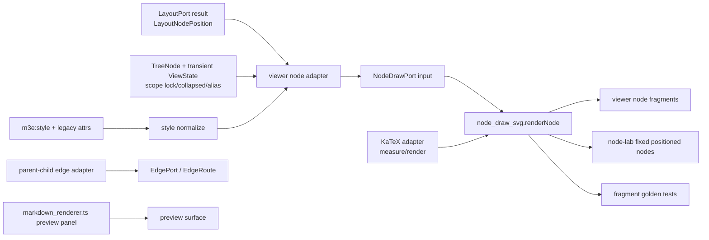

# Design Document

## Overview

`node-draw-seam` は、`viewer.ts` 内の `drawNode()` を `NodeDrawPort` と `node_draw_svg` の typed pure seam として切り出すための spec である。

この design は implementation ではなく、最初の切り出し単位を定義する。中心は次の 6 点:

1. `NodeDrawPort`: `node + LayoutNodePosition + style + ViewState + Surface + content -> NodeDrawOutput` の typed contract。
2. `node_draw_svg.ts`: viewer / lab 共用の SVG/DOM fragment renderer。
3. `node-lab`: layout/edge なしで固定 positioned nodes を描く standalone visual lab。
4. KaTeX adapter: `measureLatex` / `renderLatex` を nodeDraw 内 adapter として扱い、lab で実 stylesheet を検証する。
5. edge/preview separation: `drawNode()` 内 child edge と folder preview edge を nodeDraw から出す。
6. `golden + EN ratchet`: fragment snapshot、node-lab Playwright、typecheck / dependency-cruiser / jscpd / composition で bypass と copy を塞ぐ。

### Goals

- node drawing を layout / EdgePort / Markdown preview から分離する。
- viewer と node-lab が同一 renderer を import する設計にする。
- `NodeStyleAttrs` / `m3e:style` / label split / ViewState class 生成を typed contract にする。
- KaTeX node を nodeDraw の supported content として固定する。
- child edge 生成を `drawNode()` から分離する実装計画を明示する。
- lab green ではなく `fragment golden + lab Playwright + exclusive seam + composition` を昇格条件にする。

### Non-Goals

- この spec draft で implementation code を書かない。
- layout algorithm / `LayoutPort` を変更しない。
- parent-child edge / GraphLink / EdgePort を実装しない。
- Markdown/Mermaid preview panel を nodeDraw に統合しない。
- tabular node component を第一 ratchet で所有しない。tabular は後続の別 seam として起票する。
- folder preview mini graph / preview edge を第一 ratchet で所有しない。viewer-owned helper として温存し、将来 `folderPreview` または `surfaceDraw` seam として別起票する。
- RenderGraph 全体 seam をこの unit で完成させない。
- `final/` へ同期しない。

## Boundary Commitments

### This Spec Owns

- `NodeDrawPort` public contract。
- `node_draw_svg.ts` public renderer。
- style normalize / label split / plain-vs-latex content adapter の module plan。
- node-lab minimum inspection surface。
- nodeDraw fragment golden schema / update / parity flow。
- viewer `drawNode()` の node-only extraction と child edge 分離設計。
- nodeDraw boundary の dependency-cruiser / jscpd / typecheck / EN5 ratchet。

### Out of Boundary

- `LayoutPort.layout` algorithm と `LayoutResult` shape の変更。
- `EdgePort.selectPorts` / `EdgeRoute.route` の実装。
- GraphLink endpoint edit。
- Markdown/Mermaid renderer。
- node component `tabular` の seam 化。第一 ratchet では除外し、後続で別 seam 起票する。
- folder preview mini graph の seam 化。第一 ratchet では viewer-owned helper として温存し、後続で `folderPreview` または `surfaceDraw` seam として別起票する。
- app-wide command / mutation behavior。

### Revalidation Triggers

- `LayoutNodePosition` / `LayoutNodeMetric` の shape が変わる。
- `NodeStyleAttrs` / `m3e:style` の schema が変わる。
- `TreeNode` alias / folder / scope lock / collapsed ViewState の shape が変わる。
- KaTeX loading path or CSS class names が変わる。
- Surface View 正本 (`Tree / Axial / Radial / Disperse / System`) が変わる。
- `viewer.ts` の `drawNode()` / `render()` / `measureLayoutNode()` / `markdown_renderer.ts` の責務が分割される。
- dependency-cruiser / jscpd / TypeScript config が変わる。

## Dependencies

### D1: LayoutPort position contract

nodeDraw は `LayoutNodePosition` を consume する。`x / y / w / h / depth / labelLines / fontSize / branchSide / scatterCollapsedGroup` は layout 済み position と content measurement metadata として扱う。

Implementation dependency:

```typescript
import type { LayoutNodePosition } from "./layout_port";
```

`nodeDraw` は layout を呼ばない。`measureLayoutNode()` が生成する `boxSizes` は layout 入力であり、node content/style measurement と layout placement の境界である。実装 phase では次の責務分離にする:

```text
viewer adapter:
  TreeNode + style + content -> LayoutNodeMetric(boxSizes)
  AppState + viewState -> LayoutPort.layout(...)
  TreeNode + LayoutNodePosition + style + ViewState -> NodeDrawInput

nodeDraw:
  NodeDrawInput -> SVG/DOM fragment
```

KaTeX metrics は `measureLayoutNode()` の boxSizes に必要なので `NodeDrawLatexAdapter.measureLatex` を shared adapter として再利用できる設計にする。ただし nodeDraw renderer は layout 再計算をしない。

### D2: EdgePort separation

parent-child edge は EdgePort seam が所有する。nodeDraw extraction では `drawNode()` 内の child edge generation を先に `renderParentChildEdges(...)` 相当へ出し、node renderer から `layoutEdgePath` / `edgePortPairBetweenRects` / `smoothGraphLinkPath` を参照できない状態にする。

### D3: Preview separation

Markdown/Mermaid preview は `markdown_renderer.ts` と preview panel の concern。folder preview mini graph は第一 ratchet では切らず、viewer-owned helper として温存する。nodeDraw first ratchet では folder node の frame/label/lock/collapsed/status/confidence までを扱い、folder 内 preview child nodes / preview edges は out of boundary とする。将来の分離先は `folderPreview` または `surfaceDraw` seam として別起票する。

## Existing Architecture Analysis

Current `dev-beta` has:

- `beta/src/browser/viewer.ts`
  - `NodeStyleAttrs`, `readNodeStyleAttrs`, `buildNodeVisualStyle`, `buildLabelStyle`, `confidenceColor`, `diagramLabel`, `uiLabel`。
  - `measureNodeLabel`, `measureWrappedNodeLabel`, `measureLatex`, `isLatexNode`, `latexSource`。
  - `measureLayoutNode(state, nodeId, displayRootId, config)` that produces layout `boxSizes` from node content/style.
  - `render()` obtains `layout = buildLayout(state)` and closes over `state`, `pos`, `viewState`, `scopeLockMap`, `structuredMode`, `scatterSurface`。
  - inner `drawNode(nodeId)` appends node strings to `nodes` and child edge strings to `edges`。
  - KaTeX node content is emitted as `foreignObject` with `.latex-node-content`。
  - collapsed / alias / status / confidence / lock overlays are emitted inline with node fragments.
  - folder preview mini graph emits preview edges and mini child nodes inside the folder branch.
- `beta/src/browser/markdown_renderer.ts`
  - Markdown and Mermaid preview panel rendering; this is not nodeDraw.
- `beta/src/shared/layout_port.ts`
  - `LayoutNodePosition` and `LayoutNodeMetric` shared source exist.

The failure being closed is:

```text
drawNode(nodeId)
  -> node SVG fragment
  -> parent-child edge path
  -> folder preview edge path
  -> recursive traversal
  -> KaTeX render
  -> transient view class derivation from global viewState
```

This gives no typed boundary for node appearance. The target is:

```text
viewer adapter -> NodeDrawInput
node_draw_svg.renderNode(input, adapters) -> NodeDrawOutput
parent-child edge adapter -> EdgePort / EdgeRoute
surface/folder preview adapter -> later seam
render traversal -> orchestrates fragments only
```

## Architecture

### Boundary Map



Forbidden:

```text
node_draw_svg -> src/browser/viewer.ts
node_draw_svg -> markdown_renderer.ts
node_draw_svg -> edge_port / edge_route / edge geometry helpers
src/labs/node/** -> src/browser/** implementation files
viewer.ts -> node SVG direct generation after extraction
```

### Module Plan

Proposed file structure for implementation phase:

```text
beta/
  src/
    shared/
      node_draw_port.ts              # public contract, style normalize, label/content helper types
      node_draw_svg.ts               # public renderer used by viewer and lab
      node_draw_latex.ts             # optional adapter wrapper if KaTeX isolation needs separate file
    browser/
      viewer.ts                      # adapter + orchestration only; no node SVG direct generation
      node_draw_viewer_adapter.ts    # optional browser adapter from TreeNode/viewState to NodeDrawInput
    labs/
      node/
        node-lab.tsx                 # fixed positionedNode[] visual lab
        node-lab.css
        node_samples.ts              # lab sample fixtures, no product logic
        node-lab.html
  tests/
    fixtures/node-draw-golden/
      *.json
      *.svg.snap
    unit/
      node_draw_contract.test.ts
      node_draw_fragment_golden.test.ts
      node_draw_viewer_adapter.test.ts
    e2e/
      node-lab.spec.ts
  dependency-cruiser.config.cjs
  jscpd.config.json
  tsconfig.node-draw.json
  tsconfig.labs.json
```

Exact filenames can change during implementation, but ownership cannot:

- public contract is `node_draw_port.ts`。
- shared renderer is `node_draw_svg.ts`。
- viewer and lab import the same renderer.
- lab does not import `viewer.ts` or `src/browser/**` implementation files.
- browser adapter may live in browser if it touches product globals; renderer must not.

## NodeDraw Contract

The public contract should be narrow and product-independent:

```typescript
import type { LayoutNodePosition } from "./layout_port";

export type SurfaceViewName = "Tree" | "Axial" | "Radial" | "Disperse" | "System";
export type NodeDrawKind = "root" | "plain" | "folder" | "latex" | "status";
export type NodeDrawType = "text" | "image" | "folder" | "alias";
export type AliasDrawState = "none" | "read" | "write" | "broken";
export type ScopeLockDrawState = "none" | "self" | "other";

export interface NodeDrawNode {
  id: string;
  type: NodeDrawType;
  kind: NodeDrawKind;
  label: string;
  text?: string;
  alias: AliasDrawState;
  isFolder: boolean;
  isScopePortal: boolean;
  isRoot: boolean;
  isLatex: boolean;
}

export interface NodeDrawStyle {
  fill?: string;
  text?: string;
  border?: string;
  borderStyle?: "solid" | "dashed" | "dotted" | "none";
  borderWidth?: number;
  shape?: "rect" | "rounded" | "pill" | "diamond";
  icon?: string;
  status?: "placeholder" | "confirmed" | "contested" | "frozen" | "active" | "review";
  confidence?: number;
  urgency?: number;
  importance?: number;
}

export interface NodeDrawViewState {
  selected: boolean;
  primarySelected: boolean;
  linkSource: boolean;
  cutPending: boolean;
  dragSource: boolean;
  dropTarget: boolean;
  collapsedCount?: number;
  lockedBy: ScopeLockDrawState;
}

export interface NodeDrawSurface {
  view: SurfaceViewName;
  structuredMode?: SurfaceViewName;
  displayRootId?: string;
  rootless?: boolean;
}

export type NodeDrawContent =
  | { kind: "plainLabel"; labelLines: string[]; fontSize?: number }
  | { kind: "latexHtml"; html: string; displayMode: boolean };

export interface NodeDrawInput {
  node: NodeDrawNode;
  position: LayoutNodePosition;
  style: NodeDrawStyle;
  view: NodeDrawViewState;
  surface: NodeDrawSurface;
  content: NodeDrawContent;
}

export interface NodeDrawBounds {
  x: number;
  y: number;
  w: number;
  h: number;
  maxX: number;
  maxY: number;
}

export interface NodeDrawOutput {
  svg: string;
  overlays?: string;
  bounds: NodeDrawBounds;
}

export interface NodeDrawLatexAdapter {
  renderLatex(source: string): { html: string; displayMode: boolean };
  measureLatex?(source: string): { w: number; h: number };
}

export function renderNode(input: NodeDrawInput, adapters?: { latex?: NodeDrawLatexAdapter }): NodeDrawOutput;
```

### Contract Notes

- `NodeDrawNode.kind` is a renderer variant, not persisted schema. Viewer adapter derives it from `TreeNode`, root identity, latex content, and status.
- `NodeDrawStyle` is normalized. Raw `attributes["m3e:style"]` parsing belongs in a normalize function or viewer adapter, not inside the drawing branch.
- `NodeDrawViewState` is transient. It must not be written back to `TreeNode` or `AppState`.
- `NodeDrawSurface.view` uses canonical names only.
- `NodeDrawContent.kind = "latexHtml"` carries sanitized renderer output. Markdown is intentionally absent.
- `NodeDrawOutput.svg` is the primary node fragment. `overlays` is reserved for badge/collapsed/lock fragments when implementation wants a separate layer; returning all node-local overlays inside `svg` is also acceptable if the distinction is documented.

## Style Normalize and Label Split

### Style normalize

Implementation should expose a public helper or adapter-friendly function:

```typescript
export function normalizeNodeDrawStyle(raw: {
  styleJson?: string;
  legacy?: Record<string, string>;
  surfaceShape?: "rect" | "diamond" | "rounded";
}): NodeDrawStyle;
```

Rules:

- JSON `m3e:style.fill / border / text / urgency / importance / status` wins over legacy color fields where current behavior does.
- Derived urgency/importance fill is computed only when explicit fill is absent.
- `confidence` is clamped to `[0, 1]`.
- invalid color / status / shape values are dropped.
- icon sanitization remains short-string only.

### Label split

Viewer adapter keeps the semantic label rules:

```text
uiLabel:
  aliasLabel -> broken snapshot label -> alias target text -> node.text -> Untitled

diagramLabel:
  icon + uiLabel, scope portal bracket marker where needed
```

nodeDraw receives:

- `node.label`: semantic UI label for accessibility / data attributes.
- `content.plainLabel.labelLines`: display label lines after wrapping/measurement.
- `style.icon`: icon token if retained separately.

This avoids a renderer-global dependency on `map.state` for alias target resolution.

## KaTeX Design

KaTeX is in scope because latex nodes are node body pixels, not preview panel pixels.

### Adapter shape

Product adapter can wrap current behavior:

```text
isLatexNode(TreeNode) -> latexSource(text) -> renderLatex(text) -> NodeDrawContent.latexHtml
measureLatex(text) -> LayoutNodeMetric for measureLayoutNode
```

The shared renderer does not call global `katex` directly unless the implementation chooses a shared `node_draw_latex.ts` adapter that is explicitly injected. This keeps pure fragment tests deterministic and lets node-lab load real KaTeX stylesheet for visual verification.

### Lab behavior

node-lab loads KaTeX CSS and renders actual `foreignObject` content. Playwright checks:

- `.latex-node-content` exists inside `foreignObject`。
- the foreignObject has non-zero width/height from `LayoutNodePosition`。
- no console error is emitted for valid samples。
- fallback sample renders deterministic escaped text when adapter reports failure。

## Viewer Migration Design

### Step 1: Split traversal from node fragment

Current `drawNode(nodeId)` recursively traverses children. Implementation should separate:

```text
renderVisibleNodes(order/displayRoot traversal):
  for each visible positioned node:
    input = toNodeDrawInput(...)
    output = renderNode(input)
    append output.svg / output.overlays
```

Traversal order remains viewer-owned. nodeDraw does not recurse.

### Step 2: Move parent-child edge generation out

Current child edge generation is at the top of `drawNode()`. It should move to:

```text
renderParentChildEdges({
  state,
  layout,
  visibleChildren,
  surface: canonical view/options,
  parentChildLinkLabels,
})
```

This function may be a transitional viewer helper until EdgePort seam owns it. It must not live in `node_draw_svg.ts`.

### Step 3: Keep folder preview as viewer-owned helper

Current folder branch can render `previewLayout`, preview GraphLinks, preview mini nodes, and preview labels. Director decision NDQ2 resolves this: first ratchet keeps folder preview rendering in viewer outside nodeDraw. Product behavior should be preserved through a `renderFolderPreview(...)` helper or equivalent viewer-owned helper.

It must not enter `node_draw_svg.ts`, because preview edge generation would reintroduce EdgePort / GraphLink dependencies.

### Step 4: Replace node SVG direct generation

After `renderNode()` covers root/plain/folder/alias/latex/status/confidence/collapsed/lock classes, `viewer.ts` should no longer concatenate these node SVG strings directly. It should only:

- build `NodeDrawInput`,
- call `renderNode`,
- append returned fragments,
- update `maxX/maxY` from `bounds`,
- orchestrate edge/surface/annotation layers.

## Node Lab Design

The lab app is a small inspection surface, not a product renderer.

### UI Capabilities

- sample selector with fixed `positionedNode[]` scenarios:
  - plain
  - long wrap
  - multiline
  - root
  - folder
  - alias read / write / broken
  - selected / multi / primary
  - cut
  - link-source
  - collapsed
  - scope-locked self / other
  - fill
  - color
  - border
  - status
  - confidence
  - KaTeX
- Surface View selector: `Tree / Axial / Radial / Disperse / System` only.
- canvas: fixed-position nodes, no layout recomputation, no parent-child edge.
- panels: input JSON summary, output bounds, fragment preview, golden diff.
- status: `green`, `changed`, `invalid sample`, `missing adapter`, `katex fallback`.

### Build Strategy

The lab lives under `src/labs/node/`, consistent with `layout-lab` and `edge-port-lab` direction:

- use React/Vite where practical,
- share `tsconfig.labs.json`,
- import from `src/shared/node_draw_port` and `src/shared/node_draw_svg`,
- do not import `viewer.ts`, `workbench-ui.tsx`, or `src/browser/**` implementation files,
- load KaTeX CSS explicitly for lab rendering.

Example import direction:

```typescript
import { renderNode, type NodeDrawInput } from "../../shared/node_draw_svg";
```

If exact relative paths differ, adjust path only; do not route through browser globals.

## Golden Sample Design

### Fixture Shape

```typescript
interface NodeDrawGoldenSample {
  schema_version: 1;
  sample_id: string;
  source: {
    product_path?: "viewer.drawNode";
    captured_at?: string;
    sanitized: boolean;
  };
  input: NodeDrawInput;
  expected: {
    svg: string;
    overlays?: string;
    bounds: NodeDrawBounds;
    selectors?: string[];
  };
}
```

`input` must not include personal payload. Labels can be generic but should cover Japanese and long text in at least one sample if implementation needs typography evidence.

### Snapshot normalization

Fragment golden should normalize:

- insignificant whitespace between tags,
- numeric precision to a fixed decimal strategy if non-integer values appear,
- deterministic class order,
- attribute order if renderer construction can vary.

It must not normalize away:

- class names,
- data-node-id,
- shape path/rect geometry,
- `foreignObject`,
- collapsed/status/confidence/lock/alias fragments.

### Golden update

Golden update is explicit only:

```text
npm run update:node-draw-golden -- --sample <id>
```

Normal test runs never rewrite fixtures.

## EN Composition Decision

For nodeDraw, the first-ratchet gate is **EN5-Lite**.

EN5-Lite consists of:

- pure fragment golden for `NodeDrawInput -> NodeDrawOutput`;
- node-lab Playwright screenshot and DOM checks;
- node-lab loading product's real `viewer.css` (resolved during implementation to the actual product viewer CSS bundle) and KaTeX stylesheet;
- EN4 dependency-cruiser ratchet proving viewer node SVG generation goes through `node_draw_svg`;
- EN3 typecheck proving shared `node_draw_port.ts` is the common contract;
- EN2 jscpd proving lab/product do not copy renderer logic.

Reason:

- nodeDraw contract is `NodeDrawInput -> fragment`; its correctness is fully expressible as pure deterministic fragment output.
- KaTeX visual correctness needs browser rendering and stylesheet, which node-lab Playwright covers.
- node-lab must load the same product viewer stylesheet, so the lab cannot pass with a fake visual environment.
- EN4/EN3/EN2 prove the product path is locked to the shared renderer and contract.
- real server snapshot mainly verifies viewer adapter wiring and can be environment-sensitive.

EN5-Full is still required before broad promotion. EN5-Full is a **narrow real-server node snapshot route** after pure seam extraction:

```text
createAppServer() or existing diagnostic
  -> render/load a tiny sanitized map
  -> capture node fragment snapshot or DOM selector summary
  -> assert viewer path uses node_draw_svg output classes/fragments
```

Director decision NDQ3 resolves this: EN5-Full is a mandatory follow-up before broad promotion, but it is not required for the first ratchet. Fixture-only lab green is not enough; first ratchet completion requires the full EN5-Lite set above.

## Ratchet Enforcement

### EN3 typecheck

`node_draw_port.ts`, `node_draw_svg.ts`, product adapter, node-lab, and tests must be included in `npm run typecheck` or a narrow equivalent. A build that excludes `src/shared/node_draw_*` or `src/labs/node/**` is not acceptable.

### EN2 jscpd

`jscpd` must catch copied renderer logic:

- product `viewer.ts` cannot retain duplicated SVG branch logic once migrated,
- node-lab cannot implement its own SVG renderer,
- style normalize / label split helpers cannot be copy-pasted between lab and product.

Baseline ignores may exclude generated snapshots, `dist`, `node_modules`, and fixtures, but not `node_draw_svg.ts` logic.

### EN4 dependency-cruiser

Rules after extraction:

- `src/labs/node/**` cannot import `src/browser/**` implementation files.
- `src/shared/node_draw_svg.ts` cannot import `src/browser/**`, `markdown_renderer.ts`, edge route modules, or viewer globals.
- `src/browser/viewer.ts` may import `src/shared/node_draw_*` and optional browser adapter.
- `src/browser/viewer.ts` must not import `src/labs/**`.
- If renderer internals split into multiple files, product/lab can import only the public entrypoint.

EN4 acceptance is not "grep found no bypass"; it is "adding a bypass import fails `npm run lint:deps`."

## Director Resolved

### NDQ1: tabular component

**決定:** tabular node component は第一 ratchet から除外する。`renderNodeComponent` / tabular `foreignObject` は viewer-owned path に残し、後続で別 seam として起票する。

**反映:** Non-Goals / Out of Boundary / viewer migration acceptance は tabular を nodeDraw completion から除外する。

### NDQ2: folder preview mini graph

**決定:** folder preview mini graph は viewer-owned helper として温存する。第一 ratchet の folder node は frame/label/lock/collapsed/status/confidence までを nodeDraw が扱う。folder 内 preview child nodes / preview edges は out of boundary とし、将来 `folderPreview` または `surfaceDraw` seam として別起票する。今は切らない。

**反映:** D3 と Step 3 は viewer-owned helper 方針に確定し、`node_draw_svg.ts` へ preview edge / mini node を入れない。

### NDQ3: first ratchet gate

**決定:** 第一 ratchet は EN5-Lite で確定する。EN5-Lite は pure fragment golden、node-lab Playwright screenshot、EN4 dependency-cruiser ratchet、EN3 typecheck 共有 port、EN2 jscpd を必須にする。node-lab は product の実 `viewer.css` と KaTeX stylesheet を読み込み、視覚 fidelity が product と一致することを acceptance に含める。real-server node snapshot route (`createAppServer()` 経由または既存 diagnostic) は EN5-Full として broad promotion 前の必須 follow-up に置き、第一 ratchet では必須にしない。

**反映:** EN Composition Decision / Ratchet Enforcement / tasks Phase 6-8 は EN5-Lite first、EN5-Full follow-up に更新する。

## Decisions

### A: `node_draw_port.ts` and `node_draw_svg.ts`

**決定:** `node_draw_port.ts` holds the public contract, style normalize, and label/content helper types. `node_draw_svg.ts` holds the renderer shared by viewer and lab.

**根拠:** EN3 needs a shared type contract; EN2 needs lab/product to reference one renderer instead of copying SVG branches.

### B: KaTeX in nodeDraw, Markdown/Mermaid out

**決定:** KaTeX is rendered by nodeDraw through adapters. Markdown/Mermaid remains preview-panel/surface work and is excluded.

**根拠:** KaTeX is current node body pixels; Markdown/Mermaid is current panel preview in `markdown_renderer.ts`.

### C: Composition gate is staged

**決定:** first-ratchet gate is EN5-Lite: pure fragment golden, node-lab Playwright screenshot, EN4 dependency-cruiser ratchet, EN3 shared-port typecheck, and EN2 jscpd. node-lab must load product's real `viewer.css` and KaTeX stylesheet. Product wiring composition via real server snapshot is EN5-Full and is mandatory before broad promotion, not before the first ratchet.

**根拠:** nodeDraw pure contract is deterministic, product visual fidelity is covered by product CSS + KaTeX in node-lab, and real-server snapshot mostly tests adapter wiring while adding environment sensitivity.

### D: child edge must be separated before nodeDraw completion

**決定:** nodeDraw completion requires child edge generation to leave `drawNode()` / node renderer. A transitional viewer edge helper is acceptable until EdgePort implementation owns it.

**根拠:** node renderer that emits edge paths is not a nodeDraw seam and would bypass EdgePort separation.
