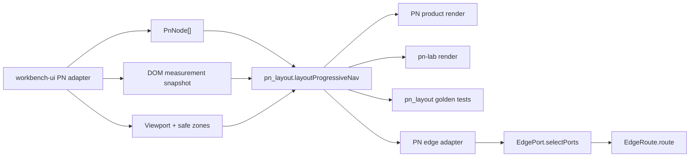

# Design Document

## Overview

`progressive-nav-seam` は、Progressive Navigation (PN) の visible failure を止めるための first-ratchet seam である。目的は PN を map-backed canonical model にすることではなく、本番 UI で見えている破綻を先に閉じること。

中心は次の 6 点:

1. `pn_layout`: `PnNode[] + anchor/viewport/measurement snapshot -> overlay/node/edge/focus/overflow` の typed pure contract。
2. overlay placement: canvas content と重ならない screen-space layer decision。
3. EdgePort integration: PN parent-child edge を既存 `selectPorts -> route` path に乗せ、`edgePathBetweenRects` direct call を禁止。
4. viewport separation: pan/zoom fast path と PN DOM remeasure を分離。
5. collapse / overflow / 3rd-level: action-tree prototype の段階展開を product-quality contract にする。
6. PN lab: `src/labs/pn/` で akaghef が以前の action-tree と同じ感じを目視できる lab。

This design is a spec draft only. It defines implementation scope and tests; it does not modify product code.

## Current Failure Diagnosis

### D1: Edge bypass

Current product PN imports `edgePathBetweenRects` directly at `beta/src/browser/workbench-ui.tsx:34`, computes PN edge paths inside `ProgressiveNavigation` at `workbench-ui.tsx:1151-1169`, and calls `edgePathBetweenRects(parentRect, childRect, 0)` at `workbench-ui.tsx:1165`.

That bypasses existing EdgePort contracts:

- `beta/src/shared/edge_port.ts:84-92` - `selectPorts(...)`
- `beta/src/shared/edge_route.ts:75-92` - `route(...)`
- `beta/src/shared/parent_child_edge_adapter.ts:58-67` - `routeParentChildEdge(...)`

`edgePathBetweenRects` itself is a straight-line helper in `beta/src/browser/edge_geometry.ts:153-157`, not the typed EdgePort route path. Therefore PN edge cannot participate in EdgePort golden tests or branch-aware route metadata.

### D2: Overlay/canvas overlap

`.wb-progressive-nav` is absolute at `left: 72px; top: 307px` with `overflow: visible` and no explicit z-index in `beta/src/browser/workbench-ui.css:520-534`. Active-node placement only clamps to viewport in `workbench-ui.tsx:1001-1009`, and product render applies this directly to the overlay in `workbench-ui.tsx:1233-1243`.

This is not enough to prevent overlap with visible canvas content. The current calculation knows anchor rect and viewport bounds, but not selected canvas node rects, safe zones, or expanded overlay footprint.

### D3: Viewport event coupling

`beta/src/browser/viewer.ts:4201-4222` applies canvas transform and dispatches `m3e:viewport-changed`. PN listens to that event in `workbench-ui.tsx:1202-1212` and immediately calls `measureRootAnchor`, which reads DOM rects and mutates React layout state in `workbench-ui.tsx:1171-1200`.

This makes high-frequency camera movement and expensive PN remeasurement share a trigger. It also means PN can shift/reflow during pan/zoom, exactly when the canvas fast path should remain cheap and stable.

### D4: 2026-06-16 PN + scatter break relation

`docs/tasks/handoff_layout_refactor_pn_integration.md:69-72` records that PN layout through generic `layout()` was implemented and reverted after collapse. The same handoff records at `:92-96` that the 3rd level (`View > Layout > Direction`) had collapsed because the placement was effectively two-level oriented, with incomplete browser confirmation.

The relation is direct: PN was pushed through a generic layout path before PN's own visible invariants were typed. This spec keeps PN as a surface overlay seam first; it reuses layout ideas only through explicit `pn_layout` input/output, not by treating PN as a normal map layout.

### D5: Prototype behavior is stranded

`beta/prototypes/action-tree/app.js` has the behavior baseline:

- visible path/sibling/children expansion: `app.js:80-98`
- hover/click activation, root collapse, reset: `app.js:100-131`
- DOM rect edge anchors: `app.js:133-164`
- search and keyboard command list: `app.js:260-301`
- canvas/navigator grid avoiding unmanaged overlap: `styles.css:38-48`

The product PN should not copy this prototype; it should preserve the behavior in `pn_layout` samples and PN lab Playwright.

## Architecture

### Boundary Map



Forbidden:

```text
workbench-ui PN -> edgePathBetweenRects
workbench-ui PN -> GraphLink nearest endpoint edit helper
src/labs/pn/** -> src/browser/**
src/labs/pn/** -> copied action-tree layout logic
pn_layout -> DOM / React / AppState / viewer globals
```

### Proposed File Structure

Implementation phase may adjust filenames, but ownership must stay stable:

```text
beta/
  src/
    shared/
      pn_layout.ts
      pn_layout_golden.ts
    labs/
      pn/
        pn-lab.html
        pn-lab.tsx
        pn-lab.css
        pn_samples.ts
    browser/
      pn_workbench_adapter.ts       # optional narrow adapter
      workbench-ui.tsx              # product wiring only
  tests/
    fixtures/pn-layout-golden/
      *.json
    unit/
      pn_layout_contract.test.ts
      pn_layout_golden.test.ts
    visual/
      pn_lab.spec.js
      workbench_progressive_nav.spec.js
  dependency-cruiser.config.cjs
  jscpd.config.json
  vite.config.mjs
```

## `pn_layout` Contract

### Public Types

```typescript
export type PnId = string;

export interface PnNode {
  id: PnId;
  parentId?: PnId | null;
  label: string;
  hint: string;
  action?: "command" | "toggle" | "open" | "generate" | "noop";
}

export interface PnRect {
  x: number;
  y: number;
  w: number;
  h: number;
}

export interface PnViewportSnapshot {
  width: number;
  height: number;
  cameraX?: number;
  cameraY?: number;
  zoom?: number;
}

export interface PnSafeZone {
  id: string;
  rect: PnRect;
  weight: number;
  reason: "canvas-content" | "selected-node" | "rail" | "topbar" | "right-panel" | "modal" | "custom";
}

export interface PnNodeMetrics {
  w: number;
  h: number;
}

export type PnPlacementMode = "right-of-anchor" | "dock-left-of-anchor" | "compact" | "fixed-side-panel" | "scroll";
export type PnOverflowMode = "none" | "scroll" | "compact" | "side-panel";
export type PnRouteStyle = "orthogonal" | "line" | "curve";

export interface PnLayoutInput {
  nodes: PnNode[];
  rootId: PnId;
  activeId: PnId;
  anchorRect: PnRect;
  viewport: PnViewportSnapshot;
  safeZones: PnSafeZone[];
  nodeMetrics: Record<PnId, PnNodeMetrics>;
  options?: {
    maxDepth?: number;
    siblingPolicy?: "active-path-plus-siblings" | "active-path-plus-children";
    placementCandidates?: PnPlacementMode[];
    routeStyle?: PnRouteStyle;
    minColumnGap?: number;
    minRowGap?: number;
  };
}

export interface PnPlacedNode {
  id: PnId;
  rect: PnRect;
  depth: number;
  selected: boolean;
  hasChildren: boolean;
  visibleReason: "root" | "active-path" | "sibling" | "child" | "search";
}

export interface PnRoutedEdge {
  id: string;
  sourceId: PnId;
  targetId: PnId;
  sourceRect: PnRect;
  targetRect: PnRect;
  sourceSide: "left" | "right" | "top" | "bottom";
  targetSide: "left" | "right" | "top" | "bottom";
  routeStyle: "orthogonal" | "line" | "curve" | "force-link";
  d: string;
  active: boolean;
}

export interface PnPlacementDecision {
  mode: PnPlacementMode;
  rect: PnRect;
  overlapScore: number;
  canvasNodeOverlapScore: number;
  trialOrder: PnPlacementMode[];
  rejected: Array<{ mode: PnPlacementMode; rect: PnRect; overlapScore: number; canvasNodeOverlapScore: number }>;
}

export interface PnLayoutOutput {
  overlayRect: PnRect;
  placement: PnPlacementDecision;
  visibleNodeIds: PnId[];
  pathIds: PnId[];
  nodes: PnPlacedNode[];
  edges: PnRoutedEdge[];
  focusOrder: PnId[];
  overflow: { mode: PnOverflowMode; clippedIds: PnId[]; scrollRect?: PnRect };
}

export function layoutProgressiveNav(input: PnLayoutInput): PnLayoutOutput;
```

### Contract Rules

- `PnNode.action` is a UI command tag only. Actual side effects stay in product adapter.
- `pn_layout` does not read `pn:id` from map state in first ratchet. It receives `PnNode[]`.
- `anchorRect` and `safeZones` are screen-space rectangles.
- `overlayRect` is screen-space and independent of canvas transform.
- `node.rect` is local to `overlayRect`, so product render can position children under `.wb-progressive-nav`.
- Edge routing converts local node rects into EdgePort `EdgeRect` and uses `routeParentChildEdge` or `selectPorts -> route`.
- All numeric output must be deterministic for golden comparison.

## Visibility Model

The first ratchet uses action-tree behavior:

1. Always include root.
2. Include active path.
3. Include children of the active path node.
4. Include siblings of nodes on the active path when `siblingPolicy = active-path-plus-siblings`.
5. Search filter can reduce visible command rows, but must not remove active path ancestors needed for context.

The 3rd-level case is mandatory:

```text
[GUI] -> View -> Layout -> Direction -> Right/Left/Down/Up
```

The layout output must show at least four depth columns without uncontrolled overflow. If viewport cannot contain the expanded tree, output `overflow.mode` must be `scroll`, `compact`, or `side-panel`; never silent clipping.

## Placement Modes and Overflow

Placement candidates are computed relative to the anchor and viewport. Director resolved order is fixed:

1. `right-of-anchor`: current behavior baseline, but scored against canvas safe zones.
2. `dock-left-of-anchor`: mirror placement when right side overlaps selected / visible canvas node content or right panel.
3. `compact`: deep columns are compacted and/or internally scrolled while keeping canvas-node overlap at zero.
4. `fixed-side-panel`: action-tree-like side panel fallback when expanded depth is too wide.
5. `scroll`: final explicit overflow fallback.

Scoring:

```text
score = weighted safe-zone overlap area
      + viewport overflow penalty
      + anchor occlusion penalty
      + distance penalty
```

Adoption rule:

```text
for mode in [right-of-anchor, dock-left-of-anchor, compact, fixed-side-panel, scroll]:
  compute candidate overlayRect and placed node rects
  compute canvasNodeOverlapScore against selected/visible canvas node safeZones
  if canvasNodeOverlapScore == 0:
    choose candidate
    break
```

The chosen placement must have `canvasNodeOverlapScore = 0`. The general `overlapScore` may still include viewport, rail, topbar, right-panel, anchor, or distance penalties for diagnostics, but the canvas-node component is a hard gate. If no candidate can satisfy zero canvas-node overlap, output must switch to explicit overflow handling (`scroll`, `compact`, or `side-panel`) and must not silently clip. The zero-overlap rule applies to selected / visible canvas node content safeZones, not to internal PN card layout or blank canvas space.

Candidate order, selected mode, rejected candidates, `canvasNodeOverlapScore`, and general `overlapScore` are emitted for golden tests and debugging.

Layer contract:

| Layer | Ownership | Rule |
|---|---|---|
| canvas content | viewer canvas | transformed by camera |
| PN overlay | workbench overlay root | screen-space; not inside transformed canvas |
| PN edge layer | PN overlay child | below PN cards |
| PN node layer | PN overlay child | above PN edges |
| modal/popover | workbench modal layer | above PN |

CSS must give PN overlay an explicit layer token or z-index. The spec does not choose the exact number; implementation must document the relation.

## EdgePort Integration

PN edge route style mapping:

| PN option | EdgeRouteStyle |
|---|---|
| `orthogonal` | `orthogonal` |
| `line` | `line` |
| `curve` | `curve` |

PN first ratchet always uses Tree right semantics for its internal staged tree unless a later canonical PN direction option is added:

```typescript
routeParentChildEdge({
  relation: { kind: "parent-child", parentNodeId: sourceId, childNodeId: targetId },
  parentRect: sourceRect,
  childRect: targetRect,
  surfaceMode: "tree",
  direction: "right",
  routeStyle,
});
```

This deliberately treats PN internal tree as a parent-child edge graph, not GraphLink. Product PN must stop importing `edgePathBetweenRects`; tests and dependency-cruiser enforce this.

## Viewport Separation

### Current coupling to remove

Current product behavior:

```text
applyZoom()
  -> canvas transform update
  -> dispatch m3e:viewport-changed
  -> PN measureRootAnchor()
  -> getBoundingClientRect()
  -> setRootRect / setPlacement
  -> React layout recompute
```

Target behavior:

```text
camera fast path
  -> canvas transform update
  -> cheap overlay transform or no PN change
  -> no full PN remeasure

bounded PN remeasure triggers
  -> open / close
  -> activeId changes
  -> root/anchor identity changes
  -> resize
  -> layout-options-changed
  -> camera settled event, not every camera tick
  -> explicit PN refresh
```

Implementation can add a narrow event such as `m3e:viewport-settled` or coalesce `m3e:viewport-changed` in product adapter, but PN must not recompute `layoutProgressiveNav` per pan/zoom tick.

Testable invariant:

- During a drag pan sequence, PN overlay remains visually stable relative to its screen-space strategy.
- Recompute count is bounded (for example <= 2 after initial open + settled event) while many viewport events fire.
- Linear panel fast path remains independent; PN changes must not regress `syncLinearPanelPosition`.

## PN Lab

### Purpose

PN lab is a visual approval surface. It makes the first-ratchet behavior inspectable without starting the full viewer.

### Input

`src/labs/pn/pn_samples.ts` provides deterministic samples:

- `gui-basic`: `[GUI]` root with Board/View/Scatter/Mindmap/Annotation/Panel.
- `view-layout-3rd-level`: `View > Layout > Direction / Depth Align / Edge Route / Link Route`.
- `active-node-generation`: active-node N2-N6 / N7-N26 groups.
- `overflow-narrow`: narrow viewport forcing scroll or side-panel fallback.
- `safe-zone-collision`: anchor near selected canvas content, requiring non-overlap placement.

### Lab UI

Lab controls:

- sample selector
- active node selector
- viewport size preset
- anchor position preset
- safe-zone toggle
- route style selector
- search input
- reset/collapse

Lab display:

- simulated canvas content rects
- PN overlay
- PN node cards
- EdgePort routed edges
- focus order / output JSON summary
- overlap score and overflow mode

### Action-tree baseline

The lab should feel like `beta/prototypes/action-tree`: staged reveal, parent node position retained, keyboard/search available, root collapse/reset available, and safeZone no-overlap inspectable from `PnNode[]` input. The difference is that lab rendering consumes `layoutProgressiveNav` output rather than using prototype-local layout logic.

The exact visual approval line is not fixed in this spec. Akaghef approves the PN lab by動作感 after the lab exposes the minimum judgment surface:

- staged expansion
- parent node position retention
- keyboard/search
- safeZone no-overlap
- EdgePort routed edges
- placement/overflow summary visible enough to diagnose failures

## Golden Samples

Golden schema:

```typescript
interface PnLayoutGolden {
  id: string;
  input: PnLayoutInput;
  expected: {
    placementMode: PnPlacementMode;
    overlayRect: PnRect;
    visibleNodeIds: PnId[];
    pathIds: PnId[];
    focusOrder: PnId[];
    overflowMode: PnOverflowMode;
    canvasNodeOverlapScore: 0;
    edges: Array<{
      id: string;
      sourceSide: EdgePortSide;
      targetSide: EdgePortSide;
      routeStyle: EdgeRouteStyle;
      endpointSummary: { sx: number; sy: number; tx: number; ty: number };
    }>;
    maxSafeZoneOverlap: number;
  };
}
```

Initial golden set:

- `gui-root-open`
- `view-layout-third-level`
- `layout-edge-route-fourth-level`
- `active-node-expand`
- `narrow-overflow-scroll`
- `safe-zone-avoid-selected-node`
- `viewport-pan-remeasure-bounded`
- `search-filter-keeps-path`

Golden updates must be explicit. Normal test runs must not rewrite fixtures.

## Ratchet

### dependency-cruiser

Add PN-specific rules:

- `src/labs/pn/**` must not import `src/browser/**`.
- `src/shared/pn_layout.ts` must not import `src/browser/**`, `react`, or DOM APIs.
- product PN adapter must not import `src/browser/edge_geometry.ts` or `edgePathBetweenRects`.
- `src/labs/pn/**` may import only `src/shared/pn_layout.ts`, EdgePort public contracts as needed, and lab-local sample/render files.

### jscpd

Add paths:

- `src/shared/pn_layout.ts`
- `src/labs/pn`
- `src/browser/workbench-ui.tsx` or narrow PN adapter file

Do not ignore PN layout or edge routing logic. Exclude only generated fixtures/snapshots if needed.

### typecheck

`tsconfig.labs.json` or equivalent must include `src/labs/pn/**` and shared `pn_layout`.

### EN5-Lite

Required checks:

```bash
npm --prefix beta run typecheck
npm --prefix beta run lint:deps
npm --prefix beta run lint:copy
npx --prefix beta vitest run tests/unit/pn_layout_*.test.*
npx --prefix beta playwright test tests/visual/pn_lab.spec.js
npx --prefix beta playwright test tests/visual/workbench_progressive_nav.spec.js
```

Exact command names may be consolidated during implementation, but all gates must exist.

## Follow-up Design Notes

### map-backing / `pn_model`

Future contract:

```text
map subtree / attributes pn:id,pn:hint,pn:action -> PnNode[]
```

This belongs after visible-fix. It should be a model adapter that feeds `pn_layout`, not part of `pn_layout` itself.

### canonical Surface View name reconcile

Product PN currently exposes legacy concepts in labels/actions. Future reconcile should map:

- `tree -> Tree`
- `timeline -> Axial(timeline)`
- `scatter -> Disperse(scatter)`
- `system -> System`
- `mindmap` and `logic-chart` need canonical interpretation per `map_layout_modes.md`

Visible-fix spec should not multiply legacy names. It can keep current labels for product behavior while new types use canonical terms.

## Director Resolved

### PN-Q1: placement fallback priority

Placement trial order is fixed:

```text
right-of-anchor -> dock-left-of-anchor -> compact -> fixed-side-panel -> scroll
```

The implementation must adopt the first candidate whose canvas-node `overlapScore = 0`. This order is part of `PnPlacementDecision.trialOrder` and golden output.

### PN-Q2: zero canvas-node overlap

Chosen placement must satisfy:

```text
canvasNodeOverlapScore == 0
```

The check covers selected / visible canvas node safeZones against both `overlayRect` and placed PN node rects. It does not constrain blank canvas space or PN's internal card-to-card layout except through normal PN layout/overflow rules.

If zero canvas-node overlap is impossible, output must choose explicit overflow (`scroll`, `compact`, or `side-panel`) and never silently clip.

### PN-Q3: lab approval

The PN lab visual approval line is intentionally not pre-fixed. Akaghef approves by lab動作感. The spec fixes only the minimum judgment surface: action-tree staged expansion, parent node position retention, keyboard/search, and safeZone no-overlap from `PnNode[]` input.

## Risks

- PN no-overlap scoring can become too clever and introduce new motion instability. Keep candidates small and deterministic.
- Full viewer Playwright can still pass while real server path fails; this is accepted for first ratchet only because map-backing is non-goal.
- Product PN still has action side effects in `workbench-ui.tsx`; first ratchet should isolate layout/edge behavior without refactoring command semantics.
- If exact canvas content rects are expensive to collect, first implementation should start with selected-node rect + fixed UI safe zones, then expand.
