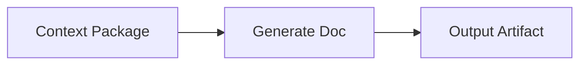
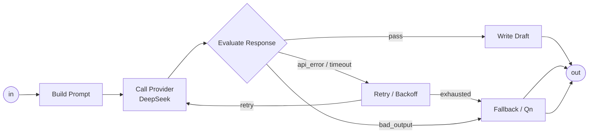
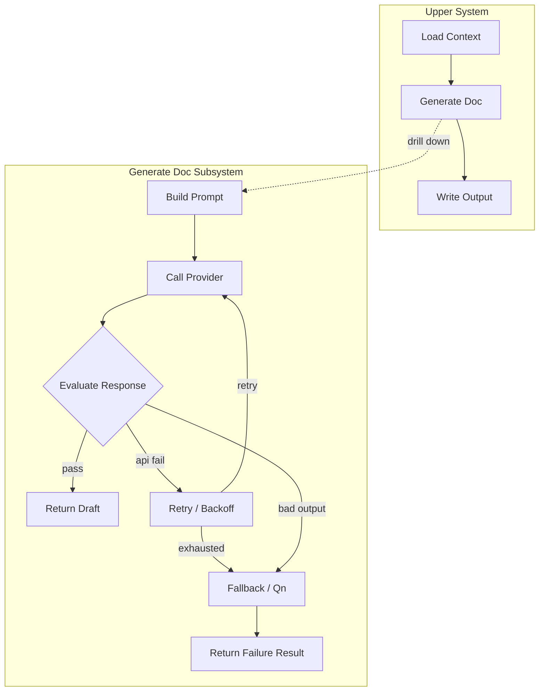

# Generate Doc Subsystem UI

`Generate Doc` は、PJ04 の subsystem UI を試す題材として適している。

上位 system では抽象化して、次のような 1 node として見せる。



人間が全体を見るときはこれで十分。
`Generate Doc` の中に入ると、実際の処理は次の subsystem として見える。



つまり上位の `Generate Doc` は 1 node だが、内部は subsystem。



UI としては、上位では太い 1 本の lane で `Generate Doc -> Output` を見せ、失敗時の retry / fallback loop は subsystem 内に閉じる。
上位 system の図を複雑にしないことが重要。

## UI Interaction

- `Generate Doc` node を選択する
- `Enter` または `[` で subsystem へ入る
- `]` で上位 system へ戻る
- 上位 node には「内部に loop あり」の小アイコンを出す
- 失敗時 / 警告時だけ、上位 node に赤 / 黄バッジを出す
- `j/k` で具象度を上げると、内部 subsystem preview が見える

## Block Template

```yaml
block_template: llm.generate_doc.subsystem
kind: subsystem
outer:
  label: Generate Doc
  reads:
    - state.contextPackage
    - state.docGoal
  writes:
    - state.draftDocument
inner:
  nodes:
    - build_prompt
    - call_provider
    - evaluate_response
    - retry_backoff
    - fallback_qn
    - return_draft
  edges:
    - build_prompt -> call_provider
    - call_provider -> evaluate_response
    - evaluate_response/pass -> return_draft
    - evaluate_response/api_error -> retry_backoff
    - retry_backoff/retry -> call_provider
    - retry_backoff/exhausted -> fallback_qn
    - evaluate_response/bad_output -> fallback_qn
```

## Design Decision

Fallback loop は上位 system に出さない。
subsystem 内部の責務にする。

上位 system は:

```text
Generate Doc -> Output
```

下位 subsystem は:

```text
Call Provider -> Evaluate -> Retry/Fallback -> Return
```

この分離により、複雑な LangGraph 機能を M3E で扱う場合でも、上位の system diagram が破綻しない。
PJ04 の subsystem UI 試作としては、`Generate Doc Subsystem` を最初の標準テンプレ候補にする。

*2026-04-29*
