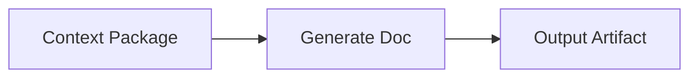
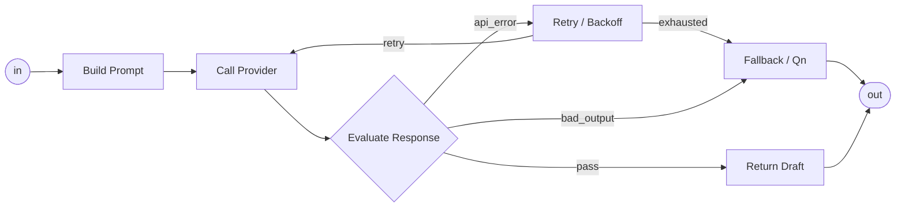

# LangGraph Node Template Support

目的: LangGraph の node / edge / state / checkpoint 機能を、M3E の System Block Template として量産可能にする。

LangGraph の API をそのまま UI に出すのではなく、M3E 上では次の形へ翻訳する。

```text
LangGraph pattern
  -> M3E System Block Template
  -> Contract Tree
  -> GraphSpec
  -> Runtime Board / Trace
```

## 1. Block Template 表テンプレ

各 block template は、最低限この表で定義する。

| 項目 | 例 | 意味 |
|---|---|---|
| `block_id` | `langgraph.node.process` | テンプレの安定ID |
| `label` | `Process Node` | System Diagram 上の初期表示名 |
| `kind` | `agent` / `tool` / `router` / `subsystem` | M3E node kind |
| `langgraph_pattern` | `add_node` | 対応する LangGraph 機能 |
| `outer_role` | `1 step process` | 上位 system 上での見え方 |
| `inner_contract` | `input/output/reads/writes/failure` | Contract Tree に必要な情報 |
| `state_reads` | `state.context` | 読む state channel |
| `state_writes` | `state.result` | 書く state channel |
| `edge_ports` | `default`, `error` | 出入口として持つ edge label |
| `failure_policy` | `retry`, `fallback_qn` | 失敗時の扱い |
| `trace_fields` | `latency_ms`, `status`, `error` | Runtime Board に出す trace |
| `ui_l0` | `label only` | 具象度 L0 の表示 |
| `ui_l2` | `kind + reads/writes badge` | 具象度 L2 の表示 |
| `ui_l5` | `live state / span` | 具象度 L5 の表示 |
| `required_fields` | `node_id`, `reads`, `writes` | template instantiate 時に必須の項目 |
| `default_values` | `retry: 0` | 省略時の値 |

## 2. LangGraph Pattern 対応表

| LangGraph pattern | M3E block template | 意味 |
|---|---|---|
| `StateGraph` | `langgraph.subsystem.state_graph` | state を持つ subsystem 全体 |
| `add_node` | `langgraph.node.process` | 通常の処理 node |
| `add_edge` | `langgraph.edge.default` | 無条件遷移 |
| `add_conditional_edges` | `langgraph.node.router` | 条件分岐 node |
| `TypedDict` / state schema | `langgraph.state.schema` | State Contract |
| reducer / `Annotated` | `langgraph.state.channel` | channel + reducer contract |
| `Send` | `langgraph.flow.parallel_send` | fan-out / map / 並列実行 |
| subgraph | `langgraph.subsystem.child_graph` | node の内側に別 graph を持つ |
| checkpoint / thread | `langgraph.runtime.thread` | resume 可能な実行系列 |
| interrupt | `langgraph.flow.human_gate` | 人間判断を挟む gate |
| `Command` | `langgraph.flow.command` | state update + goto |
| `ToolNode` | `langgraph.node.tool` | tool call 実行 node |

## 3. Core Templates

### 3.1 `langgraph.node.process`

通常の 1 step 処理 node。
LLM call、pure function、transform 処理の共通土台。

| 項目 | 例 | 意味 |
|---|---|---|
| `block_id` | `langgraph.node.process` | 通常処理 node template |
| `label` | `Process` | 表示名 |
| `kind` | `agent` or `tool` | LLM なら agent、決定的関数なら tool |
| `langgraph_pattern` | `add_node` | LangGraph の node |
| `state_reads` | `state.input` | 入力 channel |
| `state_writes` | `state.output` | 出力 channel |
| `edge_ports` | `default`, `error` | 通常遷移と失敗遷移 |
| `required_fields` | `node_id`, `reads`, `writes`, `callable_ref` | 実行に必要 |
| `trace_fields` | `status`, `latency_ms`, `error` | 最小 trace |

```yaml
block_template: langgraph.node.process
kind: tool
outer:
  label: Process
  ports:
    in: [default]
    out: [default, error]
contract:
  reads: []
  writes: []
  callable_ref: ""
  input_schema: {}
  output_schema: {}
  failure:
    retry: 0
    on_error: error
  trace:
    step_id: ""
```

### 3.2 `langgraph.node.llm`

LLM provider を 1 回呼ぶ node。
DeepSeek で 1 つ処理する場合はこの template。

| 項目 | 例 | 意味 |
|---|---|---|
| `block_id` | `langgraph.node.llm` | LLM call node |
| `label` | `Generate Doc` | 表示名 |
| `kind` | `agent` | LLM 処理 |
| `langgraph_pattern` | `add_node` | LangGraph 上は通常 node |
| `provider` | `deepseek` | LLM provider |
| `model` | `deepseek-chat` | model |
| `prompt` | `...` | prompt-text |
| `state_reads` | `state.contextPackage` | LLM 入力 |
| `state_writes` | `state.draftDocument` | LLM 出力 |
| `edge_ports` | `default`, `api_error`, `bad_output` | 通常 / API失敗 / 出力不正 |

```yaml
block_template: langgraph.node.llm
kind: agent
outer:
  label: Generate Doc
  ports:
    in: [default]
    out: [default, api_error, bad_output]
contract:
  reads:
    - state.contextPackage
  writes:
    - state.draftDocument
  provider:
    name: deepseek
    model: deepseek-chat
    max_tokens: 1200
    temperature: 0.2
    timeout_ms: 30000
  prompt_text: ""
  output_schema: {}
  failure:
    retry: 1
    on_error: api_error
  trace:
    step_id: generate_doc
    fields:
      - latency_ms
      - input_tokens
      - output_tokens
      - error
```

### 3.3 `langgraph.node.router`

条件分岐 node。
LangGraph の `add_conditional_edges` に対応する。

| 項目 | 例 | 意味 |
|---|---|---|
| `block_id` | `langgraph.node.router` | 分岐 node |
| `kind` | `router` | M3E node kind |
| `langgraph_pattern` | `add_conditional_edges` | 条件分岐 |
| `route_keys` | `pass`, `fail`, `default` | 分岐 label |
| `state_reads` | `state.evaluation` | 判定に読む state |
| `state_writes` | なし | 原則 route のみ |

```yaml
block_template: langgraph.node.router
kind: router
outer:
  label: Route
  ports:
    in: [default]
    out: [pass, fail, default]
contract:
  reads:
    - state.evaluation
  route_keys:
    - pass
    - fail
    - default
  default_route: default
  callable_ref: ""
  trace:
    step_id: route
```

### 3.4 `langgraph.flow.retry`

失敗時に同じ node へ戻す loop。
上位 system では隠し、subsystem 内で持つのが基本。

| 項目 | 例 | 意味 |
|---|---|---|
| `block_id` | `langgraph.flow.retry` | retry/backoff loop |
| `kind` | `subsystem` | retry を含む小 graph |
| `langgraph_pattern` | `conditional edge + back edge` | 条件付き戻り |
| `route_keys` | `retry`, `exhausted` | retry する / 尽きた |
| `state_reads` | `state.error`, `state.retryCount` | 失敗情報 |
| `state_writes` | `state.retryCount` | retry 回数更新 |

```yaml
block_template: langgraph.flow.retry
kind: subsystem
outer:
  label: Retry / Backoff
contract:
  reads:
    - state.error
    - state.retryCount
  writes:
    - state.retryCount
  max_attempts: 2
  backoff_ms: 1000
  routes:
    retry: call_provider
    exhausted: fallback_qn
```

### 3.5 `langgraph.flow.human_gate`

人間判断を挟む node。
LangGraph interrupt 相当。

| 項目 | 例 | 意味 |
|---|---|---|
| `block_id` | `langgraph.flow.human_gate` | human approval / Qn |
| `kind` | `agent` or `router` | Qn生成なら agent、承認分岐なら router |
| `langgraph_pattern` | `interrupt` | 中断して人間入力を待つ |
| `edge_ports` | `approve`, `reject`, `edit` | 人間判断 |
| `runtime_board` | required | Runtime Board 上に出す |

```yaml
block_template: langgraph.flow.human_gate
kind: router
outer:
  label: Human Gate
  ports:
    in: [default]
    out: [approve, reject, edit]
contract:
  reads:
    - state.qn
    - state.draftDocument
  writes:
    - state.humanDecision
  interrupt:
    before: true
    prompt: ""
  trace:
    step_id: human_gate
```

### 3.6 `langgraph.flow.parallel_send`

複数 item を並列に処理する fan-out。
LangGraph の `Send` に対応する。

| 項目 | 例 | 意味 |
|---|---|---|
| `block_id` | `langgraph.flow.parallel_send` | fan-out / map |
| `kind` | `subsystem` | 並列処理を持つ subsystem |
| `langgraph_pattern` | `Send` | item ごとに node を起動 |
| `state_reads` | `state.items` | 並列対象 |
| `state_writes` | `state.results` | 集約結果 |
| `reducer` | `append` | 結果 merge |

```yaml
block_template: langgraph.flow.parallel_send
kind: subsystem
outer:
  label: Parallel Map
contract:
  reads:
    - state.items
  writes:
    - state.results
  item_channel: state.items
  result_channel: state.results
  target_node: ""
  reducer: append
  trace:
    step_id: parallel_send
```

### 3.7 `langgraph.subsystem.state_graph`

1 system / subsystem 全体。
M3E の scope と対応する。

| 項目 | 例 | 意味 |
|---|---|---|
| `block_id` | `langgraph.subsystem.state_graph` | graph 全体 template |
| `kind` | `subsystem` | M3E scope |
| `langgraph_pattern` | `StateGraph` | state graph |
| `state_schema` | `WeeklyReviewState` | state contract |
| `entry` | `load_sources` | entry node |
| `terminal` | `write_outputs` | terminal node |

```yaml
block_template: langgraph.subsystem.state_graph
kind: subsystem
outer:
  label: State Graph
contract:
  state_schema: {}
  channels: []
  entry: ""
  terminals: []
  graph_spec_version: "0.1"
  compile:
    deterministic: true
```

## 4. Example: Generate Doc Subsystem

上位では 1 node。



内部では fallback loop を持つ subsystem。



```yaml
block_template: llm.generate_doc.subsystem
kind: subsystem
outer:
  label: Generate Doc
  reads:
    - state.contextPackage
    - state.docGoal
  writes:
    - state.draftDocument
inner:
  uses:
    - langgraph.node.process      # build_prompt
    - langgraph.node.llm          # call_provider
    - langgraph.node.router       # evaluate_response
    - langgraph.flow.retry        # retry_backoff
    - langgraph.flow.human_gate   # fallback_qn
  edges:
    - build_prompt -> call_provider
    - call_provider -> evaluate_response
    - evaluate_response/pass -> return_draft
    - evaluate_response/api_error -> retry_backoff
    - retry_backoff/retry -> call_provider
    - retry_backoff/exhausted -> fallback_qn
    - evaluate_response/bad_output -> fallback_qn
```

## 5. Next

このメモを PJ04 の正式 task に落とす場合:

1. `System Block Template` を PJ00 Glossary に追加する
2. `projects/PJ04_MermaidSystemLangGraph/docs/system_block_templates.md` を作る
3. `llm.generate_doc.subsystem` を最初の標準 template として定義する
4. M3E UI では template insert → Contract Tree 初期化 → GraphSpec compile の順で使う

*2026-04-29*
