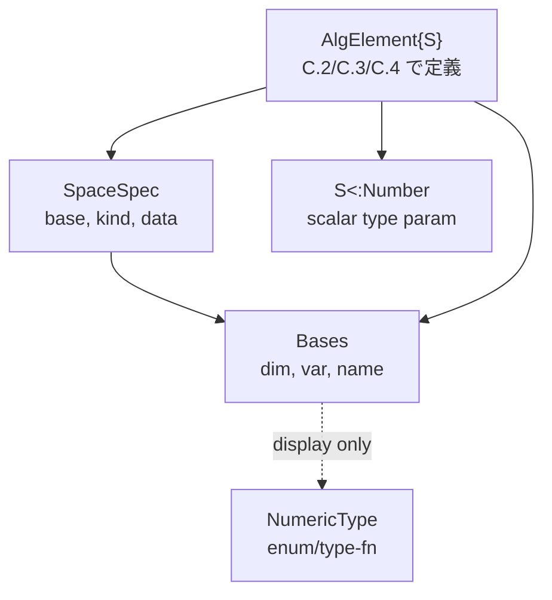

# 1. 概要

Shared core は AlgLibMove の **最下層 leaf module** で、StrAlg / VectAlg / PolAlg の 3 系統
すべてから参照される。構成:

- **NumericType** — 係数の数値分類 (double / sym / parameter) を表す enum-like 値。
- **SpaceSpec** — 代数要素が属する空間の仕様 (次元、基底、kind=scalar/vector/tensor、構造定数)。
- **Bases** — 基底集合 (次元 + basis label)。代数要素の index ラベル源。

依存方向 (他 module を参照しない):

```
PolAlg / StrAlg / VectAlg / SparseEx
          │
          ▼
     Shared core  ──  (Bases, SpaceSpec, NumericType)
```

Shared core 内部の依存:

- `SpaceSpec` → `Bases` (1:N)
- `Bases` → (optional) `NumericType` (MATLAB 側の ctype/ptype フィールド)
- `NumericType` は独立

scalar_type_decision Q1=D (`Alg{S<:Number}` パラメトリック) に沿い、Bases も `Bases{S}` として
係数型をパラメータ化する。ただしデフォルト S / mutable 性等は TBD。

# 2. NumericType

## 2.1 MATLAB 側の現状

`matlab_src/Core/Base/NumericType.m` は `enumeration` で 3 値 `D`(double,priority 0) /
`S`(sym,1) / `P`(sym,1)。`Bases.ctype/ptype` に保持、`validate` で `isa` 判定、`getType` で
priority max を取る reducer、`zeros(m,n)` で対応零行列生成。runtime flag による double/sym
切替が実態で、bases_coeff_type Q3(a) の「苦しさ」の一因。

## 2.2 Julia 側の設計

scalar_type_decision Q1=D で **係数型はパラメトリック `S<:Number`** に移行するため、
NumericType を **runtime dispatch flag として使う必要は原則消える**。ただし以下の用途が残る:

1. **分類トレーシング** — golden parity test で MATLAB 側の ctype 記録を復元・比較。
2. **ユーザー向け UI** — "この Bases は double ベース / symbolic ベース" を文字列で示す。
3. **promote 優先度の legacy 表現** — priority を保存、decision log として。

設計案:

```julia
@enum NumericType INT RATIONAL FLOAT COMPLEX SYMBOLIC PARAMETER
```

もしくは型関数ベース (推奨、Julia idiomatic):

```julia
numerictype(::Type{<:Integer})            = INT
numerictype(::Type{<:Rational})           = RATIONAL
numerictype(::Type{<:AbstractFloat})      = FLOAT
numerictype(::Type{<:Complex})            = COMPLEX
numerictype(::Type{<:Symbolics.Num})      = SYMBOLIC
```

契約:

- `numerictype(::Type{S}) -> NumericType` — 型 S から分類を返す。dispatch 用ではなく表示・記録用。
- `numerictype(x) = numerictype(typeof(x))` — 値経由。
- MATLAB `D/S/P` 3 値は `FLOAT` / `SYMBOLIC` / `PARAMETER` にマップ (parity test 用)。

**非ゴール**: multimethod を `NumericType` で分岐させること。それは Q1=D で自動化される。

# 3. SpaceSpec

## 3.1 MATLAB 側の現状

`matlab_src/Core/StrAlgebra/SpaceSpec.m` (`< handle`): properties = `base (1,:) Bases`,
`kind ∈ {"tensor","scalar","vector","matrix"}`, `data` (tensor 構成 SpaceSpec)、`SC dictionary`
(構造定数)。static `tensorSpec(i1,i2)`、`or(i1,i2)` 結合、`INIT` constant。handle で keyHash 同一性。

## 3.2 Julia 側の設計

MATLAB 版は handle (参照セマンティクス) だが、Julia 側は **value-semantic immutable struct** に
移行する (handle vs value の debt #21 は value 選好):

```julia
@enum SpaceKind SCALAR VECTOR MATRIX TENSOR

struct SpaceSpec
    base::Vector{Bases}         # 基底 (1..N)
    kind::SpaceKind
    data::Union{Nothing, Vector{SpaceSpec}}   # tensor 構成情報
    # SC (structure constant) は別レイヤに分離 (C.2 VectAlg 側)
end
```

- **SC (構造定数) は SpaceSpec から分離**: SC は VectAlg 固有で、PolAlg/StrAlg は不要。shared core
  に持たせるのは責務過多。→ VectAlg 側に `Algebra{...}` wrapper を置く (C.2 で決定)。
- `data` を `Union{Nothing, Vector{SpaceSpec}}` とするかは未決 (TBD_tensor_repr)。

### 不変条件

- `length(base) ≥ 1`
- 各 `Bases` の `dim` は正整数
- `kind == TENSOR ⇒ data !== nothing && length(data) ≥ 2`
- `kind ∈ {SCALAR, VECTOR, MATRIX} ⇒ data === nothing`

### 契約 API

| 関数 | シグネチャ | 意味 |
|---|---|---|
| `dim` | `dim(s::SpaceSpec) -> Int` | 総次元 = Σ `dim(b)` |
| `basis` | `basis(s::SpaceSpec) -> Vector{Bases}` | 基底配列 |
| `kindof` | `kindof(s::SpaceSpec) -> SpaceKind` | |
| `tensor` | `tensor(s1, s2) -> SpaceSpec` | static `tensorSpec` 相当 |
| `Base.:(==)` | 構造同値 (base, kind, data) | |
| `Base.hash` | `==` と整合 | |
| `Base.:(|)` | `or` 相当 (要不要は TBD) | |

# 4. Bases

## 4.1 MATLAB 側の現状

`matlab_src/Core/Base/Bases.m` (`< matlab.mixin.Heterogeneous & handle`): protected
`dim_::int`, `var_::string (1,:)`; public `name::char='basis'`, `ctype/ptype::NumericType=D`;
transient `ZERO` (零元キャッシュ)。Sealed methods: `dim, dims, setVar, getCtype, validate, string, disp`。

**重要**: MATLAB 版 **`Bases` は係数ベクトルを持たない**。ラベル集合 + 次元 + 数値型タグのみ。
係数は StrAlg/VectAlg/PolAlg 側の `cf` が持つ。bases_coeff_type.md が想定した「係数 + SpaceSpec」は
VectAlg の `(cf, bs)` に相当し、Bases 自体はラベル値オブジェクト。
→ Julia 側で「係数入り Bases」に再設計するかは TBD。

## 4.2 Julia 側の設計

### 案 A (MATLAB 忠実 — ラベルのみ) 【推奨】

```julia
struct Bases
    dim::Int
    var::Vector{Symbol}     # or String
    name::String
end
```

- 係数型パラメータを持たない (MATLAB と同様)。
- `ctype/ptype` は削除 (numerictype(S) で代替)。
- 不変条件: `dim ≥ 1`, `length(var) == dim`, `allunique(var)`.

### 案 B (bases_coeff_type.md 想定 — 係数入り)

```julia
struct Bases{S<:Number}
    coeffs::Vector{S}
    space::SpaceSpec
end
```

- 代数要素を直接表す (現 MATLAB の StrAlg.cf / VectAlg.cf に相当)。
- デフォルト S は TBD (bases_coeff_type Q1、候補 `Rational{Int}`).
- open_problems 側の命名はこちらを想定していたため、**開発チームで命名衝突の解決が必要**。

**TBD_bases_role**: A/B どちらを採るか。推奨は **A + 別途 `AlgElement{S}` (または既存の各代数型)** で
係数を持たせる構造。bases_coeff_type.md の `Bases{S}` 想定は名前だけ `AlgVector{S}` などに改名すべき。
ここでは**案 A を採用した場合の契約**を記述する。

### 契約 API (案 A 採用時)

| 関数 | シグネチャ | 意味 |
|---|---|---|
| `dim` | `dim(b::Bases) -> Int` | |
| `dims` | `dims(bs::Vector{Bases}) -> Vector{Int}` | MATLAB `dims` |
| `varnames` | `varnames(b::Bases) -> Vector{Symbol}` | |
| `Base.:(==)` | 構造同値 | |
| `Base.hash` | | |
| `Base.show` | `"Basis:[name]\n[var1, var2, ...]"` | |
| `validate` | `validate(b::Bases, ::Type{S})::Bool` | S がこの Bases で許容されるか (常に true が基本、将来の制約用) |

### 代数要素型 (参考、詳細は C.2/C.3/C.4)

案 A に付随して、係数を持つ型は以下のように別モジュールで定義:

```julia
# Phase C.2 PolAlg 側
struct PolAlg{S<:Number}
    coeffs::Vector{S}
    powers::Matrix{Int}
    base::Bases
    space::SpaceSpec
end

# Phase C.4 VectAlg 側
struct VectAlg{S<:Number}
    storage::SparseEx{S}
    bases::Vector{Bases}
    space::SpaceSpec
end
```

scalar_type_decision Q1=D に準拠、`promote_type(Float64, Num) = Num` で昇格自動化。

### 代数要素側の共通契約 (Phase C.2 以降でも shared core 契約として参照)

| 契約 | 記述 |
|---|---|
| `eltype(::Type{Alg{S}}) = S` | |
| `length, size, getindex` | 基底インデックスでの係数アクセス |
| `zero(::Type{Alg{S}})`, `one(...)` | `zero(S)` / `one(S)` 委譲 (Q4) |
| `iszero(x)` | 構造判定 `all(iszero, coeffs)`、記号厳密判定は simplify API 側 |
| `+, -, *(c::S, a::Alg{S})` | scalar 倍は代数側定義 (Q5=A) |
| `convert(::Type{Alg{T}}, a::Alg{S})` | `T` へ `convert.(T, coeffs)` |
| `promote_rule(::Type{Alg{A}}, ::Type{Alg{B}}) = Alg{promote_type(A,B)}` | |

**不変条件**: `length(coeffs) == dim(space)` (dense 表現の場合)、sparse は `SparseEx` 側の契約。

### mutable vs immutable

**TBD_mutable_vs_immutable**: MATLAB は handle、Julia は immutable struct 推奨だが、
`coeffs` の in-place 更新が性能要件にあれば `mutable struct` 検討。Phase B 範囲外、C.2 着手時に決定。

# 5. 依存図



NumericType は構造依存せず、display/記録専用。

# 6. Stage 対応

| Stage | 内容 | 本文書との関係 |
|---|---|---|
| C.1-a | **本設計ドキュメント策定** | 本書 |
| C.1-b | Bases / SpaceSpec / NumericType の Julia 実装 | 契約に従い実装 |
| C.1-c | shared core の単体 test + MATLAB parity | test 戦略 §8 |
| C.2 | PolAlg 移植 (shared core 依存) | `PolAlg{S}` が Bases/SpaceSpec 参照 |
| C.3 | SparseEx 移植 | 係数型 S を shared core と揃える |
| C.4 | VectAlg 移植 | Bases 配列 + SparseEx + SpaceSpec |
| C.5 | StrAlg 移植 | 同上 |

# 7. open_problems スロット (TBD)

| ID | 内容 | 決定トリガ |
|---|---|---|
| `TBD_bases_coeff` | bases_coeff_type Q1: デフォルト係数型 (Rational{Int} 仮) | C.2 PolAlg 着手時 |
| `TBD_bases_role` | 案 A (ラベル値オブジェクト) vs 案 B (係数入り) の採用 | 本書レビュー後即決を推奨 |
| `TBD_mutable_vs_immutable` | 代数要素型を mutable にするか | C.2 着手時、性能要件確定後 |
| `TBD_tensor_repr` | SpaceSpec.data の Union{Nothing, Vector{SpaceSpec}} 形態 | C.4 VectAlg tensor 実装時 |
| `TBD_sc_location` | 構造定数 SC を shared core から VectAlg 側へ分離する最終方針 | C.4 着手時 |
| `TBD_numerictype_necessity` | NumericType enum を実際に保持するか、型関数だけで十分か | C.1-b 実装時 |

# 8. test 戦略概要

C.0-b parity framework との連動:

1. **単体 test (Julia 側)**:
   - `Bases`: `dim`, `varnames`, `==`, `hash`, `show`
   - `SpaceSpec`: `tensor`, `dim`, `==`, 不変条件違反時のエラー
   - `NumericType`: `numerictype(T)` が期待値を返す
2. **代数要素契約 test (C.2 以降と連動)**:
   - `zero(Alg{S})`, `one(Alg{S})`, `iszero` の構造判定
   - 加減乗 (`+, -, *`) の結果型
   - `@inferred` で型安定性 (パラメトリック S の伝播)
3. **MATLAB golden parity**:
   - `Bases` 直列化 — MATLAB 側 `save('.mat')` を fixture、Julia 側 load & 再構築後 `==`
   - `SpaceSpec` の tensor 結合 — 同じ入力で dim と base 配列が一致
   - `NumericType` の MATLAB D/S/P ↔ Julia FLOAT/SYMBOLIC/PARAMETER マッピング

parity framework (refactor_boundary_policy) に従い、MATLAB 実装を読み替えた contract レベルでの
一致を検証。内部表現 (handle vs value、enum vs type-fn) は一致を要求しない。

# 9. 非ゴール

- 実装コード本体 (C.1-b で対応)
- `SparseEx` の設計 (C.3 別 module)
- `VectAlg` / `StrAlg` / `PolAlg` の代数要素型の詳細 (C.2/C.4/C.5)
- 相互変換 API (three_system_inquiry §4、C.6 以降)
- 構造定数 SC の表現 (C.4 VectAlg 側)
- MATLAB `calcTensorExpression` DSL の移植 (debt #7)
- `matlab.mixin.Heterogeneous` 相当の Julia 抽象型設計 (`IAdditive` trait は C.0 共通)
