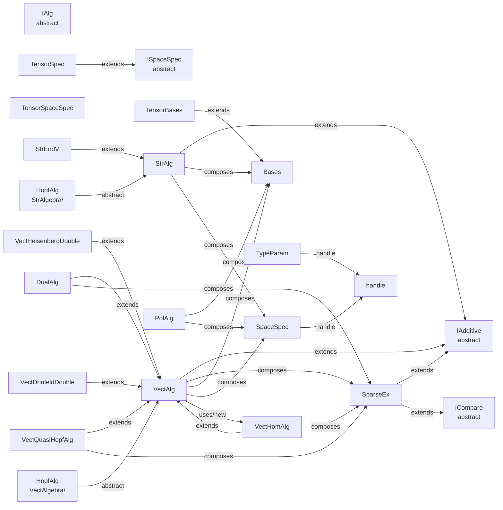

# 1. 調査サマリ

- **3 系統は並立ではなく「表現の粒度で分担」している**。StrAlg=自由代数（モノミアル語 + 係数）、PolAlg=可換多項式（指数ベクトル + 係数）、VectAlg=有限次元ベクトル空間（basis index + 係数テンソル）で、入力側の記述手段と計算側の稠密表現という差。
- **VectAlg は既に SparseEx を composition で取り込んでいる**（`sparse SparseEx=SparseEx` プロパティ + `cf` の get/set 透過委譲）。ユーザーの「継承すべきだったか」という疑念は現コードでは合成で解決済で、継承は不要と判断できる。
- **3 系統間の class 変換メソッドは未整備**。ユーザー実行スクリプト（`C250814Uqsl2BorelSmallStr2Vec.m`）で Str→Vec を手動ループで書き下している。相互変換は debt #12 の未解決核心。
- **依存 DAG は 3 つの island に分かれている**: StrAlg cluster（Hopf/Str 系 Examples を束ねる）、VectAlg cluster（SparseEx/VectHomAlg/DualAlg/QuasiHopf を束ねる最大クラスタ）、PolAlg island（他系統への依存ゼロ、最も独立）。
- #26 段階移植は **PolAlg → SparseEx → VectAlg cluster → StrAlg cluster → 相互変換** の順が候補。

---

# 2. 各系統の classdef 俯瞰表

| 系統 | ファイル | 行数 | 表現対象 | 内部データ | 主要メソッド | 他系統参照 |
|---|---|---|---|---|---|---|
| **StrAlg** | `Core/StrAlgebra/StrAlg.m` | 969 | 自由結合代数（文字列的モノミアル語）。Hopf/Quasi-Hopf の元。 | `cf(:,1)`, `pw(:,:) cell`（各セル=生成元 index の語）, `base Bases`, `spec SpaceSpec`, `ZERO StrAlg`, `ctype NumericType`, `sortedFlag` | `plus/mtimes/mpower`, `calc/calcComplete/simplify` 相当, `replace`（関係式適用）, `algfun/antialgfun`, `unit`, `act`, `rep` | `IAdditive`, `Bases`, `SpaceSpec`, `matlab.mixin.Heterogeneous` |
| **VectAlg** | `Core/common/VectAlg.m` | 828 | 有限次元（テンソル積）ベクトル空間の元。Hopf 構造を structure constant（SC）で保持。 | `cf`（get/set で `sparse` に透過委譲）, `bs (1,:) Bases`, `ZERO`（`bs.ZERO` に委譲）, `spec SpaceSpec`, **`sparse SparseEx = SparseEx`** | `plus/mtimes/kron`（テンソル積）, `calc`, `setBase/setSC`, `getSC/getMor`, `unit/counit/coprod/antipode`（spec 経由）, `algfun` | `IAdditive`, `Bases`, `SpaceSpec`, **`SparseEx`（composition）**, `VectHomAlg`（`getMor` 内で new）, `matlab.mixin.indexing.RedefinesBrace` |
| **PolAlg** | `Core/PolAlgs/PolAlg.m` | 544 | 可換多項式（指数ベクトル表現）。dim 次元変数での polynomial。 | `cf(:,1)`, `pw`（行 = モノミアル、列 = 変数の冪）, `base Bases`, `spec SpaceSpec`, `ctype/ptype NumericType` | `plus/minus/mtimes/mpower/mrdivide`, `C`（canonical 化）, `lfun`, `sym/subs/matrix`, `disp0-disp3` | `IAdditive` は継承せず独自定義に近い。**StrAlg/VectAlg への参照ゼロ**。 |
| SparseEx | `Core/tensor/SparseEx.m` | 410 | 一般 rank の疎テンソル（COO 形式）。 | `key (N,R)`, `val (N,1)`, `size`, `zero` | `convert/set_vkd`, add/mul, `toMatrix` | `IAdditive`, `ICompare` |

各系統とも `IAdditive` mixin を共有しているが、それ以外の共通基底は無い。

---

# 3. SparseEx 関係（#23 への実証）

**事実**:
- `VectAlg.m:14` に `sparse SparseEx = SparseEx` プロパティがあり **composition**。
- `VectAlg.m:24-29` で `set.cf/get.cf` が SparseEx への透過委譲になっている:
  ```matlab
  function obj=set.cf(obj,value)
      obj.sparse=SparseEx(value);
  end
  function value=get.cf(obj)
      value=obj.sparse.toMatrix();
  end
  ```
  つまり外側 API は従来通り `obj.cf`（稠密テンソル）を見せつつ、実態は SparseEx で持つ。これは典型的な decorator/delegation パターン。
- VectAlg 派生の `VectQuasiHopfAlg`, `VectHomAlg`, `DualAlg` はいずれも **SparseEx を field に直接持つ**（`associator SparseEx`, `tensor (1,1) SparseEx` 等）。継承ではなく個別 field として保持。
- `StrAlg` と `PolAlg` は SparseEx を **一切参照しない**（Grep 結果で 0 件）。疎性は各系統の表現形式（pw の cell/指数行列）に内在するため SparseEx 不要。

**「VectAlg が SparseEx を継承すべきだったか」への回答（推測含む）**:
- 現コードは既に「API としては稠密 cf を見せつつ、storage で SparseEx を持つ」という composition で十分機能している。継承（`classdef VectAlg < SparseEx`）だと `key/val/size` API が VectAlg の外側に露出し、basis index と非零 index の二重意味が混乱する。
- 推測: ユーザーが迷ったのは「VectAlg の `plus/mtimes` が SparseEx の `plus/mtimes` を部分的に reimplement している」ため。ただしこの reimplement は basis-aware（`bs` をまたいだ align が必要）なので、継承で `plus` を override しても結局同じ量のコードを書くことになる。
- **Julia 側の推奨**: 入れ子 composition が自然。`struct VectAlg{T}; storage::SparseEx{T}; bs::Vector{Bases}; ... end` で OK。`vectalg.sparseex.primitivenum` のドット path はまさに現 MATLAB と同じ構造。継承（abstract supertype）は IAdditive 相当の trait のみで十分。

---

# 4. 相互変換の有無と完全性

| 方向 | classdef 内メソッド | 実コード |
|---|---|---|
| StrAlg → VectAlg | **なし** | `Execution/C2508/C250814Uqsl2BorelSmallStr2Vec.m` で手動ループ: 生成元の冪をイテレートし `tmp.pw/tmp.cf` から多次元配列 `Mu0` を組み立てる。汎用化されていない。 |
| VectAlg → StrAlg | **なし** | 痕跡なし。 |
| StrAlg ↔ PolAlg | **なし** | 痕跡なし。PolAlg は可換多項式、StrAlg は自由代数のため自明対応は可換 quotient のみ。 |
| PolAlg ↔ VectAlg | **なし** | 痕跡なし。 |
| VectAlg → SparseEx | 透過（`obj.sparse`） | storage 層なので変換ではない。 |
| 内部 → `sym` | `PolAlg.sym`, `StrAlg` の `repMono/rep`, `VectAlg` の `getSC` 経由 | 各自独立。共通 API ではない。 |

**完全性**: 相互変換は未整備。behavioral equivalence テスト（同じ数学的元を 3 表現で往復して一致）は **現状不可能**。移植後 Julia 側で整備する余地が大きい。

---

# 5. 依存 DAG



凡例: `extends` = classdef 継承、`composes` = property に保持、`uses/new` = メソッド内で `new` / static factory。

**観察**:
- `HopfAlg` は StrAlgebra/ と VectAlgebra/ の両方に独立した abstract class として存在する（同名別物）。これは #12 の症状そのもの。
- `IAlg` は Abstract 定義されているが実際の継承は確認されず（要追加調査）。

---

# 6. Delegation chain のクラスタ

| cluster | 構成 | 移植難度 |
|---|---|---|
| **Island A: PolAlg** | `PolAlg`, `Bases`, `SpaceSpec`, `NumericType`, `sortrowCustom`, `PolAnmodalg/PolC2modalg/...` (Examples/PolAlg) | 低。他 2 系統ゼロ依存、単独で Julia 化可能。 |
| **Cluster B: VectAlg + SparseEx** | `VectAlg` → `SparseEx` → `IAdditive/ICompare`、派生 `VectHomAlg/DualAlg/VectQuasiHopfAlg/VectHeisenbergDouble/VectDrinfeldDouble`、`calcTensorExpression`, `TP/SI/PE` | 中。SparseEx を先行決着すれば VectAlg 本体は composition なので並行移植可。ただし `calcTE` DSL (debt #7) に強結合。 |
| **Cluster C: StrAlg + HopfAlg** | `StrAlg` → `StrEndV`, `HopfAlg(Str)`, Examples/StrAlgebra/* (StrUqsl2, StrCnAlg, StrKPAlg ほか 11 件) | 中〜高。`pw cell` の自由語表現と `replace` による関係式適用が MATLAB 的 cell dispatch に依存。Julia では Vector{Int} or tuple で差し替え。 |
| **Shared core** | `Bases`, `SpaceSpec`, `NumericType`, `TypeParam`, `IAdditive`, `ICompare`, `TensorBases/TensorSpec/TensorSpaceSpec` | 先行移植必須（3 系統すべてが基底として参照）。 |

**Island 先行、cluster は bundle**: PolAlg は単独で Phase C 先頭に置ける。VectAlg と StrAlg は shared core が揃ってからまとめて（ただし cluster 内は段階展開）。

---

# 7. debt への回答

### #12 「3 系統並立」
- **並立ではなく分担**。PolAlg＝可換多項式、StrAlg＝自由代数（非可換、Hopf 構造の入力記述に特化）、VectAlg＝有限次元 Hopf の数値表現。数学的には包含関係でなく「同じ代数を別の表現系で書く」relationship。
- **統合すべきか**: 完全統合は否（表現の粒度が違い、演算コストも違う）。ただし:
  - `IAdditive` を真に抽象化して 3 系統共通 trait にする
  - `StrAlg → VectAlg` の汎用変換（quotient to finite-dim representation）を 1 メソッドで
  - `HopfAlg` の abstract を 1 本にまとめ、StrAlg 系/VectAlg 系は implementation として
  という「共通 API 化」は Julia 側で推進する価値あり。

### #23 「VectAlg は SparseEx を継承すべきだったか」
- **否、現 composition が正解**。`sparse SparseEx = SparseEx` + `set.cf/get.cf` の透過 delegation は MATLAB で表現できるベストに近い。継承だと `key/val/size` が VectAlg API に露出し、basis index との意味衝突が起きる。
- Julia 側も composition で OK。trait/abstract 型での共通化は `IAdditive` レベルで十分。「`vectalg.sparseex.primitivenum`」のような入れ子アクセスは素直な struct field path で自然に実現される。

### #26 「段階移植 vs 一気移植」
推奨順序（dependency DAG から導出）:
1. **Shared core 先行**: `Bases`, `SpaceSpec`, `NumericType`, `IAdditive`/`ICompare` trait 化
2. **PolAlg island**: 独立移植、early win としてテスト整備
3. **SparseEx**: VectAlg の storage 層として単体で
4. **VectAlg cluster**: SparseEx 完了後に VectAlg 本体 + 派生 (DualAlg/VectHomAlg/…) を bundle 移植
5. **StrAlg cluster**: HopfAlg 抽象を整理しつつ StrAlg + Examples
6. **相互変換 API**: 3 系統が出揃った最後に `convert(::Type{VectAlg}, ::StrAlg)` 等を新規設計（MATLAB 側には無い、Julia 側で新設）

---

# 8. 未解決 open question

1. **`HopfAlg` の StrAlgebra 版と VectAlgebra 版は同じ抽象を表すか別物か**。同名異クラスは設計ミスの可能性。Julia では 1 本化したい。
2. **`IAlg`（Abstract, Core/common/IAlg.m）の位置付け**。実継承が確認できず、dead code か未活用 contract か。
3. **PolAlg の SpaceSpec/Bases 依存の意味**。PolAlg は可換多項式なのに SpaceSpec まで持つ理由は要確認（代入/特殊化の context 保持？）。
4. **`calcTensorExpression` (debt #7) の VectAlg への結合度**。VectAlg cluster 移植の実難度を決める支配要因。
5. **相互変換 API を Julia 側で新設する場合の設計**。`StrAlg → VectAlg` は「関係式で商を取って有限次元表現へ評価」という非自明な手続き（現コードは手書きループ）。誰がその spec を持つか（SpaceSpec 拡張？ 別 struct？）未定。
