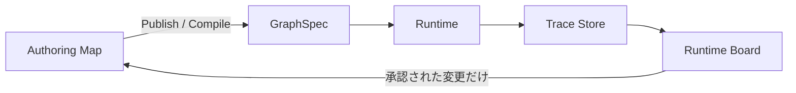

# Glossary — M3E 用語辞書

M3E プロジェクト固有の語、および揺れがちな語を正規化する辞書。
**新しい語を skill / map / code に持ち込む前にここへ登録する**。揺れを見つけたら正規語を決めて記載する。

最終更新: 2026-07-18

---

## 運用ルール

- **正規語** を一つ決める。別表記・禁止語は **備考** に記す
- 他の正規語との関係は **関連語** に書く（横断参照）
- 実装命名（code identifier）と仕様語（spec term）が食い違う場合は両方書き、どちらを正とするか明示する
- 凍結・廃止した語は削除せず `status: deprecated` で残す（歴史追跡のため）
- 表形式: `正規語 | 意味 | 関連語 | 備考（禁止・別表記・注意事項を含む）`

---

## 1. プロダクト構造

| 正規語 | 意味 | 関連語 | 備考 |
|---|---|---|---|
| **workspace (ws)** | 永続データ実体の単位。SQLite 本体・backup・audit・cloud-sync などをまとめて保持する入れ物 | map, data profile, owner | 概念階層の最上位。`ws > map > scope > node`。workspaceId を単なる表示ラベルとして使う運用は避ける |
| **map** | workspace 内で扱う 1 つの知識マップ | workspace, node, scope | （別表記）doc / document は非推奨。仕様語は `map`。実装の `docId` は互換名として残る |
| **node** | 思考要素の最小単位。型: text / image / folder / alias | edge, scope, alias | |
| **edge** | 親子関係のみを表す有向関係（親→子） | node | 関係線（補助線）は別概念 |
| **spine** | 分散した node / alias / link 群を、人間が木または DAG として読めるようにする主骨格 | node, edge, scope, syntax tree, semantic graph | Rapid では主に親子 edge の列として保存される。個々の node が参照関係や GraphLink を持っていても、説明順序・階層・責任分解の本質を捕まえる背骨を spine と呼ぶ。Scatter などの自由配置でも、spine が決まれば木/DAG へ戻せる。表示上の線や補助関係とは混同しない |
| **folder** | 一般向け説明で scope を直感的に伝えるために使う語。実装上は nodeType の一種でもある | scope | UI/導入説明で使ってよいが、**仕様・実装の正規語は `scope`** |
| **scope** | map 内の階層的に管理される構造境界。見える範囲・編集範囲を制御する基本単位 | folder, scopen, root scope, facet | M3E 固有の中核概念。（別表記・併用可）folder world |
| **alias** | 他ノードを参照する窓。実体を複製しない | node, scope | 実装語は alias。（仕様語）reference。**alias→alias は禁止** |
| **root scope** | map の最上位 scope | scope, map | |
| **scopen** | 既存 node（群）を scope として区切る操作 | scope, unscopen | 動詞。（別表記）scope 化 |
| **unscopen** | scope の区切りを解除する操作 | scope, scopen | 動詞。境界だけ外し、中身の node は残す。（別表記）非 scope 化 |
| **scope 粒度** | scope で区切るときの分量（1 scope が抱える node 数・意味範囲のサイズ感） | scope, facet | 運用判断用の軸。粒度が粗い/細かいで議論する |
| **scope bind** | 複数 scope / facet 上の表示要素を、同一の正本実体に結びつける操作または同期契約 | scope, facet, alias, GraphLink | 動詞表現: `scope を bind する`。射影ではない。`edge` は親子構造、`alias` は参照窓、`GraphLink` は非木構造の関係線、`scope bind` は同一性と更新伝播の契約として区別する |

**現時点の整理**:
- 概念階層は `ws > map > scope > node` を基準に考える
- `scope` は M3E 固有概念として前面に出す
- `folder` は一般向け説明や導入時の補助語として使う
- `scopen` / `unscopen` は scope を名詞だけでなく操作動詞としても扱う運用を明示する
- `scope bind` は別 scope / facet 間で同じ実体を共有する同期契約であり、射影とは呼ばない

## 1.5 federated semantics

| 正規語 | 意味 | 関連語 | 備考 |
|---|---|---|---|
| **canonical source** | ある durable content / assertion を復元できる一次保存先 | canonical owner, materialization | 同じ concern の copy を複数 write 可能にしない |
| **canonical owner** | ある entity / assertion / durable concern の確定権を持つ canonical source | canonical source, write authority | 同じ concern について一つだけ |
| **write authority** | canonical owner へ確定変更を適用する権限と route | canonical owner, authority root, Command | UI 上の編集可能性や alias の access 表示とは別概念 |
| **authority root** | owner と write route を明示的に設定し、子孫へ継承させる tree 上の root | scope, write authority | scope とは別概念。code field 名は未確定だが、仕様語は `authority root` とする |
| **materialization** | canonical source から再生成できる read model | canonical source, semantic graph, 射影 | Neo4j の source-owned subgraph、index、cache、context bundle を含む。**Deep → Rapid の射影とは別概念** |
| **query projection** | openCypher / ISO GQL の `RETURN` 句など、query result の列・式を選択する操作 | materialization, 射影, Semantic Command | DB query 文脈に限定して修飾する。M3E の無修飾な `射影（Deep → Rapid）` や materialization とは別概念 |
| **context projection** | task / conversation のために graph の局所 topology と属性を一時表現へ切り出す操作 | Mermaid, TOON, graph operation, materialization | LLM 会話用の修飾語付き概念。無修飾の `射影` は Deep → Rapid に限定。正本ではない |
| **graph operation** | LLM の編集意図を stable target、operation、base revision、provenance を持つ検証可能な操作へ正規化したもの | context projection, Command, write authority | Mermaid / TOON 全置換や database raw write として扱わず、Command と owner routing を通す |
| **source-materialized record** | 外部または局所 canonical source が所有し、Neo4j 等へ再生成可能な copy として載せた record | materialization, canonical source | source event だけが更新する |
| **M3E-owned accepted record** | M3E が owner で、proposal / validation / approval を通過した Deep entity / assertion | Deep entity, proposal journal, graph operation | activation gate 後は Neo4j canonical runtime に保存できる。source-materialized record と role を混同しない |
| **M3E Semantic Source** | M3E-owned accepted Deep entity / assertion を所有する論理 canonical source | canonical source, M3E-owned accepted record, Semantic Core | storage 製品名ではない。activation gate 後の canonical runtime 実装は Neo4j |
| **TOON context** | graph property、provenance、state、owner、revision、schema を LLM へ compact に渡す context 表現 | context projection, Mermaid, graph operation | exact grammar / version は未確定。正本または write format にしない |
| **Rapid occurrence** | Rapid 文書内の位置、表現、順序、局所文脈を持つ node occurrence | Rapid, Deep entity, entity binding | 文書内表現の canonical owner。同じ node が Deep entity を持たなくてもよい |
| **Deep entity** | 文書横断の stable identity と typed semantics を持つ entity | Deep, Rapid occurrence, entity binding | 本文を Rapid occurrence と二重所有しない |
| **entity binding** | Rapid occurrence と Deep entity の同一性または対応を結ぶ assertion | Rapid occurrence, Deep entity, scope bind | many-to-many を許す。`scope bind` は表示面間の同期契約であり別概念 |
| **referential state** | materialized record の参照解決状態 | materialization, canonical source | `resolved / indexed-only / inaccessible / stale / missing / tombstoned / unresolved`。参照不能を deletion と同一視しない |
| **journal** | Command / operation の因果と履歴をreplay可能に保存する論理記録 | portable snapshot, Recovery Gate, proposal journal | 操作の歴史。物理DB複製であるbackupと区別する |
| **backup** | database engine等の物理状態を複製し、同系統のrestoreに使うartifact | journal, portable snapshot, Recovery Gate | engine依存の補助復旧経路。単独ではRecovery Gateの根拠にしない |
| **portable snapshot** | engineに依存しない論理直列化からsemantic stateをrebuildする復旧artifact | journal, backup, Recovery Gate | M3E-owned accepted graphはportable snapshot + journal replayのみでの復旧実証を要求する |
| **Rebuild Gate** | source-materialized recordをcanonical owner source群から再構築できることを確認するgate | canonical source, materialization, Recovery Gate | 他者が所有する正本からderived read modelを再生成するgate |
| **Recovery Gate** | M3E-owned accepted recordを自己のportable snapshot + journal replayだけで復旧できることを確認するgate | portable snapshot, journal, Rebuild Gate | backup / restoreは補助検証してよいがgate根拠にしない |

## 1.6 RAG評価軸とconsumption mode

| 正規語 | 意味 | 関連語 | 備考 |
|---|---|---|---|
| **reachability（到達性）** | 存在する関連情報へrelation経路を辿って到達できる性質 | identity, entity binding, semantic graph | 自律モードで最優先。単なる全文検索hit率と混同しない |
| **latency** | query開始から利用可能なcontextをconsumerが得るまでの時間 | context bundle, materialization | 対話モードでは最優先。自律モードでもturn数×待ち時間としてthroughput / costへ蓄積する |
| **hop depth** | queryがrelationを何段辿るか | semantic graph, typed relation | 深いほど到達範囲は増えるが、noiseとcostも増える |
| **fan-out** | 1 hopあたりに展開する候補数 | scope, hop depth | `scope` は認知境界であり、fan-out制御装置として働く |
| **specificity（特異度）** | 取得要素が意図した対象に該当する精度 | typed relation, provenance | 偽陽性を抑える評価軸 |
| **freshness（鮮度）** | contextがどのsource revision / indexed time時点かを説明できる性質 | revision, referential state | staleをresolvedと同じ確度で扱わない |
| **reproducibility（再現性）** | 同じsource revision集合とqueryから同じ判断contextを再生成・監査できる性質 | context lockfile, journal | deterministic serializationを要求する |
| **対話モード** | 人間との対話loop内でcontextを消費するmode | latency, specificity, fan-out | 優先順は概ね latency > specificity > fan-out制御 > hop depth。materialized viewを優先する |
| **自律モード** | agentが人間の即時応答を待たず探索・実行するmode | reachability, specificity, hop depth | 優先順は概ね reachability > specificity > hop depth > latency。必要に応じlive traversalを許す |

## 2. 帯域（Band）

帯域は独立複数軸ではなく、**粒度と構造が連動する単一の進化軸**。詳細は [../01_Vision/Axes.md](../01_Vision/Axes.md)。

| 正規語 | 意味 | 関連語 | 備考 |
|---|---|---|---|
| **Flash** | 断片・素材の領域。マルチモーダル（テキスト/画像/音声/貼付）、日常との連結、突発・散発的アイデア。構造化前 | 昇格, Rapid | inbox は Flash 内の受け皿名 |
| **Rapid** | **文書 1 つ単位**の領域。syntax tree（親子・章立て・節、説明順序あり、線形化可能） | syntax tree, Flash, Deep | 現在の実装中心。Freeplane mindmap / LaTeX 章立て的 |
| **Deep** | **文書群・知識体系**の領域。semantic graph（多種エッジ、説明順序と独立、同ノードが複数経路に現れる） | semantic graph, 世界モデル, 射影 | nLab / Wikidata / mathlib4 dep 網的 |
| **昇格 (promote)** | Flash → Rapid への統合操作 | Flash, Rapid, 体系化, 射影 | |
| **体系化** | **Rapid → Deep** への変換操作。複数文書を束ねて概念網に編み上げる | Rapid, Deep, 射影 | 射影の逆方向 |
| **射影 (projection)** | **Deep → Rapid** への変換操作。体系から特定目的の説明順序を持つ 1 文書を切り出す | Deep, Rapid, 世界モデル, 体系化, materialization | 同じ Deep から科研費/学振/JST 等を別々に射影。世界モデル=資産、射影出力=使い捨て。storage / index の derived read model は `materialization` と呼ぶ。`memory/project_projection_vision.md` 参照 |
| **syntax tree** | 親子・線形化可能・説明順序ありの木構造。Rapid の内部構造 | Rapid, semantic graph | 本文・章立て・Freeplane mindmap 的 |
| **semantic graph** | 多種エッジ・説明順序非依存の網構造。Deep の内部構造 | Deep, syntax tree | （禁止）semantic tree — tree ではなく graph。akaghef 用法でも避ける |
| **世界モデル** | Deep の到達形。射影の源泉となる資産 | Deep, 射影 | |

## 2.1 データ精錬度軸（D0〜D3）

データ精錬度は、生の観測から法則・主張へ至る一方向の変換軸。各 `Dn+1` は `Dn` からのmaterializationであり、変換規則とprovenanceを必須とする。semantic graphへ直接入れるのはD3と、目的を明示して選択されたD2だけとする。D0 / D1は原則として本文を複製せずidentity参照する。

| 正規語 | 意味 | 関連語 | 備考 |
|---|---|---|---|
| **D0（生data）** | 未集計の観測、event、raw record | D1, materialization | graphには本文を搬入せずidentity参照を基本とする |
| **D1（集計）** | D0を数え上げ、分類、正規化した集計 | D0, D2, provenance | 集計方法をprovenanceへ残す |
| **D2（傾向）** | D1から導いたpattern、傾向、比較結果 | D1, D3, specificity | graphへ入れる場合は選択理由とtransformationを必須にする |
| **D3（法則・主張）** | 検証・反証・参照の単位となる定義、法則、claim、assertion | Deep entity, typed relation | 数学ontologyで支配的な精錬度 |

## 2.5 facet（プロジェクト観点）

| 正規語 | 意味 | 関連語 | 備考 |
|---|---|---|---|
| **facet** | PJ の一側面を切り出した scope であり、かつその切り出しが**意味単位として凝集している**もの。両方の条件を満たす場合のみ facet と呼ぶ | scope, alias, 小分類 | **PJ 直下の第一階層に限定**。内部サブツリーは「小分類」として扱う。**scopen 粒度・レイアウティング規則は facet ごとに定義**、内部はそれに従う。実体は 1 箇所、他 facet からは alias で参照。（禁止）「12 スコープ」「観点スコープ」 |
| **facet 跨ぎ操作** | 複数 facet にまたがる link / alias 作成・更新 | facet, alias | サブワーカーは原則実行しない（並行書き込み race 回避）。マネージャー session が batch でまとめて行う。（別表記）cross-facet op |
| **小分類** | facet 内部の整理用サブツリー（例: `src/core/`, `src/io/`） | facet, scope | ただの scope として扱う。facet 要件（PJ 一側面 + 凝集）は課さない。親 facet の規則に従う |

初出: AlgLibMove プロジェクト（2026-04-15、[../../projects/PJ01_AlgLibMove/plan.md](../../projects/PJ01_AlgLibMove/plan.md)）
定義確定: 2026-04-16 — 「PJ の一側面 かつ 意味単位で凝集」の両立要件に合意。PJ 直下限定。内部サブツリーは小分類として別扱い。
機能追加: 2026-04-17 — facet は scopen 粒度・レイアウティング規則を定義する単位。書き込み時はその facet の規則に従うことを運用ルール化。

## 3. 計画階層（Principle → Vision → Strategy → Goal → Task）

5層で構成する。固定原則と未達ギャップを分ける。**判断は Strategy 層で行う**。task は大量になるのでテキストでプールする。

| 層 | 役割 | 置き場 | 粒度 |
|---|---|---|---|
| **Principle** | 破ってはいけない原則。当たり前になっていても守る判断基準 | `docs/01_Vision/Principle.md` | 固定・長期 |
| **Vision** | まだ埋まっていない上位ギャップ。半月単位で見直す | `docs/01_Vision/Vision.md` / `docs/00_Home/Objective.md` | 長期・未達中心 |
| **Strategy** | Vision をどう攻めるか。判断・優先度はここ | `docs/01_Vision/Strategy.md` / `docs/00_Home/Objective.md` / map `DEV/strategy/` | 中期・日次更新可 |
| **Goal** | strategy 配下の具体的な到達点 | map `DEV/strategy/<Project>/Goal` ノード | 機能単位 |
| **Task** | 実作業単位。大量。 | **テキストでプール**（`06_Operations/Todo_Pool.md` or map の text ノード） | 30分〜数時間 |

**運用**:
- Principle は頻繁に書き換えない。揺れた時の判断基準として参照する
- Vision には「原則」ではなく「未達ギャップ」を書く
- agent・人間が判断する時は **strategy 層を読む**。task は流し読み
- task は書き殴って貯める（フォーマット緩め、優先度は strategy で付ける）
- task が重要判断を含む場合は strategy に昇格、または `reviews/Qn` 起票

### 3.1 参照 ID 運用

| ID | 用途 | 安定性 | 備考 |
|---|---|---|---|
| **P1, P2, ...** | Principle の安定参照 ID | repo-wide で長期固定 | 並び替えで付け替えない |
| **V1, V2, ...** | Vision の安定参照 ID | repo-wide で長期固定 | 半月見直しでも既存 ID は維持する |
| **S1, S2, ...** | Strategy の安定参照 ID | repo-wide で長期固定 | 日次更新しても既存 ID は維持する |
| **G1, G2, ...** | Goal のローカル ID | session / board / document 単位で一貫 | 長期固定は要求しない |
| **T1, T2, ...** | Task のローカル ID | session / board / document 単位で一貫 | 長期固定は要求しない |

**運用規則**:
- `P*`, `V*`, `S*` は repo 全体で使う安定 ID とする
- `P*`, `V*`, `S*` は重要度順ではなく識別子として扱う
- 並び替えや再編集で `P*`, `V*`, `S*` の番号を付け替えない
- 廃止項目が出ても欠番を許容する
- `G*`, `T*` はセッションや task board の中で一貫していればよい
- 下位項目は、可能な限りどの `P*` / `V*` / `S*` に関係するかを明示する

### 3.2 個数ガイド

- `P*`, `V*`, `S*` は増やしすぎない。今くらいの個数感を維持する
- 目安:
  - Principle は 5〜10 個程度
  - Vision は 3〜6 個程度
  - Strategy は 10〜20 個程度
- 新しい `P*`, `V*`, `S*` を足す前に、既存項目へ統合できないかを先に検討する
- 個数が上限側に寄ってきたら、追加より統合・抽象化・重複削除を優先する

## 4. 開発プロセス

| 正規語 | 意味 | 関連語 | 備考 |
|---|---|---|---|
| **map** | M3E マップ本体（データとしてのグラフ） | canvas, viewer, graph | §1 参照 |
| **canvas** | map を agent ↔ 人間の共有ホワイトボードとして使う時の呼称 | map, reviews/Qn, Agent Status | canvas-protocol skill 参照。（禁止）whiteboard — canvas に統一 |
| **viewer** | map を描画するブラウザ UI | map, meta-panel | |
| **meta-panel** | viewer 上部の UI パネル。モード / scope / ステータス等を表示 | viewer | `beta/README.md` 記載の正式名。（別表記）メタパネル |
| **graph** | map の**グラフ形式**表現（node + edge の構造そのもの） | map, linear | M3E の既定ビュー。`linear` との対比で使う |
| **linear** | 同じ内容を**線形表記**（リスト・アウトライン・本文）で扱う形式 | graph, linear-text, linear-transform | tree → list の写像。編集は linear 側でもできる。（別表記）linear view |
| **linear-text** | linear 形式のテキスト実体（Markdown など） | linear, linear-transform | Obsidian/vault export の出力形。linear-transform 経由で生成 |
| **linear-transform** | graph ↔ linear の相互変換を担う変換処理または将来の delegated worker capability | linear, linear-text, Codex worker | プロバイダ経由で実行、双方向の同期を想定。（別表記）linear-agent |
| **Director** | Claude の現在の運用ロール。intent 分解、Codex handoff、dispatch、review、worktree / PR 管理を担う | Codex worker, handoff, gate | Director は product code / spec / investigation の hands-on 作業をしない |
| **Codex worker** | `codex exec` で起動される唯一の hands-on worker。実装、仕様書き、調査、検証を担う | Director, handoff, task worktree | 旧 `sub-agent` worker model を置き換える |
| **task worktree** | Codex code task ごとに作る isolated worktree | Codex worker, branch, PR | path `$HOME/dev/M3E-<task>`、branch `codex/<task>`、PR base `dev-beta` |
| **sub-agent** | deprecated: 旧 Claude Agent Teams で使っていた作業エージェント概念 | Director, Codex worker | 新規運用では使わない。Claude sub-agent worker (`manage` / `visual` / `data` / `team`) は廃止 |
| **Manager** | deprecated: 旧 devM3E オーケストレーター名 | Director | 新規運用では Claude `Director` と呼ぶ |
| **role** | deprecated: 旧 sub-agent 担当領域 (visual / data / team など) | Codex task scope | 新規運用では role branch ではなく Codex handoff scope として扱う |
| **reviews/Qn** | 判断待ちキューの個別質問ノード | decisions/, canvas, Ambiguity Pooling | `selected="yes"` で確定。略記 `Q` は会話中のみ可 |
| **decisions/** | 確定した判断のプール（reviews/ から移送） | reviews/Qn | selected が付いた Q はここへ。（同義）decision pool |
| **Agent Status** | map 上の agent / task 状態可視化ノード | Director, Codex worker, canvas | 固定パス `DEV/Agent Status`。旧 sub-agent 状態表示から移行対象 |
| **design_doc** | task ノード attribute。設計書のパスを指す | Task | `docs/03_Spec/...` 絶対/相対パス |
| **gate** | task / decision 間の依存関係。前段 done で後段解放 | Director, Codex worker | Director が監視 |
| **Ambiguity Pooling** | 曖昧点を block せず reviews/Qn に貯める方針 | reviews/Qn, canvas | canvas-protocol 規定 |

## 5. 凍結・廃止語（deprecated）

| 語 | status | 扱い | 備考 |
|---|---|---|---|
| **MVP** | deprecated (2026-04-15) | 段階論としては凍結。ドキュメントの新規記述で使わない | コード中の `RapidMvpModel` 等の命名は歴史的残滓として残る（リネームは別タスク） |

## 6. 実装命名との対応（コード ↔ 仕様）

| コード識別子 | 仕様語 | 関連語 | 備考 |
|---|---|---|---|
| `RapidMvpModel` | Rapid 帯域のデータモデル | Rapid | MVP は歴史的残滓。`RapidModel` リネームは Rule_Backlog に積む |
| `AppState` | map 全体の state スナップショット | map | |
| `docId` / `documentId` | map 識別子 | map, mapId | 実装互換名として当面残す。仕様説明では `mapId` / `map` を優先する |
| `scopeId` | scope の node id | scope | 現行 API は `scopeId`。仕様語とも一致させる |
| `workspaceId` / `wsId` | workspace の内部識別子 | workspace, wsLabel | 保存先フォルダを一意に決める内部 ID。ユーザーには基本見せない |
| `wsLabel` | workspace の表示名 | workspace, wsId | 例: `Akaghef-personal` |
| `mapId` | map の内部識別子 | map, mapLabel, mapSlug | `map_<ULID>` を正本にする |
| `mapLabel` | map の表示名 | map, mapId | 例: `開発`, `研究`, `tutorial` |
| `mapSlug` | map の固定スラッグ | map, mapId | 例: `beta-dev`, `beta-research`, `final-tutorial` |

## 6.1 データ運用軸

| 正規語 | 意味 | 関連語 | 備考 |
|---|---|---|---|
| **channel** | 実行チャネル。`beta` / `final` | beta, final | アプリ側の軸 |
| **data profile** | データの役割・安全性レベル。`personal` / `seed` / `temp` / `test` など | workspace, owner | データ運用側の軸 |
| **owner** | 誰のデータかを表す属性 | workspace, data profile | 現時点の個人運用では `akaghef` |

## 6.2 現在の標準 runtime モデル

| 項目 | 現在の標準 |
|---|---|
| owner | `akaghef` |
| data profile | `personal` |
| workspace label | `Akaghef-personal` |
| workspace id | `ws_<ULID>` |
| map id | `map_<ULID>` |
| Akaghef personal の初期 map | `開発` / `研究` |
| Akaghef personal の固定 slug | `beta-dev` / `beta-research` |
| final 配布版の初期 map | `tutorial` のみ |

**補足**:
- `ws` は DB ファイル単体ではなく、`data.sqlite`, `backups/`, `audit/`, `cloud-sync/`, `conflict-backups/` などを含む永続フォルダ単位
- `wsLabel` と `wsId` は分離する。表示名の変更で内部識別子と保存先は変えない
- `mapLabel` と `mapId` も分離する。`mapLabel` は変更可能、`mapId` は不変、`mapSlug` は固定
- `beta` / `final` は channel であり、概念上は map そのものとは別軸

## 7. サーバー・ポート

| 正規語 | ポート | 関連語 | 備考 |
|---|---|---|---|
| **beta** | 4173 | channel, final | 開発 default。agent 操作・map API は原則ここ。実装互換名としての `docId` は残りうる |
| **final** | 38482 | channel, beta | 配布・安定版確認。実装互換名としての `docId` は残りうる |

**規則**: agent は dev 作業中 `4173` を使う。`38482` を使うのは final 確認時または明示指示があった時のみ。

## 8. ファイル構成系

| 正規語 | 意味 | 関連語 | 備考 |
|---|---|---|---|
| **beta/** | 開発対象ソース | final/, channel | `final/` は本番、触らない |
| **docs/** | 設計・運用ドキュメント | daily, ADR, handoff | 日本語記述が基本 |
| **daily** | 作業日記 `docs/daily/YYMMDD.md` | docs/ | 追記のみ・改変禁止 |
| **ADR** | Architecture Decision Record `docs/09_Decisions/ADR_NNN_*.md` | docs/ | |
| **handoff** | 作業引き継ぎ文書 `docs/tasks/handoff_*.md` | docs/ | |

## 9. MDD / system 実行

MDD (Map Driven Development) で system を設計・実行・運用するための語彙。
PJ04 の用語を全体 glossary に昇格したもの。

| 正規語 | 意味 | 関連語 | 備考 |
|---|---|---|---|
| **MDD (Map Driven Development)** | map を system 設計・契約・実行観測の中心に置く開発方式 | Authoring Map, GraphSpec, Runtime Board | M3E の Vision の一つ。図は説明資料ではなく、実行契約へ compile される authoring 正本 |
| **Authoring Map** | system を設計・編集する正本 map。system diagram、contract tree、intent、prompt、schema を持つ | map, System Diagram, Contract Tree, GraphSpec | 人間と AI が編集する場所。runtime state / trace / checkpoint は直接書き戻さない |
| **System Diagram** | Authoring Map 上の外側の図。subsystem / agent / tool / router / edge の骨格を見る場所 | Authoring Map, Contract Tree, scope, edge | 人間が overview する主画面。Mermaid 風の見た目でも Mermaid source は正本ではない |
| **Contract Tree** | 各 system node の内側にある契約ツリー。input/output、prompt、schema、reads/writes、failure policy、callable-ref などを持つ | System Diagram, Contract, scope, Inner | System Diagram の node から入る詳細。AI-fill の主要な書き込み先 |
| **Contract** | node が実行可能であるための約束。最低限 `input / output / reads / writes / failure / trace id / callable-ref` を含む | Contract Tree, GraphSpec, callable-ref | contract が曖昧だと system diagram と実装・trace が対応しなくなる |
| **GraphSpec** | Authoring Map から compile された固定実行契約。map そのものではなく derived | Authoring Map, Contract, Runtime, Publish | hash を持ち、runtime に渡される。runtime 正本ではなく、map から生成される中間契約 |
| **Runtime Board** | 完成・実行中 system を運用・監視する表示空間。trace、current node、error、Qn、resume 操作を見る | Runtime, Trace Store, Thread, Run | Authoring Map を直接汚さない。最初は同じ map の別 surface / overlay、将来は publish 先の別 map も許容 |
| **Trace Store** | 実行ログの append-only 保存先。latency、token、node result、error、state snapshot 参照を持つ | Runtime Board, Thread, Run | map 正本ではない。例: `tmp/*trace*.json`、将来は NDJSON ring |
| **Runtime** | GraphSpec を受け取り、LLM / tool / LangGraph 等を実際に動かす実行層 | GraphSpec, Run, Thread, Bridge | PJ04 では独自 runtime を作らず、Python LangGraph 等を subprocess / bridge 経由で使う |
| **Run** | GraphSpec + input + provider 設定から開始される 1 回の実行 | Runtime, Thread, Trace Store | Run は Thread を生成または再開する |
| **Thread** | 1 回または resume 可能な実行系列。checkpoint chain を `thread_id` で辿る | Run, checkpoint, Runtime Board | LangGraph 的な thread と対応する |
| **Publish** | Authoring Map を GraphSpec へ固定し、Runtime Board で実行可能にする操作 | compile, GraphSpec, Authoring Map | `compile` より上位の運用語。設計から稼働対象へ送る境界 |
| **Concreteness Axis** | 同じ node / edge をどの粒度で見るかの window 側の軸。`j/k` で L0〜L5 を切り替える | window, System Diagram, Runtime Board | map 構造は変えない。L0 箱のみ、L5 live state / trace。具象軸を map 正本へ永続化しない |

**基本分離**:

- Authoring Map は編集正本
- GraphSpec は固定された実行契約
- Runtime は実行層
- Trace Store は実行記録
- Runtime Board は運用表示

## 10. Joint（外部連携）

Map と外部サービスの間を取り持つ層。詳細仕様は [../03_Spec/Joint_Integration_Hub.md](../03_Spec/Joint_Integration_Hub.md)。
リマインダー機能は joint の最初の応用。

| 正規語 | 意味 | 関連語 | 備考 |
|---|---|---|---|
| **joint** | Map と外部サービスを取り持つ標準アダプタ層。`fetch` / `push` / `notify` / `webhook` の 4 契約で定義 | adapter, channel, reminder | 1 service = 1 adapter。registry に動的登録。実装命名は `joint` 統一。（別表記）integration / connector は非推奨 |
| **adapter** | joint の具体実装。1 service につき 1 つ | joint | （別表記）connector / integration は非推奨 |
| **channel** | joint adapter のうち **notify 系**（出口）を指す呼称。例: OS / banner / Slack / Email / Discord / LINE / Telegram / mobile push の 8 種 | joint, adapter, notify channel | reminder 設定で `channel: ["os", "slack:#x"]` 形式に使う。**§7 のリリース channel (beta/final) とは別概念**、文脈で判別 |
| **reminder** | node に紐付く trigger ベースの通知ルール。trigger kind は `absolute` / `relative` / `recurring` / `stale` / `event` / `manual` の 6 種 | nudge, channel, joint | node attribute `reminder.rules[]` に格納。1 ノードに複数 rule 可 |
| **nudge** | 強制度の弱い reminder。停滞検知（`stale` trigger）や未完成原則の起動時 prompt が代表例 | reminder | 「OS 通知より静かなチャネル（banner）優先」が既定 |
| **m3e-notify** | OS scheduler から呼ばれる小型 CLI。M3E 終了中も SQLite を read-only で開いて発火する | joint, channel, m3e-node | Plan 1（A-small）の中核実装。常駐しない |

---

## 追加したい語 / 揺れ発見時

このファイルに追記 → commit。議論が必要なら `reviews/` に Q として起票してから正規語を決める。
