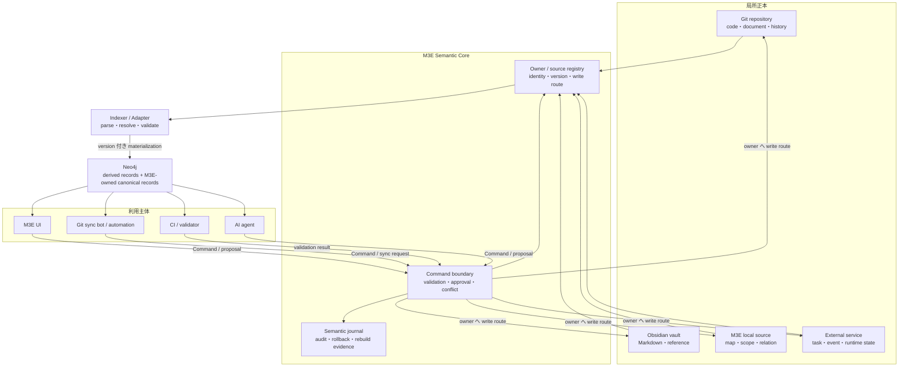
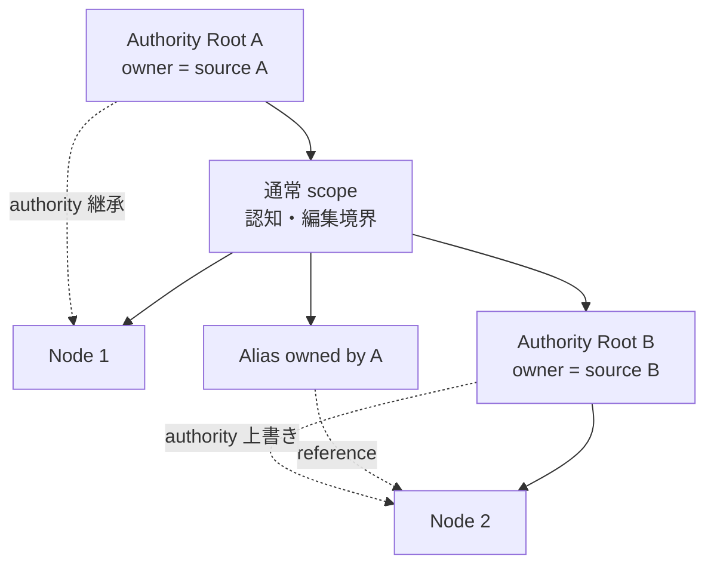

# Strategy

最終更新: 2026-07-18

この文書は M3E の `Planning Hierarchy` における Strategy 層の入口。
Strategy は「いま何を攻め、何を後回しにするか」を置く。判断と優先度はここで扱う。

---

## Definition

- Strategy は Vision のギャップをどう埋めるかを書く
- Principle のような固定原則は置かない
- Goal / Task より上位の攻略方針を書く
- 日次で更新してよい
- `S1`, `S2`, ... の安定 ID で参照する
- Strategy の個数は増やしすぎず、10〜20 個程度を目安に保つ
- idea が十分に溜まったテーマは `Deferred Strategy` として受け止め、必要時に `Current Strategy` へ昇格させる

---

## Current Strategy

### S1. まずは M3E 自身を、人間+AI の作業場として日常運用に載せる

Refs: `V1`, `V2`, `V4`

M3E を説明対象ではなく実用対象にする。開発、判断、レビュー、引き継ぎを M3E 上で回し、作業場としての有効性を先に証明する。

日常運用の中心は、抽象的な「全部入り」ではなく、**日々のメッセージやりとり**と
**タスク通知・リマインダー**を M3E の上で受け止められる状態に置く。Flash は
「思いつきを投げる箱」に留めず、外部会話や軽い依頼を M3E に流し込み、
必要に応じて node / task / reminder へ昇格させる入口として扱う。

外部プラットフォームを 1 つに統一すること自体は目的にしない。むしろ
Discord / Email / Calendar などの複数チャネルを joint で fetch / notify し、
M3E の知識ネットワークを参照して文脈理解・返信 draft・通知整理を行うことで、
**思考と判断の中枢を M3E に寄せる**ことを S1 の具体像とする。

### S2. Team Collaboration を最優先の突破口にする

Refs: `V1`, `V2`, `V4`

複数主体が同じ構造を共有しながら安全に収束できることを、今の最重要ギャップとして扱う。scope lock、push/pull、競合処理、状態共有を優先的に詰める。

### S3. 便利機能より保存・同期・復元の信頼性を先に固める

Refs: `V1`, `V3`

新しい体験を増やす前に、壊れない運用を先に作る。保存、復元、競合、履歴、再起動後の整合性を最上位に置く。

### S4. Rapid を主戦場にして、Deep への昇格導線を壊さず進める

Refs: `V1`, `V3`, `V4`

当面の実装と検証は Rapid 側で前進させる。ただし Rapid を局所最適化しすぎず、Deep 側の世界モデルへ成長できる構造を維持する。

### S5. 読解を読み捨てで終わらせず、既存知識への増設として回収する

Refs: `V1`, `V3`

読むたびに新しいメモが散乱する状態を避ける。読解結果は既存の map / scope / node に接続し、知識体系を強くする方向へ吸収する。

### S6. 世界モデルを正本にし、成果物はそこから派生させる

Refs: `V1`, `V3`

個別文書を正本にしない。論文、申請書、説明資料は世界モデルから生み出す派生物として扱い、知識資産の中心を一つに保つ。

### S7. 射影の片道化を防ぎ、成果物から世界モデルへ戻る運用を作る

Refs: `V3`

出力して終わりではなく、出力の過程で得た修正や知見を世界モデルに戻せるようにする。知識と成果物の往復を運用として成立させる。

### S8. 認知境界としての scope を UI とデータ構造の両方で貫く

Refs: `V1`, `V4`

万ノードを扱うために、scope を単なる表示機能にしない。見える範囲、編集範囲、同期範囲、責務境界を scope でそろえる。

### S9. node / scope / map を跨ぐ操作を、学習コストより一貫性優先で設計する

Refs: `V1`, `V4`

局所的に便利でも、全体構造を壊す操作は採らない。操作体系は短期の軽さより、長期運用での理解可能性を優先する。

### S10. 人間と AI の主導権を UI と運用の両面で明示する

Refs: `V2`

AI に勝手な確定権を渡さない。提案、採否、差分、責任主体が常に見える形で、人間が判断権を持ったまま協調できるようにする。

### S11. AI には損切り・探索・整形を寄せ、人間は judge に集中できる形へ寄せる

Refs: `V2`

人間が全部を直接処理しない前提で組む。AI は高頻度タスク、下準備、候補生成、トリアージを担当し、人間は高裁量判断に集中する。

### S12. subPJ を並列に走らせられる運用を、M3E 上の標準ワークフローとして固める

Refs: `V2`, `V4`

複数の作業線を抱えても破綻しないように、task claim、status、gate、review、handoff を構造化する。一人の判断で多数の小さな試行を回せる状態を目指す。

### S13. 外部インフラやプロバイダに依存しすぎない保存・実行経路を維持する

Refs: `V1`, `V3`, `V4`

クラウドや外部 AI は使うが、そこに閉じ込められない構成を保つ。データの所在と復元可能性を自分たちで握り続ける。

### S14. Mapify / Miro / Obsidian / GitHub の強みを混ぜるが、寄せ集めでは終わらせない

Refs: `V4`

迅速なマインドマップ化、ビジュアルコラボ、構造化知識、版管理を別ツール連携で済ませず、一つの運用系として統合する。

### S15. Weekly Advance で週ごとの戦い方を明文化し、Strategy を日々の実行へ接続する

Refs: `V1`, `V2`, `V3`, `V4`

日々の Task を直接管理するだけではなく、「今週はどう勝つか」を先に置く。週単位の進め方を変えることで、Strategy を現実の開発ループに落とし込む。

### S16. 局所正本を連邦化し、Neo4j で大域 semantic graph を再構築する

Refs: `V1`, `V2`, `V3`, `V4`, `V5`

単一 SQLite に map・設計情報・共有状態を集約する構成から、**情報を所有者の近くに局所化し、その意味関係を大域 graph として統合する構成**へ移る。Git repository、Obsidian vault、M3E local data、外部 service は、それぞれが得意な正本を所有する。M3E はそれらの identity、scope、typed relation、authority、validation を接続し、Neo4j は concern ごとの ownership metadata を持つ大域 semantic graph を保持する。

Neo4j の役割は一律ではない。外部 canonical source が所有する content / assertion を載せた record は再構築可能な **materialization** である。一方、M3E が所有する accepted Deep entity / assertion は、activation gate 通過後に Neo4j を **canonical runtime** として保存できる。proposal、pending transfer、外部 source 本文まで Neo4j の正本範囲へ広げない。

この Strategy は「SQLite を Neo4j に置換する」ことを目的にしない。目的は、単一 database に隠れていた所有権・version・同期・復元の問題を明示し、repository、bot、CI、人間、AI が同じ意味ネットワークを壊さず利用できるようにすることである。

#### 最初に検証する use case

S16 の最初の価値は、Neo4j server を起動することではない。**repository-local semantic source を agent と CI が通常の file read だけで利用でき、code・spec・relation assertion を同じ branch / commit で変更・検証できること**を anchor use case とする。

大域 graph の実需を先に仮定しない。Phase 2 の Neo4j shadow materialization は、M3E の日常 dogfooding から生じた cross-source query を少なくとも 3 件、入力・期待結果・source revision を含めて具体化できた時点で開始する。query が具体化できない間は、portable source、identity、authority、validation の整備を優先する。M3E-owned accepted graph の canonical runtime activation は、shadow 検証と recovery gate の後に行う。

#### S16.1 戦略判断

採用する判断は次の一文に集約する。

> **内容は canonical owner の近くに局所化し、参照で接続する。Neo4j は外部所有 record の materialization と、Gate 後の M3E-owned accepted graph の canonical runtime を concern 単位で分ける。write は常に owner へ route する。**

| 対象 | 判断 |
|---|---|
| 単一 SQLite を恒久的な全情報正本として拡張する | 不採用 |
| 各 repository に SQLite を複製する | 不採用 |
| Neo4j binary store を repository に配置して Git 管理する | 不採用 |
| Neo4j を全内容の唯一の正本にする | 不採用 |
| 局所正本を所有単位ごとに置き、Neo4j を大域 materialized graph にする | 採用 |
| M3E-owned accepted Deep graph の canonical runtime を Gate 後に Neo4j とする | 採用 |
| M3E semantics を Cypher schema に直接定義させる | 不採用 |
| M3E Semantic Core を storage から分離する | 採用 |

Neo4j は `Node`、`Relationship`、`Label`、`Property` を第一級に扱う property graph database であり、Deep の横断探索・経路探索・依存解析に適合する。一方、物理的には専用 binary store、index、transaction log、page cache を持つ database engine であり、Git diff 可能な semantic source ではない。したがって semantics は **Neo4j-defined ではなく Neo4j-backed** とし、canonical runtime にする M3E-owned record も portable recovery evidence を別 failure domain に持つ。

#### S16.2 現構造が限界に達した理由

現行 runtime は概念上 `workspace > map > scope > node` だが、永続化は workspace directory 内の `data.sqlite` と backup・audit・cloud-sync 一式へ集約される。map state は SQLite 内の JSON blob として保存されるため、repository の設計情報と M3E の意味情報が次の境界で一致しない。

| 境界 | Repository / 外部正本 | 単一 SQLite 中心の現行 M3E |
|---|---|---|
| 責任 | repository、vault、service ごと | workspace database に集約 |
| 変更 | commit、pull request、provider API | M3E API / database 更新 |
| version | branch、commit、provider revision | map version、saved time |
| backup | repository / service 単位 | workspace 全体 |
| restore | source owner 単位 | SQLite / workspace 単位 |
| bot 可視性 | filesystem、Git、provider API | M3E 専用 API が必要 |
| 大域探索 | cross-source 関係を失いやすい | 1 workspace 内に閉じる |

この不一致により、repository の設計情報を M3E に載せると複製が必要になる。複製自体は避けられないが、双方を write 可能な正本にすると dual-canon になる。また、他の作業領域を含む SQLite backup は repository の version と対応せず、局所的な復元・比較・Git 管理を困難にする。

問題は SQLite の性能不足だけではない。

```text
現状の混線
= 保存
+ 正本
+ 共有
+ 探索
+ bot context
+ backup / restore
```

S16 ではこれらを所有責務ごとに分離する。

#### S16.3 正本の分担

durable な concern ごとに canonical owner を一つだけ決める。物理的複製は許すが、複製先の役割を materialization、cache、index、snapshot のいずれかとして明示する。

| 情報 | canonical owner | Neo4j 上の役割 |
|---|---|---|
| code、design document、byte history | Git repository | version 付き materialization / index |
| Markdown 本文と vault reference | Obsidian / Git | materialization / reference |
| calendar、task、workflow 実行状態 | 外部 service | observed state / reference |
| M3E-owned accepted Deep entity / assertion | M3E Semantic Source | Gate 後は canonical runtime record |
| M3E の identity、scope、typed relation、validation rule | M3E Semantic Core とその versioned contract | validation / interpretation |
| cross-source relation assertion | 宣言した所有 source | materialized graph |
| AI / bot の proposal、pending assertion、未確定判断 | M3E-local proposal journal | 権限・分類付き materialized proposal subgraph |
| commit、branch、pull request | Git provider | reference / observed state |
| runtime trace、ViewState、一時 selection | runtime | 原則保存しない、または別 trace store |
| search summary、embedding、逆参照 | 再生成可能 | derived index |

Git が本文を所有する場合、M3E は同じ Markdown 本文を別の正本として複製しない。M3E が所有するのは、外部正本だけでは表せない identity、relation、scope、contract、authority、validation frontier である。

#### S16.4 全体構成



Neo4j は全 source を横断する query surface になるが、外部 source が所有する内容への raw write surface にはしない。Neo4j 上で生じた編集要求は M3E Command に変換し、owner の adapter へ routeする。

#### S16.5 局所 semantic source

repository に属する設計情報は、repository と同じ lifecycle・branch・commit・pull request で管理できる Git diff 可能な source を持てるようにする。作業案として repository-local `.m3e/` を候補にする。

```text
repo-A/
├─ src/
├─ docs/
├─ tests/
└─ .m3e/
   ├─ manifest.*
   ├─ entities/
   ├─ relations/
   ├─ authority/
   └─ schema-version
```

`.m3e/` という配置名と serialization 形式は未確定であり、仕様化時に決める。確定前でも次の制約は固定する。

- Neo4j database directory、binary store、transaction log を置かない。
- runtime cache、embedding、generated inverse relation、private secret を commit しない。
- repository 本文が正本なら、本文コピーではなく stable identity と canonical path / symbol reference を置く。
- M3E が所有する non-regenerable relation assertion、scope contract、authority declaration は source として置ける。
- 大きな monolithic JSON blob へ戻さず、Git diff・merge・blame が意味を持つ粒度に分割する。
- branch 上では code、spec、semantic source を同じ commit で変更できるようにする。
- repository 外の private / public-danger 情報を repository-local source へ混入させない。

repository は唯一の所有単位ではない。科学研究・個人知識・外部 service を Git に押し込まないため、S16 内では次の一般形を採る。

```text
所有 source
├─ Git-backed source
├─ Obsidian-backed source
├─ M3E-local source
└─ external-provider-backed source
```

各 source は stable source ID、version、取得方法、write route、権限、schema version を registry へ提示する。

#### S16.6 分散 identity と大域 graph

局所 ID 単独では衝突するため、大域 identity は少なくとも source identity と local entity identity の組で解決する。

```text
m3e://<source-id>/<local-entity-id>
```

URI 形式自体は仕様化時に確定する。必要なのは次の性質である。

- 表示名、file path、repository rename から独立した stable identity を持つ。
- materialized record は出典 source、revision、path、content hash、indexed time、schema versionを持つ。
- entity の owner は常に一つに決まる。
- 他 source は entity を複製せず、identity を参照する。
- 逆方向 relation は原則 query / index で導出し、二重保存しない。

時刻 (t) における大域 graph は、各 source の最後に受理された revision (r_i) の局所 graph と、owner が明示された cross-source relation の和として扱う。

\[
G_{\mathrm{global}}(t)
=
\bigcup_i G_i(r_i)
\cup E_{\mathrm{cross-source}}
\]

global graph は「全 source の絶対的な同時刻状態」ではなく、**どの source revision を束ねたか追跡可能な整合 snapshot**である。

#### Rapid occurrence と Deep entity

Rapid の node は、文書内の特定位置に現れる表現・順序・文脈を持つ **occurrence** として扱う。Deep の **entity** は、複数文書を横断する concept、claim、person、project などの stable identity を担う。両者は `binds` relation で接続し、一対一を仮定しない。

- Rapid occurrence は文書内表現と sibling order の canonical owner である。
- Deep entity は大域 identity と cross-document semantics の canonical owner である。
- 同じ本文を Rapid と Deep の双方へ canonical content として複製しない。
- すべての Rapid node に Deep entity を強制せず、必要な occurrence だけを段階的に bind できるようにする。
- binding の owner、entity merge / split、redirect / tombstone は Phase 0 spec で固定する。

#### S16.7 cross-source relation の所有

relation assertion 自体にも owner を一つだけ決める。

| relation | owner |
|---|---|
| A が B に依存する | 原則 source A |
| B が A から参照されている | Neo4j で逆引き生成 |
| 組織全体の architecture relation | architecture / governance を所有する source |
| 双方の合意が必要な interface contract | contract を所有する source |
| AI / bot が推定した relation | proposal 領域。確定 source へ直接入れない |

canonical relation は必ず owner を持つ。外部 source-owned relation はその source に存在させ、Neo4j では materialization とする。M3E-owned accepted relation は Gate 後の Neo4j canonical runtime に保存できるが、Command validation、audit、portable recovery evidence を別 failure domain に維持する。owner metadata のない Neo4j raw write で canonical relation を作らない。

proposal 領域も例外にしない。AI / bot が提案した未確定 relation、判断待ち queue、approval state は一つの論理的な M3E-local proposal journal を canonical owner とし、Neo4j には materialized read model としてのみ載せる。Neo4j 全削除によって未確定判断が消える構成は Rebuild Gate と「消失バグゼロ優先」に違反する。

M3E relation の意味は既存の区別を維持する。

- `edge`: 親子の主構造。layout に参加する。
- `GraphLink`: 非木構造の map relation。overlay であり ownership を変えない。
- `alias`: 他 scope の実体を見る参照窓。実体を移動・複製しない。
- node-level `link`: 外部 URL / attribute。graph relation ではない。

Neo4j の `Relationship` は保存上の器であり、それだけでは M3E の `edge` / `GraphLink` / `alias` の意味を決めない。

#### S16.8 scope と write authority の分離

scope は引き続き認知・表示・編集境界であり、storage boundary にはしない。ただし scope tree の祖先探索を、write authority の継承解決にも利用できる。

owner と write route を明示的に切り替える root を `authority root` と呼ぶ。この仕様語は Glossary へ登録し、物理 marker の field 名だけを実装時の判断として残す。

\[
\operatorname{authority}(v)
=
\operatorname{authority}
(\text{nearest authority-root ancestor of }v)
\]

| 対象 | 規則 |
|---|---|
| 通常 scope | 認知・編集境界。owner を変更しない |
| authority root | owner、canonical source、write route を明示 |
| 子孫 node | 最近傍 authority root から authority を継承 |
| nested authority root | 明示された場合だけ authority を上書き |
| alias | alias 自身は配置先 authority、target は参照先 authority |
| GraphLink | relation assertion の owner と endpoint の owner を分ける |



同一 authority 内の reparent は通常の tree move とする。authority root を跨ぐ reparent は単純 move ではなく ownership transfer であり、source側除去、destination側追加、identity維持、複数 source の承認、途中失敗を扱う明示的な workflow とする。通常の scope move を暗黙の ownership transfer にしない。

#### S16.9 source が手元にない状態

分散構成では、すべての source が常に clone・mount・認証されているとは限らない。参照不能を一律 `broken` にしない。

| 状態 | 意味 |
|---|---|
| `resolved` | source と entity を現在読める |
| `indexed-only` | Neo4j に index はあるが source は手元にない |
| `inaccessible` | source は存在するが権限がない |
| `stale` | index の revision より source が進んでいる |
| `missing` | source または entity の削除が確認された |
| `unresolved` | identity はあるが未解決 |

この状態は relation の意味と分離して持つ。`unresolved` や `inaccessible` を自動削除せず、provenance と最後に確認できた snapshot label を残す。

#### S16.10 read と write の標準経路

局所 source の確定変更から global graph への流れは一方向を基本にする。

```text
owner source で変更
→ commit / provider revision / M3E Command を確定
→ indexer が差分取得
→ semantic validation
→ Neo4j 部分更新
→ cross-source reference を再評価
→ 必要な materialization を再生成
```

Neo4j 上の情報から変更する場合は owner へ戻す。

```text
Neo4j で対象を発見
→ M3E Command / proposal
→ authority 解決
→ owner adapter へ route
→ branch / pull request / provider API / local journal
→ owner 側で確定
→ Neo4j を再index
```

Git 同期 bot、CI、AI agent、M3E UI は同じ authority resolution と Command boundary を使う。主体別に別の正本判断を実装しない。

#### S16.11 SQLite の残る役割

Neo4j 化は SQLite の即時廃止を意味しない。SQLite は段階移行中および局所 runtime で次の役割を持ちうる。

- 現行 Rapid map の write authority
- local source / cache
- offline snapshot
- migration comparison の旧系
- Neo4j 不在時の限定 runtime

ただし、SQLite に全 source の canonical content と cross-source relation を再集約してはならない。局所 cacheとして使う場合も、owner source・revision・rebuild contract を明示する。

#### S16.12 移行段階

現在の主戦場 `S2` Team Collaboration と `S3` 保存・同期・復元を中断して全面移植しない。S16 はまず意味境界を切り、現在の安全性改善へ接続する。

**Phase 0 — Canon と authority の確定**

- M3E Semantic Core が握る identity、scope、typed semantics、Command、invariant、approval、conflict policy を固定する。
- concern ごとの canonical owner を決める。
- scope と authority の分離を仕様化する。
- semantic equivalence と rollback 条件を定義する。

**Phase 1 — Storage port の分離**

```text
UI / bot / agent
→ Semantic Command API
→ Semantic Core
→ Storage Port
→ SQLite
```

- 現行 SQLite を唯一の write authority のまま維持する。
- UI、bot、sync が storage へ直接依存する経路を減らす。
- Command と validation の同値性 test を作る。

**Phase 2 — 局所 source と Neo4j shadow materialization**

```text
owner source ──→ indexer ──→ Neo4j
      │                         │
      └──── canonical ─────────┘ derived
```

- Git-backed source の最小 specimen を作る。
- Neo4j を read-only global graph として構築する。
- SQLite / source / Neo4j の結果を比較する。
- Neo4j の source-materialized record を全削除し、owner source 群からの rebuild を検証する。

**Phase 3 — bot / CI / UI の横断利用**

- Git sync bot と CI が owner metadata と global query を使う。
- M3E UI が局所 scope と大域 graph を往復する。
- source が未clone・stale・inaccessible な状態を運用検証する。
- write proposal を owner へ routeする。

**Phase 4 — M3E-owned canonical graph の activation**

- `M3E-owned accepted` と `source-materialized` の record role を混同しない schema / query contract を固定する。
- graph operation を Command へ正規化し、M3E-owned accepted graph の owner adapter だけが Neo4j canonical record を更新する。
- canonical subgraph の backup、audit、portable snapshot からの recoveryを維持する。
- SQLite の削除条件と rollback 経路を先に定義する。

#### S16.13 移行中の単一 write authority

SQLite と Neo4j の双方を自由に更新可能にする双方向同期は禁止する。

```text
禁止例:
旧 UI      → SQLite
新 bot     → Neo4j
同期処理   ↔ 双方向変換
```

これは database migration ではなく、authority 未定義の分散 system を新設する状態になる。shadow read、shadow materialization、差分比較は許すが、同じ concern の write authority は移行中も常に一箇所に限定する。

変更は最低限次に分類する。

| 変更種別 | 扱い |
|---|---|
| semantic model 変更 | 全 adapter、migration、equivalence を再評価 |
| storage 固有変更 | 対象 adapter 内に閉じる |
| UI 変更 | semantic equivalence から分離 |
| bug fix | 旧仕様修正か新仕様変更か明示 |
| migration workaround | 恒久 semantics へ混入させない |

#### S16.14 semantic equivalence

移行前後で同じ serialized data を要求しない。比較対象は意味と操作結果である。

\[
\mathrm{Equivalent}
\neq
\mathrm{same\ serialized\ data}
\]

最低限、次が同値でなければならない。

- stable identity
- root からの reachable structure
- parent-child と sibling order
- scope 導出結果
- alias target と broken state
- GraphLink endpoint と relation semantics
- 同じ Command に対する結果または拒否
- authority resolution と write route
- history の解釈
- export / rebuild 後の意味

property が全件コピーされても、delete/edit conflict、ownership transfer、alias、approval の意味が変われば移行失敗とする。

#### S16.15 検証 gate

Neo4j 導入を段階的に進めるため、次を gate とする。

| Gate | 通過条件 |
|---|---|
| Canon Gate | concern ごとの canonical owner が一意 |
| Identity Gate | source rename・path変更後も identity を追跡可能 |
| Scope Gate | scope が storage / authority と暗黙に同一化されていない |
| Relation Gate | edge / GraphLink / alias / external link の区別を保持 |
| Write Gate | 同じ concern の write authority が一箇所 |
| Rebuild Gate | derived record は owner source 群から再構築でき、M3E-owned canonical record は独立 backup / journal / portable snapshot から復旧可能 |
| Fidelity Gate | Command result と invariant が旧系と同値 |
| Failure Gate | stale・missing・inaccessible・部分失敗を識別可能 |
| Recovery Gate | backup、journal、portable snapshot から復旧可能 |
| Exposure Gate | source classification と閲覧権限を保った情報だけが materialize され、権限外 query が拒否される |
| Demand Gate | Neo4j を必要とする実需 query が 3 件以上あり、SQLite / file index だけでは不足する理由を説明可能 |
| Strategic Gate | storage対応より semantic layer 開発へ集中できる |

#### S16.16 主要 risk と failure mode

| Risk | Failure | 対策 |
|---|---|---|
| Neo4j 導入の目的化 | semantic layer より database 作業が中心になる | Strategic Gate で停止 |
| dual-canon | source-owned concern を source と Neo4j の双方が canonical と主張する | owner metadata と record role を必須化し、source-owned record は一方向 materialization |
| repository への過剰局所化 | 個人知識・研究情報まで Git に押し込む | Git-backed source を所有 source の一種に限定 |
| scope / authority 混同 | folder move が意図せず所有権移転になる | authority root を別概念として明示 |
| source 内重複 | Markdown 本文と `.m3e` node text が二重正本になる | reference と stable identity を優先 |
| cross-source edge 二重保存 | 両 source の assertion が食い違う | relation owner を一意にする |
| global transaction の幻想 | 複数 source を atomic 更新できる前提になる | pending transfer と eventual consistency |
| stale index | bot が古い global graph で変更する | source revision と content hash を必須化 |
| opaque store 依存 | Neo4j store 破損で意味情報を失う | Rebuild Gate と別 journal |
| schema migration の分散 | 古い source が読めなくなる | reader 後方互換と schema version |
| private data 混入 | repository-local source が公開される | source classification と commit guard |
| graph-level exposure | private source の投影が source 側権限と無関係に query 可能になる | materialization 前の classification filter、最小 graph 分割、Exposure Gate。Neo4j の細粒度権限を使う場合は edition / deployment ADR で検証 |
| 摩擦起点の dual-canon 退行 | owner-routed write が重く、ユーザー / AI が正本の脇に私的複製やメモを作る | M3E-local proposal を即時保存し owner 変更を batch 化する micro-edit lane。初期観測では同じ concern への routed write が 1 日 3 回を超えたら authority 境界を再評価 |
| Edition / provider lock-in | 必要機能が特定契約に閉じる | S13 に従い portable source と adapter を維持 |

#### S16.17 非目標

- Neo4j に M3E の意味判断を委譲しない。
- すべての M3E data を Git repository に置かない。
- すべての scope を authority / storage boundary にしない。
- repository ごとの SQLite 分割だけで完了としない。
- Neo4j binary store を Git 管理しない。
- ViewState、巨大 artifact、runtime trace、secret を global graphへ押し込まない。
- migration 中に SQLite と Neo4j の双方向自由更新を作らない。
- Neo4j の canonical 範囲を M3E-owned accepted Deep graph より広げない。

#### S16.18 完了の定義

S16 は Neo4j server が起動した時点では完了しない。次を満たした時に Strategy として成果が出たと判断する。

1. repository、M3E local data、外部 source の正本分担が一意である。
2. source-owned derived record は局所 source の特定 revision から再構築でき、M3E-owned canonical record は独立 recovery evidence から復旧できる。
3. bot、CI、UI、AI が同じ identity・authority・query contract を利用できる。
4. repository の code・spec・semantic source を同じ branch / commit で変更できる。
5. cross-source relation に owner と provenance がある。
6. scope と authority が別概念として検証される。
7. Neo4j の消失・stale index・未clone source・権限不足を安全に扱える。
8. semantic Command の結果と不変条件が移行前後で同値である。
9. SQLite backup の failure domain に他の所有領域を巻き込まない。
10. Neo4j が不適合でも portable source と adapter が残り、撤退できる。

#### 既存正典との関係

S16 は、Rapid standalone map に対する SQLite / JSON の現行正本性を直ちに廃止しない。一方、全 source を単一 database へ集約する将来像と、server database の第一候補を一律 PostgreSQL とする旧方針は supersede 対象とする。

- `Data_Model.md` と ADR 004 の SQLite 判断は **Rapid local persistence の範囲**で継続する。
- `Import_Export.md` と `Model_State_And_Schema_V2.md` の JSON / PersistedDocument 正本は **M3E-native Rapid document の範囲**で継続する。
- `Storage_And_Collab_Overview.md` の保存モード表は、source ごとの canonical owner と derived cache を示す形へ更新する。
- PostgreSQL、Neo4j、embedded graph database は同じ役割の単純な代替候補ではない。storage port、collaboration state、global graph materialization の concern ごとに ADR で選定する。
- 正式な正本再割当と Neo4j の採否・edition・deployment は新 ADR で記録し、ADR 004 は履歴として残す。

#### S16.19 現在の優先順位との関係

S16 は新しい Current Strategy だが、直ちに `Current_Status.md` の数日内主戦場へ追加することを意味しない。

- `S2`: scope lock、push/pull、conflict、audit を authority / Command 境界の実証として利用する。
- `S3`: 保存・同期・復元の安全性を S16 の最上位 gate とする。
- `S4`: Rapid の syntax tree を維持し、Deep semantic graph への体系化を可能にする。
- `S6`: 世界モデルを資産にするが、外部 tool が所有する本文正本を奪わない。
- `S8`: scope を認知・編集境界として維持し、authority と混同しない。
- `S13`: Neo4j や cloud provider へ閉じ込められない portable source と復元経路を維持する。
- `S14`: Git、Obsidian、外部 service を単なる import/export 先ではなく、それぞれの正本所有者として統合する。

直近は `S2` / `S3` を継続しながら Phase 0 の canon・authority・equivalence を固定する。Neo4j 実装を先行させない。

#### S16.20 未決事項

次は Strategy では確定せず、仕様・Architecture Decision Record・検証 specimen で決める。

- repository-local source の配置名を `.m3e/` にするか。
- semantic source の serialization と file 粒度。
- source registry の正本と discovery 方法。
- stable identity の具体 URI / key schema。
- authority root の物理 marker と serialization。
- cross-source ownership transfer の transaction / compensation contract。
- Neo4j deployment、edition、backup、authentication の選択。
- Neo4j Change Data Capture をどの方向で利用するか。
- SQLite を cache として残す範囲と削除条件。
- personal / research source を Git 外でどう package 化するか。
- global graph snapshot の整合水準と許容遅延。

これらの未決事項を理由に、先行して Cypher schema や repository layout を正典化しない。

#### S16.21 参照

- repository の正本割当: [../../docs/protocols/repository-canon-values.md](../../docs/protocols/repository-canon-values.md)
- scope と alias: [../03_Spec/Scope_and_Alias.md](../03_Spec/Scope_and_Alias.md)
- data model: [../03_Spec/Data_Model.md](../03_Spec/Data_Model.md)
- runtime data 配置: [../03_Spec/Data_Runtime_Layout.md](../03_Spec/Data_Runtime_Layout.md)
- storage / collaboration 概観: [../04_Architecture/Storage_And_Collab_Overview.md](../04_Architecture/Storage_And_Collab_Overview.md)
- federated source contract: [../03_Spec/Federated_Semantic_Source.md](../03_Spec/Federated_Semantic_Source.md)
- federated graph architecture: [../04_Architecture/Federated_Semantic_Graph.md](../04_Architecture/Federated_Semantic_Graph.md)
- LLM graph conversation protocol: [../04_Architecture/LLM_Graph_Conversation_Protocol.md](../04_Architecture/LLM_Graph_Conversation_Protocol.md)
- canonical source decision: [../09_Decisions/ADR_008_Federated_Canonical_Sources.md](../09_Decisions/ADR_008_Federated_Canonical_Sources.md)
- Map Manager projection rule: [../../docs/protocols/map-manager/projection-rule.md](../../docs/protocols/map-manager/projection-rule.md)
- Neo4j graph database: <https://neo4j.com/docs/getting-started/graph-database/>
- Neo4j core graph concepts: <https://neo4j.com/docs/cypher-manual/current/queries/concepts/>
- Neo4j transaction behavior: <https://neo4j.com/docs/operations-manual/current/database-internals/>
- Neo4j store formats: <https://neo4j.com/docs/operations-manual/current/database-internals/store-formats/>
- Neo4j Change Data Capture: <https://neo4j.com/docs/cdc/current/>
- Neo4j fine-grained access control: <https://neo4j.com/docs/operations-manual/current/tutorial/access-control/>

---

## Deferred Strategy

この節は、**今すぐ主戦場にはしないが、idea が十分に溜まっており Strategy 粒度で扱う価値が出てきたテーマ**を置く。

Deferred Strategy は backlog の捨て場ではない。
次の条件を満たしたら、`docs/ideas/` からここへ持ち上げる準備をする。

- 単発の思いつきではなく、複数の idea / memo / 検討メモが同じ方向を向いている
- `V*` のどれに効くかを 1 本以上言える
- まだ active ではないが、将来の攻略方針として名前を付けておく価値がある
- 具体 task ではなく、数日〜数週単位の攻め方として語れる

### Deferred Strategy の書き方

- 仮 ID は `DS1`, `DS2`, ... とする
- 1 行の核文
- `Refs: V*`
- active にしていない理由
- 昇格条件
- 関連する idea 文書へのリンク

### Current Strategy への昇格条件

以下のいずれかを満たしたら、`Deferred Strategy` から `Current Strategy` へ移すことを検討する。

- 今後数日の主戦場にする判断が出た
- `Current_Status.md` に載せるべき優先度になった
- 具体 task を `docs/tasks/` に切り始める段階に入った
- 既存の `S*` へ統合するより、独立した攻略方針として扱う方が明確

### idea から Deferred Strategy への導線

1. `docs/ideas/` に同方向の idea が溜まる
2. 共通の `V*` と攻略方向が見えたら、`Deferred Strategy` 候補として 1 行に束ねる
3. 必要なら `DS*` を作る
4. 主戦場になった時点で `S*` へ昇格させ、`Current_Status.md` と `docs/tasks/` に接続する

---

## Related

- [../00_Home/Objective.md](../00_Home/Objective.md)
- [../00_Home/Current_Status.md](../00_Home/Current_Status.md)
- [Vision.md](./Vision.md)
- [../ideas/README.md](../ideas/README.md)
