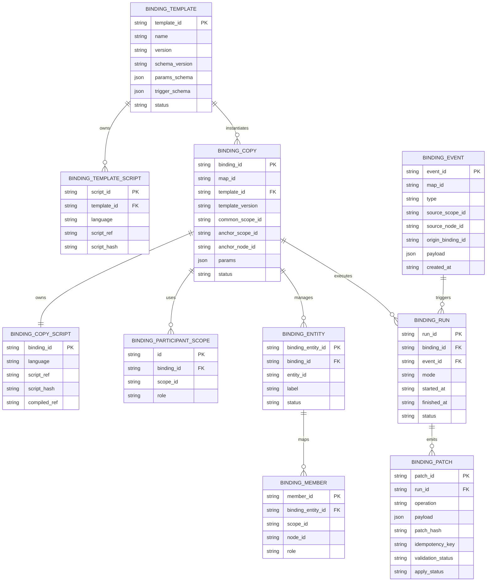

# Scope Binding

最終更新: 2026-06-06

## 目的

この文書は、複数の `scope` に置かれた表示要素を、同一の正本実体として同期する `scope bind` の仕様を定義する。

`scope bind` は射影ではない。`alias` でも `GraphLink` でもない。別 `scope` 上の node 群に対して、同一性、更新伝播、修復、監査を与える同期契約である。

## 背景

例:

- `対象図`: Akaghef の友人を tree として整理する scope
- `関係図`: 同じ友人群の連絡関係を scatter graph として表示する scope

`関係図` で友人 `N` を追加した時、`対象図` には `Akaghef > _ > N` が必要になる。これは `関係図` から `対象図` への単純な射影ではなく、「同じ人物 entity を 2 つの scope 上の node で扱う」という同期契約である。

## 非目標

- `alias` の置き換えではない。
- `GraphLink` の置き換えではない。
- UI 操作ごとの hook ではない。
- binding script が map を直接 mutate することは許可しない。
- 初期仕様では template の自動 upgrade は行わない。

## 用語

| 用語 | 意味 |
|---|---|
| binding template | 再利用可能な binding recipe。scope ID を持たない |
| binding copy | 特定の scope 群へ install された binding contract。scope ID を持つ |
| participant scope | binding copy が同期対象にする scope |
| common owning scope | participant scope 群を共通して持つ最小の所有 scope |
| binding entity | binding copy 内で管理される安定 identity |
| binding member | binding entity に対応する具体 node |
| binding script | `onEvent()` と `reconcile()` を持つ TypeScript script |
| BindingPatch | binding script が返す検証対象 patch。direct mutation は禁止 |

## 基本原則

### scope ID を正本にする

binding の participant は `facetId` ではなく `scopeId` で指定する。

`facet` は意味分類語であり、実装上の同期対象としては弱い。binding は実際には「この scope とこの scope の間の同期契約」なので、永続キーは `scopeId` とする。

ここでの `scopeId` は scope root node id への参照である。通常の `TreeNode` には `scopeId` を永続化しないが、binding registry / DB は同期契約の endpoint として scope root node id を保持する。

### template と copy を分ける

template は再利用可能な型であり、scope ID を持たない。

copy は template を特定 scope 群へ install した実体であり、scope ID、parameter、script hash、audit を持つ。

```text
template = reusable recipe
copy     = scope に install された binding contract
```

### event と reconcile を両方持つ

binding は semantic model event に結合する。ただし event は漏れる前提で扱い、必ず `reconcile()` を持つ。

```text
onEvent(event, state) -> BindingPatch
reconcile(state)      -> BindingPatch
```

### patch-only

binding script は map を直接変更しない。必ず `BindingPatch` を返す。M3E model / Map Manager が validate してから apply する。

## 保存境界

### map anchor

binding copy の人間可視 anchor は、participant scope 群の `common owning scope` に置く。

```text
commonScope
├── 対象図
├── 関係図
└── .
    └── bindings
        └── friends-target-relation
```

`.` は hidden children 用予約語であり、binding anchor や内部 metadata の置き場として使う。

### script body

実際の TypeScript script は workspace storage に置く。

```text
workspace/
  bindings/
    <commonScopeId>/
      <bindingId>/
        binding.ts
        manifest.json
        runs.jsonl
```

map node 側には `scriptRef` と `scriptHash` を保持する。script 本文を map node text に直書きしない。

## Template

template は scope 非依存の recipe である。

```ts
type BindingTemplate = {
  templateId: string;
  name: string;
  version: string;
  schemaVersion: string;
  paramsSchema: unknown;
  triggerSchema: BindingTriggerSchema;
  status: "active" | "deprecated";
};
```

template の更新は copy に自動反映しない。upgrade は明示操作とする。

```text
dry-run diff -> approve -> apply
```

## Copy

copy は binding の実体である。

```ts
type BindingCopy = {
  bindingId: string;
  mapId: string;
  templateId: string;
  templateVersion: string;
  commonScopeId: string;
  anchorScopeId: string;
  anchorNodeId: string;
  participantScopeIds: Record<string, string>;
  params: Record<string, unknown>;
  scriptRef: string;
  scriptHash: string;
  status: "active" | "paused" | "broken";
};
```

`participantScopeIds` は role 名から `scopeId` への対応を持つ。

例:

```json
{
  "target": "n_scope_target",
  "relation": "n_scope_relation"
}
```

## Entity Mapping

binding entity は label ではなく安定 identity である。

```ts
type BindingEntity = {
  bindingEntityId: string;
  bindingId: string;
  entityId: string;
  label: string;
  status: "active" | "orphan" | "review" | "deleted";
};

type BindingMember = {
  memberId: string;
  bindingEntityId: string;
  scopeId: string;
  nodeId: string;
  role: "owner" | "view" | "relation" | "derived";
};
```

owner は `BindingMember.role === "owner"` を正本とする。`BindingEntity` に owner node を重複保持する場合は cache として扱う。

## Script Interface

binding script は TypeScript を標準とする。

理由:

- M3E の `AppState`, `TreeNode`, `GraphLink` 型と整合しやすい
- validated patch の型検査がしやすい
- product runtime と同じ言語で runner を作りやすい

```ts
export type BindingScript = {
  onEvent(ctx: BindingContext): Promise<BindingPatch> | BindingPatch;
  reconcile(ctx: BindingContext): Promise<BindingPatch> | BindingPatch;
};

export type BindingContext = {
  workspaceId: string;
  mapId: string;
  bindingId: string;
  event?: BindingEvent;
  state: AppState;
  params: Record<string, unknown>;
  api: BindingApi;
};
```

Python は外部 import、分析、移行、one-shot 用途では使えるが、永続 binding script の標準にはしない。

## Event

binding は UI event ではなく semantic model event に結合する。

対象 event:

```text
node.created
node.renamed
node.deleted
node.moved
graphLink.created
graphLink.updated
graphLink.deleted
```

event record:

```ts
type BindingEvent = {
  eventId: string;
  mapId: string;
  type: string;
  sourceScopeId?: string;
  sourceNodeId?: string;
  sourceGraphLinkId?: string;
  originBindingId?: string;
  payload: unknown;
  createdAt: string;
};
```

`originBindingId` が同じ binding の event は既定で無視し、loop を防ぐ。

## BindingPatch

```ts
type BindingPatch = {
  patchId?: string;
  bindingId: string;
  idempotencyKey: string;
  operations: BindingOperation[];
  diagnostics?: BindingDiagnostic[];
};
```

operation は node / GraphLink / binding metadata を対象にする。

```ts
type BindingOperation =
  | { op: "node.create"; payload: NodeCreate }
  | { op: "node.update"; payload: NodeUpdate }
  | { op: "node.move"; payload: NodeMove }
  | { op: "graphLink.upsert"; payload: GraphLinkUpsert }
  | { op: "bindingMember.upsert"; payload: BindingMemberUpsert }
  | { op: "review.create"; payload: ReviewCreate };
```

delete 系は既定で direct delete ではなく `review.create` または orphan 化を使う。

## DB Scheme

binding は workspace DB 内で map と scope に紐付く。最小構成は以下。



### DB 制約

- `BINDING_COPY.map_id` は必須。
- `BINDING_ENTITY.entity_id` は binding copy 内で一意であればよい。
- unique 制約は `(binding_id, entity_id)` を基本にする。
- `BINDING_MEMBER` の `(binding_entity_id, scope_id, node_id)` は重複不可。
- `BINDING_PATCH.idempotency_key` は同一 binding run 内で重複不可。

## 安全性

### idempotent

同じ event に対して何度実行しても同じ結果になること。

### validated patch

patch は apply 前に検証する。

検証項目:

- `mapId` が一致する
- `scopeId` が存在する
- `nodeId` が存在する、または create 対象として妥当
- `GraphLink` endpoint は実体 node を指す
- alias endpoint 禁止など既存 Data Model 制約を破らない
- `originBindingId` による loop 防止が効いている

### delete is review-first

binding による delete 伝播は既定で禁止する。

代替:

- member を orphan 化する
- review node を作る
- broken / missing target として diagnostics に出す

### audit

少なくとも以下を保存する。

- bindingId
- scriptHash
- eventId
- runId
- emitted patch
- validation result
- apply result
- diagnostics

## 具体例: 対象図と関係図

構造:

```text
具体例
├── 対象図
│   └── Akaghef
│       └── _
└── 関係図
```

binding copy:

```json
{
  "bindingId": "friends-target-relation",
  "templateId": "mirror-relation-node-to-owner-scope",
  "commonScopeId": "scope_具体例",
  "participantScopeIds": {
    "target": "scope_対象図",
    "relation": "scope_関係図"
  },
  "params": {
    "ownerFallbackPath": ["Akaghef", "_"]
  }
}
```

event rule:

```text
node.created in 関係図:
  ensure 対象図 > Akaghef > _ > <label>
  create or update binding entity/member
```

GraphLink rule:

```text
A -[LINE]-> E in 関係図:
  LINE は node にしない
  GraphLink.label として保持する
  endpoint A/E が対象図に存在するか reconcile で検査する
```

## 予約ノード

| node text | 意味 | binding での用途 |
|---|---|---|
| `_` | default / fallback bucket | owner fallback path の一部 |
| `.` | hidden children | binding anchor / internal metadata |

## 実装段階

### Phase 0

- map anchor を作れる
- manifest を保存できる
- manual reconcile の dry-run ができる

### Phase 1

- semantic event を記録する
- `onEvent()` を実行できる
- validated patch を apply できる
- audit log を保存する

### Phase 2

- template registry
- copy upgrade workflow
- binding editor UI
- broken / orphan review UI

## 関連文書

- 用語: [../00_Home/Glossary.md](../00_Home/Glossary.md)
- 実体モデル: [./Data_Model.md](./Data_Model.md)
- scope / alias: [./Scope_and_Alias.md](./Scope_and_Alias.md)
- path / reserved node: [./Node_Path_Notation.md](./Node_Path_Notation.md)
- map write protocol: [../../protocols/map-write-protocol.md](../../protocols/map-write-protocol.md)
