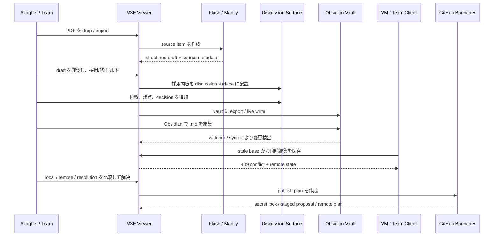
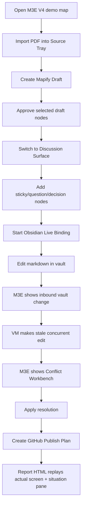

# V4 Product Experience Blueprint

更新日: 2026-05-02
status: design-in-progress

## 目的

この文書は、V4 を「API が通った縦スライス」ではなく、Akaghef が期待しているプロダクト体験として定義する。

到達点は次の一連の操作が M3E の画面上で理解できること。

1. PDF を M3E に取り込む。
2. Mapify 相当の構造化候補を人間が確認して map に採用する。
3. 採用された内容を Miro 的な議論面で付箋、論点、決定として扱う。
4. 同じ map を Obsidian vault と同期し、Obsidian 側でも自然な Markdown として編集できる。
5. host / VM / team member が同じ workspace 内で編集し、衝突したら M3E の GUI で local / remote / resolution を見て解決する。
6. GitHub へ出すものは、M3E の staged proposal / secret lock / publish plan を通してから扱う。
7. 報告動画 HTML は、実際の M3E 画面と状況 pane の2画面だけで、上の流れが分かる。

## 正しい流れ



## 体験の分解

### A. Source Tray

PDF、Markdown、web clip、画像、メモなどの未整理素材を置く入口。
ここは Flash 帯域の入口であり、map 本体へ即時反映しない。

必要なUI:

- `Source Tray` pane
- source item list
- source preview
- source metadata
- ingest status
- `Create Mapify Draft`

必要なデータ:

```ts
type SourceItem = {
  id: string;
  mapId: string;
  kind: "pdf" | "markdown" | "text" | "image" | "web";
  title: string;
  originalPath?: string;
  originalUrl?: string;
  contentHash: string;
  capturedAt: string;
  status: "captured" | "drafted" | "adopted" | "rejected";
  secretLock: "none" | "required" | "locked";
};
```

現在地:

- script では PDF text extraction 済み。
- GUI の Source Tray は未実装。
- Flash API は in-memory draft で永続 source item を持たない。

### B. Mapify Draft Review

Mapify は Flash の主要機能として、source item から構造化候補を作る。
重要なのは自動反映ではなく、人間が採用前に見て編集できること。

必要なUI:

- draft tree preview
- source preview との対応表示
- node 単位の accept / reject
- label / details 修正
- target scope 選択
- `Apply to Map`

必要なデータ:

```ts
type MapifyDraft = {
  id: string;
  sourceItemId: string;
  mapId: string;
  nodes: DraftNode[];
  targetParentId: string | null;
  status: "pending" | "partial" | "approved" | "rejected";
  createdAt: string;
  updatedAt: string;
};
```

現在地:

- `/api/flash/ingest` と approve はある。
- draft は一覧取得できるが、viewer に draft review UI がない。
- draft store は in-memory なので、再起動で消える。

### C. Discussion Surface

Miro 相当は「外部Miro連携」ではなく、M3E の surface 表示と node 属性で実現する。
Tree surface だけだと議論の場に見えないため、discussion surface が必要。

必要なUI:

- surface mode: `Discussion`
- sticky node 作成
- issue / question / decision node 作成
- participant marker
- cluster / lane
- source/draft 由来 node への link
- decision を strategy / task / spec に昇格する操作

必要なデータ:

```ts
type DiscussionKind = "sticky" | "question" | "claim" | "decision" | "action";

type DiscussionAttributes = {
  "m3e:surface": "discussion";
  "discussion:kind": DiscussionKind;
  "discussion:author"?: string;
  "discussion:status"?: "open" | "decided" | "blocked" | "done";
  "discussion:sourceNodeId"?: string;
};
```

現在地:

- node 属性で Miro-like sticky を表現することは可能。
- GUI で discussion node を自然に作る導線がない。
- surface kind は `tree | system` だけで、`discussion` が型にない。

### D. Obsidian Live Workspace

ここで言う Obsidian 同期は、単なる export/import ではない。
「M3E map と Obsidian vault が同じ作業対象を別 surface として見ている」状態を指す。

必要なUI:

- current vault path
- live on/off
- source of truth 表示
- last inbound / outbound
- changed file list
- file preview
- import/export progress
- vault-origin conflict 表示
- Obsidian で開く導線

必要なデータ:

```ts
type VaultBinding = {
  mapId: string;
  vaultPath: string;
  mode: "manual" | "live";
  sourceOfTruth: "m3e-sqlite" | "vault-md" | "mixed";
  lastInboundAt: string | null;
  lastOutboundAt: string | null;
  lastSyncedHashes: Record<string, string>;
  pendingChanges: VaultChange[];
};

type VaultChange = {
  relativePath: string;
  kind: "added" | "modified" | "deleted";
  detectedAt: string;
  status: "pending" | "applied" | "conflicted" | "ignored";
};
```

現在地:

- `vault_importer.ts`, `vault_exporter.ts`, `vault_watch.ts` がある。
- viewer に Live menu と badge はある。
- ただし、変更ファイル一覧、preview、sync direction、conflict provenance が見えない。
- import は map 全体を再構成しやすく、V4 anchor を保つ merge import ではない。

### E. Conflict Workbench

V4 の核は、同時編集や外部surface由来のズレを「壊れた」と見せず、解決可能な作業として見せること。

必要なUI:

- conflict source: `team`, `vault`, `cloud`, `github`
- left: local truth
- middle: remote / incoming
- right: resolution draft
- changed node list
- node 単位の local / remote / both / edit
- recovery point / conflict backup link
- apply resolution

必要なデータ:

```ts
type ConflictRecord = {
  id: string;
  mapId: string;
  source: "team" | "vault" | "cloud" | "github";
  baseSavedAt: string | null;
  localSavedAt: string | null;
  remoteSavedAt: string | null;
  localStateRef: string;
  remoteStateRef: string;
  resolutionStateRef?: string;
  status: "open" | "resolved" | "dismissed";
};
```

現在地:

- `baseSavedAt` による 409 検出はある。
- conflict panel は local / remote の2列表示。
- resolution draft、node単位 merge、source 表示、backup link は未実装。

### F. GitHub Safety Boundary

GitHub は慎重設計対象。
ここでは remote Git 操作を急がず、M3E 側の publish plan を先に作る。

必要なUI:

- `Publish Plan`
- staged proposal list
- secret lock status
- file/node/change unit 単位の publish included/excluded
- remote target
- diff preview
- conflict workbench への接続

基本方針:

- `git add` は出さない。
- M3E 内では常に staged proposal として扱う。
- secret lock が通らないものは publish plan に含めない。
- Akaghef PC / local workspace が正本。GitHub は配布、履歴、レビュー、復元補助。

必要なデータ:

```ts
type PublishProposal = {
  id: string;
  mapId: string;
  target: "github";
  baseRef?: string;
  changes: PublishChange[];
  secretScan: "pass" | "blocked" | "warning";
  status: "draft" | "ready" | "published" | "conflicted";
};

type PublishChange = {
  id: string;
  nodeId?: string;
  filePath?: string;
  kind: "add" | "modify" | "delete";
  included: boolean;
  secretLock: "none" | "locked" | "blocked";
};
```

現在地:

- 方針のみ。
- model / UI / secret scan は未実装。

## 成熟度表

| 領域 | 現在 | 必要な次段階 |
|---|---|---|
| PDF capture | script で抽出 | GUI Source Tray |
| Mapify draft | APIあり / in-memory | 永続draft + review UI |
| Miro相当 | node追加で代用 | Discussion surface |
| Obsidian | import/export/watchあり | binding panel + file diff + merge import |
| Conflict | 409 + 2列panel | 3列 resolution workbench |
| GitHub | 方針のみ | publish proposal + secret lock |
| Report video | 最終snapshot中心 | 実操作sceneをM3E画面 + 状況paneで再生 |

## 実装順

### Slice 1: V4 Experience Panel

目的: 既にある機能を隠れAPIからGUI操作に出す。

- viewer に `V4` panel を追加。
- panel 内に Source / Draft / Discussion / Vault / Conflict / Publish の状態を並べる。
- 実操作できるのは最初は Vault status と Draft list だけでもよい。
- report HTML はこの panel を使った画面を撮る。

合格条件:

- M3E画面上で「今どの段階か」が分かる。
- Obsidian vault path、live status、last inbound/outbound が常時見える。
- Flash draft の pending / approved が見える。

実装状況:

- 2026-05-02: `viewer.html` に `V4` button と `V4 Workbench` panel を追加。
- Flash draft count / list、Obsidian vault status / path、Conflict panel state、GitHub safety boundary、selected node source を表示。
- `Sticky` / `Decision` button で discussion 属性つき node を作成できる。
- まだ Source Tray、draft review、changed file list、3列 conflict resolution は未実装。

### Slice 2: Mapify Review UI

目的: PDF取り込みを API ではなく GUI で見て採用できるようにする。

- source text paste / file import から draft 作成。
- draft tree preview。
- selected node accept / reject。
- apply で target scope に投入。

合格条件:

- PDF由来テキストをGUIでdraft化し、少なくとも一部採用できる。
- 採用nodeに source metadata が残る。

実装状況:

- 2026-05-02: `V4 Workbench` に source text textarea、`Create Draft`、`Apply Latest Pending` を追加。
- GUIから `/api/flash/ingest` で draft を作成し、`/api/flash/draft/:id/approve` で選択node配下へ適用できる。
- `Apply` 後は local DB から map を読み直し、画面に反映する。
- まだ PDF binary のGUI抽出、draft tree preview、node単位 accept/reject、編集してから apply は未実装。

### Slice 3: Discussion Surface

目的: Miro相当を「ただのノード追加」から体験へ上げる。

- `Surface: Discussion` を追加。
- sticky / question / decision / action を作れる。
- node color / layout / author / status を表示。

合格条件:

- PDF由来nodeの周囲に議論nodeを置き、decision node に固定できる。

### Slice 4: Obsidian Binding Workbench

目的: Obsidian 同期が見える、理解できる、試せる。

- vault path / status / direction / changed files を表示。
- export/import/watch のイベント履歴を表示。
- `.md` preview をM3E内で表示。
- import は full replace と merge import を分ける。

合格条件:

- Obsidian側で編集したファイル名と内容が M3E に表示される。
- M3E側編集の vault 書き戻しが確認できる。

### Slice 5: Conflict Workbench

目的: コンフリクト解決を force save ではなく、GUI の作業にする。

- local / remote / resolution の3列。
- node単位で local / remote / both / edit。
- apply resolution。
- recovery point / conflict backup 表示。

合格条件:

- VM stale edit で conflict を起こし、GUI上で解決できる。
- 解決後の map に host edit と VM resolution が両方残る。

### Slice 6: GitHub Publish Plan

目的: GitHubを安全境界つきで扱う。

- publish proposal を作る。
- secret lock を表示。
- include/exclude を選ぶ。
- dry-run report を作る。

合格条件:

- remote push なしで、publish plan と blocked secrets が見える。
- destructive / secret-risk 操作は人間確認なしに進まない。

## E2E シナリオ

最終的な E2E は次の1本にする。



## 報告動画 HTML の仕様

動画HTMLは説明資料ではなく、検証済み操作の再生にする。

画面構成:

- 左: 実際の M3E 画面 snapshot / capture
- 右: 状況 pane

表示しないもの:

- scene 全体の進捗バー
- scene list の常時表示
- 架空のUI

表示するもの:

- 操作名
- 誰が編集しているか
- どの surface / vault / conflict source か
- 成功条件
- 実際の map / vault / conflict 状態

## 直近で解く仕様負債

1. `SurfaceKind` に `discussion` を足すか、既存 `system` surface の submode として始めるか。
2. Flash draft を in-memory のままにするか、SQLite に保存するか。
3. Vault import を full replace と merge import に分ける。
4. Conflict panel を既存2列から3列へ拡張する。
5. GitHub publish proposal の保存先を map attribute / SQLite table / file artifact のどれにするか。

## 現時点の判断

- `discussion` は V4 の体験中心なので、最終的には `SurfaceKind` に追加する。
- ただし最初の実装は既存 tree surface 上の panel と node attributes で始める。
- Flash draft は短期的には in-memory でよいが、PDF/Mapify 体験に入る前に永続化する。
- Vault import は V4 では full replace を危険操作として扱い、通常は merge import を既定にする。
- Conflict Workbench は3列化を必須にする。
- GitHub は remote 操作前に publish proposal / secret lock を必須にする。
