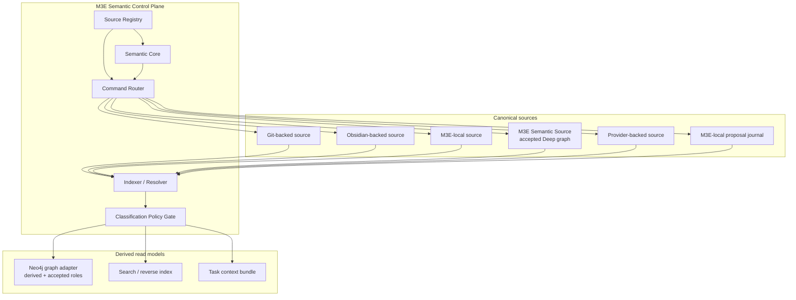
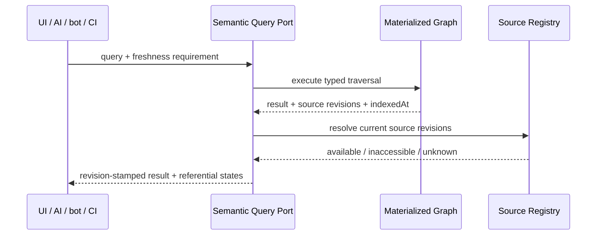
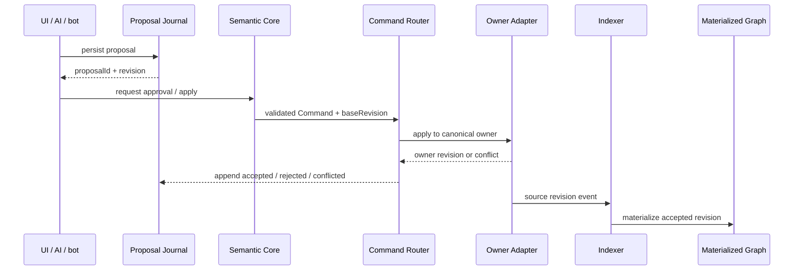

# Federated Semantic Graph Architecture

最終更新: 2026-07-19

Status: Phase 1 portable specimen implemented

Spec: [../03_Spec/Federated_Semantic_Source.md](../03_Spec/Federated_Semantic_Source.md)

## 1. 目的

この文書は、局所 canonical source を壊さずに大域 semantic graph を構築する実装境界を定義する。storage 製品や adapter に暗黙の正本性を与えず、M3E 固有 semantics の owner を source contract で明示する。

## 2. 原則

1. `Semantic Core` は storage adapter を知らずに Command と invariant を評価する。
2. `Source Registry` は source、revision、capability、classification policy、route を解決する。
3. `Adapter` は native source と M3E semantic record の境界を担当する。
4. `Materialized Read Port` は source-owned record の再生成可能な read model だけを更新する。
5. `Canonical Graph Port` は activation gate 後の M3E-owned accepted graph だけを更新する。
6. `Proposal Journal` は未確定判断を失わない canonical source である。
7. write は record role と owner を解決し、owner adapter へ route する。

## 3. Component topology



## 4. Port boundary

型名は説明用であり、実装言語とserializationは未確定とする。

```typescript
type SourceId = string
type LocalEntityId = string
type Revision = string

interface SourceDescriptor {
  sourceId: SourceId
  sourceKind: string
  schemaVersion: string
  currentRevision: Revision
  capabilities: SourceCapabilities
  classificationPolicyRef: string
  readRoute: string
  writeRoute: string
}

interface SourceReadPort {
  describe(): SourceDescriptor
  readChanges(afterRevision?: Revision): AsyncIterable<SourceChange>
  readEntity(localId: LocalEntityId, atRevision?: Revision): SourceEntity
}

interface SourceWritePort {
  propose(command: SemanticCommand): ProposalReceipt
  apply(command: ApprovedSemanticCommand): ApplyResult
  readCurrentRevision(target: TargetRef): Revision
}

interface MaterializedReadPort {
  upsert(batch: MaterializationBatch): MaterializationResult
  removeSourceRevision(sourceId: SourceId, revision: Revision): MaterializationResult
  query(query: SemanticQuery): RevisionStampedResult
  rebuild(inputs: RebuildInput[]): RebuildReport
}

interface CanonicalGraphPort {
  apply(command: ApprovedSemanticCommand): ApplyResult
  readCurrentRevision(target: TargetRef): Revision
  createPortableRecoveryPoint(revision: Revision): RecoveryPoint
}
```

`SourceWritePort.apply` を持たない source は `capabilities.directWrite = false` として扱い、proposal receipt を返すか明示拒否する。caller が adapter の native API を直接呼ぶ経路を標準にしない。`CanonicalGraphPort` は activation gate 前には無効であり、M3E-owned accepted target 以外を拒否する。ここでいう materialized read model は、Deep → Rapid の `射影 (projection)` とは別概念である。

### 4.1 Phase 1 portable specimen

Phase 1 は [semantic_source.ts](../../beta/src/node/semantic_source.ts) に read-only file adapter と `SourceDescriptor` validator を置き、[semantic-source fixtures](../../beta/tests/fixtures/semantic-source/) で rename / revision / rebuild を検証する。schema 名は `m3e.semantic-source.specimen.v1` とし、**恒久 serialization や repository 内の固定配置を決めるものではない**。adapter は任意の明示パスから読むため、`.m3e/` を正規配置として先行固定しない。

fixture は D3 record と、transform + provenance を持つ選択済み D2 record だけを graph 入力に含める。数学 ontology の最初の relationType specimen として `SPECIALIZES` を含むが、relationType 語彙全体の採択は別判断とする。

Neo4j に同居させる record は、論理的に次を区別する。

| Role | Owner | Write path |
|---|---|---|
| `source-materialized` | Git / Obsidian / provider / Rapid source | source event → indexer |
| `M3E-owned accepted` | M3E Semantic Source | validated Command → Canonical Graph Port |
| `proposal-materialized` | proposal journal | journal event → indexer |

物理 property 名は deployment / schema Architecture Decision Record で決めるが、owner source、role、owner revision、provenance は省略しない。

## 5. Materialization pipeline

```text
source event
→ adapter parse
→ schema version check
→ stable identity resolve
→ assertion owner validate
→ classification policy evaluate
→ semantic invariant validate
→ idempotency key calculate
→ materialization batch apply
→ indexed revision record
```

### 5.1 idempotency key

materialization batch は少なくとも次の組で冪等に識別する。

```text
sourceId + sourceRevision + schemaVersion + semanticContentHash
```

同じ key の再処理は graph version を進めず、audit 上の retry として記録する。

### 5.2 classification policy gate

adapter が返す source record を、そのまま global graph へ送らない。Policy Gate が `include`、`redact`、`exclude` を決める。

- policy resolution 失敗は `exclude`
- `redact` は identity と許可された relation metadata のみ
- classification policy reference 自体は source descriptor が持つ
- Neo4j role は二次防御であり、source classification の canonical owner ではない

複数 classification を一つのdatabaseへ安全に載せられない場合、database分割またはmaterialization除外を選ぶ。edition機能を理由にfail-openへ変更しない。

## 6. Read flow



consumer は `indexed-only` や `stale` を `resolved` と同じ確度で扱わない。write を伴う操作では query result の source revision を `baseRevision` に引き継ぐ。

query surface は openCypher / ISO GQL 語彙の read-only 部分集合とする。`CREATE`、`MERGE`、`SET`、`DELETE` を禁止し、独自 query 言語を追加しない。Cypher `RETURN` の query projection は M3E の `射影` / `materialization` と同一視しない。変更は常に graph operation → Semantic Command → owner adapter の write flowへ送る。

## 7. Write flow



owner apply が失敗しても proposal journal は残る。source owner の commit 後に materialization 更新が失敗しても owner commit を rollback せず、再index queueへ送りread modelを `stale` とする。M3E-owned accepted write は Canonical Graph Port の transaction結果を owner revision とし、成功後に journalへaccepted stateを追記する。

## 8. Echo suppression

bot、native editor、indexer が同じ変更を循環させないため、event は次の因果情報を持つ。

- upstream command / proposal ID
- actor / adapter ID
- source revision
- semantic content hash
- observed materialization revision

同じ owner revision と semantic content hash を持つ event は再applyせず、既存因果へ連結する。text byte が違ってもsemantic resultが同じ場合の正規化規則はsource adapterが所有する。

## 9. Authority resolution

```text
target reference
→ resolve target source
→ resolve record role
→ resolve relation assertion owner when relation Command
→ resolve nearest authority root when M3E tree Command
→ preserve alias target owner
→ check adapter capability and base revision
→ route or reject
```

`reparent` のsource解決結果がsource/destinationで異なる場合、Command Routerは `ownership-transfer-required` を返し、通常reparentを実行しない。

## 10. Ownership transfer coordinator

Coordinatorはglobal transactionを仮定せず、journaled sagaとして扱う。

| State | Source | Destination | 許可操作 |
|---|---|---|---|
| `requested` | unchanged | absent | approve / reject |
| `source-pending` | readable, write-frozen for target | absent | create destination / cancel |
| `destination-accepted` | pending | canonical copy exists | redirect source / compensate destination |
| `source-redirected` | tombstone / redirect | canonical | finalize |
| `completed` | redirect | canonical | audit only |

中間stateはproposal journalまたは専用transfer journalに保存する。transfer journalをNeo4jだけに置かない。

## 11. Rapid occurrence / Deep entity materialization

```text
Rapid occurrence
  owns: local wording, order, document context
  references: entity binding assertion

Deep entity
  owns: global identity, aliases, entity-level typed semantics

Materialized read model
  joins: occurrence --binds--> entity
```

entity binding assertionのownerはsource packageごとに明示する。Rapid node削除でDeep entityを自動削除せず、entity bindingをmissingまたはtombstonedへ遷移させる。Deep entity mergeでは旧entity IDをredirectとして残す。

## 12. Context bundle projector

Director dispatch時に次を入力としてtask固有bundleを生成する。

- query definition
- source revision set
- selected entities / occurrences / assertions
- provenance
- classification decision
- deterministic serializer version

bundleにはlockfileを付ける。agentはbundleを更新sourceとして使わず、writeはCommand envelopeでownerへ戻す。

## 13. Failure handling

| Failure | Canonical state | Read model state | Recovery |
|---|---|---|---|
| Neo4j停止 | source-owned canonはunchanged、M3E-owned accepted graphはunavailable | unavailable | source側runtimeへdegradeし、canonical graph writeを停止 |
| materialization batch失敗 | owner commit済み | stale | idempotency keyでretry |
| source未mount | unchanged | indexed-only | provenanceを表示しwriteを保留 |
| source権限不足 | unchanged | inaccessible / excluded | credential回復までfail closed |
| registry停止 | unchanged | query may continue as stale | write routing停止、registry backupから復旧 |
| proposal journal停止 | owner unchanged | proposal不可 | write UIをfail closed |
| transfer途中失敗 | journaled intermediate | mixed / stale | state machineからresume / compensate |

## 14. Deployment boundary

Phase 0 / 1ではNeo4jを必須runtimeにしない。Phase 2 shadow materialization開始には次が必要である。

1. 実需cross-source query 3件
2. portable source specimen
3. Rebuild test
4. Exposure test
5. SQLite / file indexとのsemantic comparison
6. edition / deployment / backup / authentication ADRの承認

Neo4j以外のadapter候補も同じ`MaterializedReadPort`で比較する。比較対象の名称と採否はADR検証時に更新し、ここでは固定しない。

Phase 4で M3E-owned accepted graph の Neo4j canonical runtime をactivateするには、さらにrecord role discriminator、graph operationからCommandへの正規化、canonical subgraph recovery testを要求する。会話 protocolは [LLM_Graph_Conversation_Protocol.md](./LLM_Graph_Conversation_Protocol.md) に従う。

## 15. Architecture tests

### Contract tests

- 全adapterが同じSourceDescriptor必須項目を返す。
- read-only adapterがdirect writeを受理しない。
- stale baseRevisionを全adapterが同じconflict分類で返す。
- materialization adapterが同じidempotency keyを二重適用しない。

### Equivalence tests

- SQLite Rapid documentとportable source materializationでroot reachability、sibling order、Scope、Alias、GraphLinkが意味同値。
- owner sourceからrebuildしたgraphがfixture queryに同じentity / relationを返す。
- Rapid occurrence / Deep entityのentity bindingを外してもRapid本文が変化しない。
- source-materialized recordとM3E-owned accepted recordを同じqueryで取得してもowner / roleを識別できる。

### Security tests

- classification policy未解決recordがmaterialized read modelへ入らない。
- excluded sourceのidentity、label、property、relation endpointがquery結果へ漏れない。
- redacted recordが許可property以外を持たない。
- source権限より広いconsumer roleで非許可recordを読めない。

### Recovery tests

- Neo4j directory全削除後、source-materialized recordをowner sourceからrebuildし、M3E-owned accepted recordをportable snapshot + journal replayだけでrecoverする。
- engine依存backup / restoreも補助経路として検証するが、Recovery Gateの通過根拠には含めない。
- materialization失敗後のretryでowner commitが二重化しない。
- proposal journalからpending queueを復元する。
- ownership transferの各中間stateからresumeまたはcompensateする。

## 16. Revalidation triggers

次の変更時はSpec、ADR、adapter contract、test fixtureを同時に再評価する。

- source kind追加
- identity key変更
- authority marker変更
- classification policy変更
- proposal journal format変更
- materialization database / edition変更
- canonical graph runtime activation / record role変更
- ownership transfer state変更
- Rapid / Deep entity binding semantics変更

## 関連

- [../03_Spec/Federated_Semantic_Source.md](../03_Spec/Federated_Semantic_Source.md)
- [Storage_And_Collab_Overview.md](./Storage_And_Collab_Overview.md)
- [LLM_Graph_Conversation_Protocol.md](./LLM_Graph_Conversation_Protocol.md)
- [MVC_and_Command.md](./MVC_and_Command.md)
- [../09_Decisions/ADR_008_Federated_Canonical_Sources.md](../09_Decisions/ADR_008_Federated_Canonical_Sources.md)
- [../tasks/handoff_s16_neo4j_federation_define_260718.md](../tasks/handoff_s16_neo4j_federation_define_260718.md) — Phase 1 dogfooding scenario / approval record
- [../../docs/protocols/repository-canon-values.md](../../docs/protocols/repository-canon-values.md)
