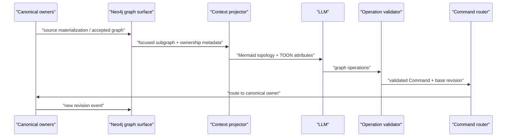

# LLM Graph Conversation Protocol

最終更新: 2026-07-18

Status: Phase 0 architecture baseline

Related Strategy: `S16`

## 1. 目的

LLM が property graph の局所文脈を読み、変更を提案し、検証可能な operation として canonical owner へ戻す会話 protocol を定義する。

Mermaid / TOON を正本にせず、LLM の自然言語出力を database raw write にもしない。会話面と確定 write の間に graph operation、Semantic Command、owner routing を置く。

## 2. 正本範囲

「Neo4j を正本」とする判断は、**M3E-owned accepted Deep entity / assertion の canonical runtime** に限定する。

| Record | Canonical owner | Neo4j role |
|---|---|---|
| Git / Obsidian / provider owned content | native source | `source-materialized` |
| M3E-native Rapid occurrence | M3E-local Rapid source | `source-materialized` または local reference |
| M3E-owned accepted Deep entity / assertion | M3E Semantic Source | activation 後は `M3E-owned accepted` canonical runtime |
| AI / bot proposal、pending assertion | M3E-local proposal journal | proposal materialization |
| ownership transfer intermediate state | proposal / transfer journal | status materialization |
| Mermaid topology / TOON context | canonical なし | task-scoped context projection |

database 名だけで record の正本性を決めない。少なくとも owner source、record role、owner revision、provenance を追跡する。

## 3. 会話 protocol



`Neo4j → context projection → LLM → graph operations → Neo4j` という短縮表現の最後の Neo4j write は、target が `M3E-owned accepted` の場合だけ直接 owner adapter に到達する。source-owned target は Git / Obsidian / provider / Rapid owner へ route し、確定後に再 materialize する。

## 4. Context projection

ここでいう **context projection** は task 固有の一時表現であり、Glossary の無修飾な `射影（Deep → Rapid）` とは別概念である。

### 4.1 Mermaid

- focus 周辺の topology、direction、relation type を人間と LLM が把握するために使う
- edge label を stable ID として解析しない
- node / edge ID は comment または別 metadata block で明示する
- Mermaid source 自体を canonical graph として write-back しない

### 4.2 TOON

- property、provenance、referential state、owner、revision、schema を compact に渡す
- topology の唯一の表現にしない
- TOON byte diff を graph operation と同一視しない
- serialization version を context bundle に記録する

### 4.3 Focus expansion

全 graph を渡さず、focus entity 集合 (V_{focus})、hop 数 (k)、relation filter、classification policy から局所 context を生成する。

```text
Expand(V_focus, k, relationFilter, classificationPolicy)
```

context bundle は次を含む。

- selected node / edge IDs
- owner source と record role
- source / graph revision
- Mermaid topology
- TOON attributes / provenance / state
- allowed operation set
- classification decision
- serializer version

## 5. Graph operation envelope

LLM は最終出力を自由記述の Mermaid / TOON 全置換にせず、operation 列として返す。

```typescript
interface GraphOperation {
  operationId: string
  operation: "create" | "set" | "remove" | "connect" | "disconnect" | "merge" | "reparent"
  targetRef: string
  key?: string
  value?: unknown
  baseRevision: string
  provenance: string
  reason?: string
}
```

型名と serialization は説明用であり、Phase 0 では固定しない。最低限の invariant は次とする。

1. `targetRef` は label ではなく stable identity を解決する。
2. `baseRevision` がない確定 write を受理しない。
3. operation は owner、record role、capability、classification を解決してから Command へ変換する。
4. source-owned target への operation を Neo4j raw write に変換しない。
5. proposal 状態の operation は journal に保存し、承認前に accepted graph へ入れない。
6. `reparent` が authority を跨ぐ場合は ownership transfer を要求する。

## 6. Validation pipeline

```text
LLM output
→ syntax parse
→ stable target resolution
→ owner / record-role resolution
→ allowed-operation check
→ baseRevision check
→ M3E semantic invariant check
→ approval check
→ Semantic Command
→ owner adapter apply
→ revision event
→ Neo4j update
```

invalid operation は部分適用せず、operation 単位または batch 単位の failure policy を明示する。自動修復を行う場合も original proposal、repair、final Command の provenance を残す。

## 7. Read / write guarantees

- context は source revision / graph revision 付きの snapshot であり、最新性を暗黙に仮定しない
- LLM の読み取り中に owner revision が進んだ場合、stale operation は conflict とする
- retry は `operationId` と semantic content hash で冪等化する
- edge の rename や表示 label 変更で identity を失わない
- source-materialized record は source event だけが更新する
- M3E-owned accepted record は validated Command だけが更新する
- proposal journal 停止中は accepted write を fail closed にする

## 8. Recovery

Neo4j が M3E-owned accepted graph の canonical runtime になった後も、単一 failure domain にしない。

- source-materialized record: owner source revision から再構築
- M3E-owned accepted record: Neo4j backup、Command audit、portable snapshot / journal から復旧
- proposal / pending state: proposal / transfer journal から復旧
- Mermaid / TOON: canonical recovery source に使わず、必要時に再生成

portable recovery evidence は常時 write authority を持つ第二正本ではない。restore test で semantic equivalence を確認するための backup / journal とする。

## 9. Security

- context projector は classification policy 通過後の record だけを出力する
- inaccessible source の label、property、edge endpoint を context に含めない
- prompt / operation に secret、credential、private absolute path を埋め込まない
- LLM が要求しても allowed operation set 外の write を生成・適用しない
- Neo4j role / privilege だけを source classification の正本にしない

## 10. Test plan

### Contract

- 同じ focus / revision / policy から deterministic な Mermaid + TOON context を生成する
- edge label を変えても stable edge ID に対する operation が同じ target を解決する
- source-owned target operation が owner adapter へ route され、Neo4j raw write にならない
- M3E-owned accepted target operation が activation 前は拒否され、activation 後は canonical graph adapter へ route される

### Conflict / failure

- stale `baseRevision` を reject し、proposal を保持する
- malformed operation batch を部分適用しない
- proposal journal 停止時に accepted write を fail closed にする
- authority を跨ぐ `reparent` を ownership transfer へ変換する

### Recovery / security

- Neo4j 全削除後、source-materialized record を source 群から再構築する
- M3E-owned accepted record を独立 recovery evidence から復旧する
- excluded source が Mermaid topology、TOON attributes、operation target candidate に現れない

## 11. Activation gate

M3E-owned accepted graph の Neo4j canonical runtime activation には次を要求する。

1. S16 Demand Gate の実需 query 3 件
2. owner / record-role discriminator の schema と query test
3. validated graph operation → Command → owner adapter の end-to-end test
4. source-materialized rebuild test
5. canonical subgraph recovery test
6. Exposure Gate と edition / deployment Architecture Decision Record

## 関連

- [../03_Spec/Federated_Semantic_Source.md](../03_Spec/Federated_Semantic_Source.md)
- [Federated_Semantic_Graph.md](./Federated_Semantic_Graph.md)
- [../09_Decisions/ADR_008_Federated_Canonical_Sources.md](../09_Decisions/ADR_008_Federated_Canonical_Sources.md)
- [../00_Home/Glossary.md](../00_Home/Glossary.md)
