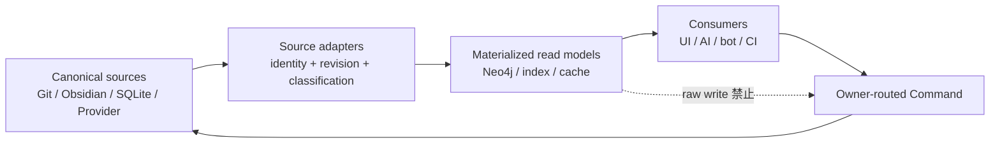

# Storage & Collab — アーキテクチャ概観

最終更新: 2026-07-18

保存モード、局所 canonical source、大域 semantic graph、Collab の責任分担を示す。詳細契約は `../03_Spec/`、採用判断は `../09_Decisions/` に委ねる。

---

## 正本と派生物

| 対象 | canonical owner | 派生物 / cache | 備考 |
|---|---|---|---|
| Standalone M3E Rapid document | SavedDoc domain model / M3E-local SQLite | JSON export、backup、audit、cloud-sync copy | 現行既定。SQLite の判断は維持 |
| Import / Export | 実行後は各側で独立 | 変換中間物 | live sync ではない |
| ローカルファイル連携 | `.md` file | SQLite index / cache | 明示的な binding mode のみ |
| Git-backed code / design / semantic source | Git repository | search index、Neo4j materialization | repository の revision と review を維持 |
| external provider native state | provider | M3E reference / materialization | M3E 固有 assertion は M3E 側で所有 |
| source-owned cross-source graph record | 各 canonical source | Neo4j 等の再構築可能な materialization | owner source から再構築 |
| M3E-owned accepted Deep graph | M3E Semantic Source | Gate 後は Neo4j canonical runtime | backup / journal / portable snapshot を別 failure domain に維持 |
| proposal / pending transfer | proposal / transfer journal | Neo4j status materialization | accepted graph と混同しない |

同じ entity、assertion、durable concern の canonical owner は一つにする。物理的複製は許すが、copy を両方 write 可能にしない。



source-materialized record は source revision を持ち、canonical source 群から再構築できなければならない。確定 write は `baseRevision` を含む Command として owner へ route する。M3E-owned accepted target だけが activation 後の canonical graph adapter に到達する。

詳細:

- [Federated Semantic Source](../03_Spec/Federated_Semantic_Source.md)
- [Federated Semantic Graph](./Federated_Semantic_Graph.md)
- [LLM Graph Conversation Protocol](./LLM_Graph_Conversation_Protocol.md)
- [ADR 008](../09_Decisions/ADR_008_Federated_Canonical_Sources.md)

---

## ローカルファイル連携モード（強結合）

```text
.md file（canonical source）
    ↕ read/write
FileBinding Layer
    ↕ materialize
SQLite（index / cache）
    ↕ push/pull
Supabase（remote sync copy）
```

- `.md` 保存 = commit（確定）。staging なし
- SQLite は index / cache であり、壊れても `.md` から再構築できる
- Cloud Sync は SQLite cache 経由（CS-2 方式）
- 普段の Import / Export はこのモードに含めない

詳細: [local_file_integration.md](../03_Spec/local_file_integration.md), [Obsidian_Vault_Integration.md](../03_Spec/Obsidian_Vault_Integration.md), [Cloud_Sync.md](../03_Spec/Cloud_Sync.md)

---

## Collab（リアルタイム共同編集）

- ユーザー間の **序列（priority）** が核心。単なるリアルタイム同期ではない
- 戦略は Priority Cascade / Auto Merge / Branch Isolate / Last Write Wins / Manual Resolve
- scope 単位で lock / share するが、scope を storage boundary または canonical owner と同一視しない
- collaboration state の server storage と global semantic graph の storage は別 concern として選定する

詳細: [Team_Collaboration.md](../03_Spec/Team_Collaboration.md), [Cloud_Sync_Conflict_Resolution.md](../03_Spec/Cloud_Sync_Conflict_Resolution.md)
