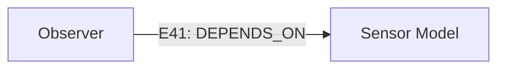
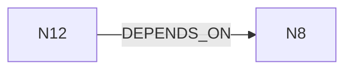

> **原文stow（2026-07-18、akaghef指針）。** PR #75 の [LLM_Graph_Conversation_Protocol.md](../04_Architecture/LLM_Graph_Conversation_Protocol.md) が連邦モデル整合形として本文書を supersede した。原文の「Neo4j を正本」は role 分離（source-materialized / M3E-owned accepted + Recovery Gate）へ精密化された。歴史的原文として保存する（本文は無改変）。

# LLM ↔ Property Graph Conversation Protocol

作成: 2026-07-18（akaghef 指針の stow）
Status: 指針（akaghef 発、working-agreement。Decision_Pool 2026-07-18-001 参照）

> これはファイルフォーマットの仕様ではなく、**LLM と property graph の間の会話プロトコル**の定義である。

## 原則

**Neo4j を正本、Mermaid + TOON を会話用 projection とする。**

```text
Neo4j
  --(context projection)--> (Mermaid topology, TOON metadata)
  --(LLM edit)--> graph operations
  --(apply)--> Neo4j
```

重要なのは、**LLM の出力を Mermaid や TOON そのものとして保存せず、最終的に graph operation へ正規化する**こと。

```text
ops[3]{op,target,key,value}:
  update,N12,status,approved
  create_edge,E41,type,DEPENDS_ON
  delete_edge,E17,,
```

## 役割分担

| ID | レイヤ | 役割 |
|---|---|---|
| CR1 | Mermaid | 人間と LLM が同時に読める局所 topology（認知的な構造把握） |
| CR2 | TOON | 表示しきれない属性・provenance・state・schema の保持 |
| CR3 | Neo4j | 完全な property graph と query |
| CR4 | graph ops | 会話結果を DB へ反映する正規化境界 |

### CR1 Mermaid — 局所 topology



### CR2 TOON — 属性・provenance・state

```text
nodes[2]{id,type,status,confidence,source}:
  N12,Observer,approved,0.94,doc:control-design
  N8,Model,draft,0.81,paper:smith2025

edges[1]{id,type,status,confidence}:
  E41,DEPENDS_ON,proposed,0.88
```

## Context projection（部分グラフ射影）

会話では全グラフを毎回渡さず、注目 node 周辺の k-hop 部分グラフだけを Mermaid + TOON に射影する:

```text
G_context = Expand(V_focus, k, relation filter)
```

## Edge ID の明示

Mermaid の edge label を識別子として解析するのは脆い。edge ID はコメントまたは独自記法で明示する:



## 帰結

- この定義なら **JSON を排除する合理性も十分ある**（会話面は Mermaid+TOON、永続面は property graph、境界は ops のみ）。
- LLM 出力の保存形式は常に graph ops。projection 形式（Mermaid/TOON）は使い捨てのビューであり正本にならない。

## 関連

- [docs/research/ontology_data_structure.md](../research/ontology_data_structure.md) — Neo4j / ontology 検討の研究線
- [docs/research/m3e_data_structure_conversations/](../research/m3e_data_structure_conversations/) — データ構造会話の抽出
- [docs/06_Operations/Decision_Pool.md](../06_Operations/Decision_Pool.md) — 決定記録 2026-07-18-001
