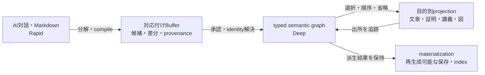

# MemForest を接点に、AI対話を typed knowledge graph へ育てる

作成日: 2026-07-19

Status: idea / MemForest の実体と公開仕様は未確認

Source: bridge message `20260718T161000Z-codex-m3e-inko-message-memforest-full-conversation-handoff-002`

関連: `V1` / `V3` / `S16` / [260701_rapid_markdown_canon_mfh_and_obsidian_surface.md](260701_rapid_markdown_canon_mfh_and_obsidian_surface.md) / [260420_math_transition_vision.md](260420_math_transition_vision.md)

## Why

AIとの数学対話をchat logのまま消費せず、tree noteを経て、再利用・検査・用途別出力が可能な知識体系へ育てたい。

AI for Math第2回で多寳雅樹さんが「AIとの数学対話をツリー構造のノートへ育てる試み」を発表し、その接点として `memforest.com` という名称が会話に出た。ただし、2026-07-19時点では公開surface、作者との対応、仕様を確認できていない。同名のagent memory論文とは別物の可能性が高く、以下はMemForestの仕様説明ではなく、M3E側で保存すべき問題設定である。

## Core Idea

会話から知識体系への流れを次のように捉える。



- 「書く」は自然言語をatomic fact候補へ分解し、typed node / relationとして統合するcompile操作になる。
- 「読む」はgraph全体を直接受け取ることではなく、読者・目的・順序に応じたselected subgraphのprojectionを見ることになる。
- `projection` は選択・変換の規則または結果を指す。`materialization` は、その派生結果をconsumerが毎回再計算せず読めるよう保存・index化することを指す。materializationは正本ではなく、正本から再構築可能でなければならない。
- RapidでMarkdownとmapの両方を扱う場合も、同じconcernのwrite authorityを二重化しない。Bufferはdual-canonの正当化ではなく、対応未確定・差分・候補・provenanceを保持する移行境界として扱う。
- S16との接続では、局所正本とM3E Semantic Coreが意味のauthorityを持ち、Neo4jはそれらから再構築できる大域materialized graphになる。

## λ式を技術的な合格試験にする

単なる文字列やtopic treeでは、数学の知識表現として不足する。最小標本を次とする。

```text
F := λ (x : Nat). x + 0 = x
```

nodeを閉じたtyped judgment `[context |- claim]` として扱い、binder `x : Nat` と `Eq(Add(x, 0), x)` を同じ境界内に保持する。外部には型付きinterfaceと安定identityだけを公開する。

最低合格条件:

1. `λx. x + 0 = x` と `λn. n + 0 = n` を同一視できるα同値
2. 表示名ではなく内部IDに基づくbound variable参照
3. `x := 3` から `3 + 0 = 3` を得るcapture-free substitution
4. collapseされたblockを外部からatomicに参照できること
5. expand時にbinder / claim graphを復元できること

ここでcollapseは見た目の折り畳みだけではない。局所変数を内部へ閉じ、型付きinterfaceだけを外へ出すλ抽象に近い操作になる。

## M3E の位置づけ

M3Eの競争軸は基盤modelの規模ではない。超人的AIと人間が同じ知識表現を共有し、推論の中間状態を検査し、`scope` / collapse / view / provenance / approvalを通じて介入できることにある。

この意味で、M3E / LGMは「Digital god本体」ではなく、AIと人間社会の間に置く**認識論的OS**として捉えられる。

制度面にも同じ分離を適用できる。

- closedな場では、評判riskで失われやすい過激なfuture scenarioを安全に生成する。
- 別の段階では、候補を厳しく反証・検証する。
- 公開projectionでは著者情報を落として内容中心に評価できる。
- 内部正本には本人対応、timestamp / hash、根拠、生成履歴を保持し、必要なら後から著者性を回収できる。

匿名化はprovenanceの破棄ではなく、内部provenanceと公開projectionの分離で実現する。

## MemForest を確認できた場合の比較軸

1. chatからtree noteへ昇格するunitはturn、summary、claim、task、concept、proof stepのどれか。
2. parent-childは時系列、topic、abstraction、logical dependency、user intentのどれを表すか。
3. 同一conceptの複数文脈をalias、GraphLink、複製のどれで扱うか。
4. treeを正本とするか、typed graphへ進むか。
5. LaTeX、Lean、binder、variable scope、proof dependencyを扱えるか。
6. AIのsummary上書きに人間の承認とprovenanceがあるか。
7. export、API、local-first、versioning、collaborationの境界は何か。
8. M3Eにとって競合、共同利用、import source、projection先のどれに位置づくか。

## Open Questions

- atomic factの境界を誰が、どの規則とapprovalで決めるか。
- treeの親子edgeと、数学的なtyped relationをどこで分離するか。
- Bufferを永続artifact、workflow state、差分queueのどれとして実装するか。
- projectionの各文・数式からsource node / relationへ戻れるprovenanceをどう表現するか。
- α同値とsubstitutionをM3E Semantic Coreの責務にするか、Lean等の外部kernelへ委譲するか。
- 内部provenanceを保持したまま公開projectionだけを匿名化するauthority modelをどう定義するか。

## Next Action

1. 多寳さん本人へ正確なURLと公開surfaceを確認し、MemForestの仕様を推測から分離する。
2. 上記λ式を、会話→Buffer→typed graph→文章projectionへ往復させる最小specimenとして記述する。
3. 数学領域からS16 Demand Gate用の実需queryを3件採取する。最初は定義→定理→証明依存、一般化・特殊化、同一概念の文献横断identityを候補とする。
