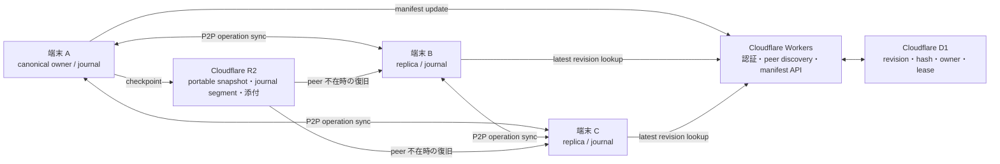

# P2P 優先同期と Cloudflare Snapshot 配布

作成日: 2026-07-30

Status: idea / 未採択・未実装

関連: `S2` / `S3` / `S13` / `S16` / [Cloud Sync](../03_Spec/Cloud_Sync.md) / [Cloud Sync Conflict Resolution](../03_Spec/Cloud_Sync_Conflict_Resolution.md) / [Federated Semantic Source](../03_Spec/Federated_Semantic_Source.md)

## Why

M3E の高頻度な編集差分を常時サーバーへ集約すると、通信・保存・運用コストが増え、局所正本の設計とも衝突しやすい。一方、端末消失や peer 不在に備えるには、端末外の復旧経路が必要である。

そこで、高頻度な差分は端末間で P2P 同期し、更新頻度の低い `portable snapshot` と復旧用 `journal` を Cloudflare に置く。Cloudflare は canonical owner ではなく、配布・発見・復旧のための複製面として扱う。

## Core Idea

### 役割分担

| Concern | Canonical owner / 保存先 | 備考 |
|---|---|---|
| Git 管理対象の byte / history | Git | M3E は再実装しない |
| M3E の確定 state | authority を持つ局所 canonical source | 同じ concern の dual-canon を作らない |
| 高頻度な未確定 operation | 各端末の journal | P2P で交換する |
| peer discovery・認証 | Workers | state 本体を所有しない |
| revision・hash・owner・lease | D1 | 小さい同期 metadata のみ |
| `portable snapshot` | R2 | canonical state から生成した復旧 artifact |
| journal segment | 局所保存＋必要範囲を R2 | snapshot 以降を replay 可能にする |
| Neo4j・検索 index・表示 cache | materialization | canonical source から再生成可能にする |

## 同期モデル

既存の `scope` 単位 3-way comparison と node 単位 conflict resolution を維持する。P2P は同期 transport の候補であり、競合規則や write authority を置換しない。

1. 各 operation は `workspaceId`、`scope` 文脈、stable target、`baseRevision`、device、actor、provenance、hash を持つ。
2. オンライン peer がある場合、未反映 operation を直接交換する。
3. 受信側は owner routing、base revision、tree invariant、alias invariant を検証してから適用する。
4. 競合は既存 Cloud Sync 方針に従い、非競合部分だけを自動統合する。
5. 一定条件で canonical owner が deterministic な `portable snapshot` を生成する。
6. snapshot、対応 journal range、content hash を R2 へ置き、小さい manifest だけを更新する。
7. peer 不在、新規端末、または局所状態破損時は、R2 の snapshot と journal replay で復旧する。

## Checkpoint 方針

毎操作で snapshot を生成しない。次のいずれかを満たした時に checkpoint 候補とする。

- 最後の checkpoint から一定時間が経過した
- journal の operation 数または byte 数が閾値を超えた
- 明示保存、同期確定、release、端末離脱が発生した
- schema migration 前後など、復旧境界を固定する必要がある

snapshot は content-addressed とし、同一内容を重複保存しない。大きな workspace では `scope` または artifact 単位の chunk と manifest に分け、変更のない chunk を再利用する。

## Cost Hypothesis

個人利用または小規模チームでは、静的配布、軽量 API、小さい metadata、低頻度 snapshot を組み合わせることで Cloudflare 無料枠に収めやすい。

例として、圧縮後 50 MB の snapshot を 1 日 4 回生成すると、重複排除なしの新規生成量は 30 日で約 6 GB になる。実際の保存量は retention と chunk reuse に依存するため、次を計測対象にする。

- snapshot size と圧縮率
- 1 checkpoint あたりの changed chunk 数
- journal bytes / operation
- R2 Class A / Class B operation 数
- Workers request 数と CPU time
- D1 rows read / written
- P2P direct 成功率
- TURN relay byte 数

最大の不確定費用は、直接 P2P 接続に失敗した場合の TURN relay である。Cloudflare 無料枠だけを根拠に総費用を見積もらず、relay traffic を独立した予算項目として扱う。

## Failure Modes

### peer が存在しない

R2 の最新 accepted manifest から snapshot を取得し、journal を replay する。snapshot が古くても `freshness` を表示し、最新状態と誤認させない。

### NAT 越えに失敗する

TURN へ fallback する。ただし relay 使用量に上限を設定し、上限到達時は checkpoint 経由の非リアルタイム同期へ落とす。

### canonical owner が不明になる

D1 の owner metadata を正本化しない。M3E Semantic Core の authority 規則に基づき fail closed とし、owner 解決まで確定 write を拒否する。

### 同時編集が競合する

CRDT を前提にせず、既存の base / local / remote 比較、node 単位 conflict、device priority、conflict backup、最終 model validation を使う。

### manifest 更新前後で障害が起きる

R2 object を先に immutable upload し、hash 検証後に manifest を compare-and-swap で更新する。manifest が参照しない orphan object は後段 GC する。

### 全端末を失う

R2 の `portable snapshot` と journal segment だけで M3E-owned state を復元できることを `Recovery Gate` とする。単一 SQLite backup の restore 成功だけでは合格としない。

### 悪意ある peer が operation を送る

peer identity、workspace membership、signature、base revision、Command validation を検証する。browser / peer から database へ raw write させない。

## Non-goals

- Cloudflare を M3E 全データの universal canonical owner にすること
- Git の byte history を置き換えること
- 初期段階から完全な CRDT / OT を導入すること
- ブラウザ peer の常時稼働を前提にすること
- Neo4j、D1、R2 間で自由な双方向 write を許可すること
- private runtime state、credentials、個人観測ログを public M3E surface に置くこと

## Test Plan

### 正常系

- 2 peer 間で非競合 operation を交換し、同一 state hash へ収束する
- peer 不在の新規端末が snapshot + journal replay で同一 state hash を復元する
- unchanged chunk を再 upload せず、manifest だけが新 revision を指す

### 境界

- journal 閾値の直前・直後で checkpoint 発火が一度だけ起きる
- snapshot upload 完了と manifest update の間で停止しても、旧 manifest が有効なまま残る
- retention 境界で Recovery Gate に必要な journal segment を削除しない
- offline peer が古い `baseRevision` から復帰した際、silent overwrite しない

### 失敗系

- P2P direct と TURN の双方が失敗した場合、未同期 state を保持して再試行可能にする
- hash 不一致の snapshot、改ざん operation、未知 device を拒否する
- D1 / Workers / R2 の quota 到達時に accepted state を破損させない
- owner 不明、cycle、parent/children 不整合、alias invariant 違反を確定しない

### Recovery Gate

- 空の環境へ portable snapshot と journal segment だけを投入する
- workspace、map、scope、node、alias、順序、revision、provenance を再構築する
- 復元後の deterministic state hash が canonical state と一致する
- source-owned materialization は canonical source から別途 rebuild できる

## Open Questions

- canonical owner を端末、user、workspace service のどの粒度で定義するか。
- owner 不在時に lease holder の確定 write を許すか、それとも proposal のみにするか。
- P2P operation protocol に WebRTC DataChannel を使うか、既存 SSE / HTTP 経路と併用するか。
- journal retention を acknowledgement、期間、checkpoint 世代のどれで切るか。
- snapshot chunk の単位を `scope`、artifact、固定 byte chunk のどれにするか。
- TURN を自己運用するか、外部 provider を使うか。上限超過時の同期品質をどう落とすか。
- Team Collaboration の scope lock / push と P2P transport の責務境界をどこに置くか。

## Next Action

実装前に、現在の Beta Cloud Sync 経路を transport、conflict policy、canonical owner、storage artifact に分解して計測する。最小 specimen は 2 端末・1 workspace・1 scope とし、次の順で成立性を確認する。

1. deterministic snapshot と state hash
2. snapshot + journal replay による Recovery Gate
3. peer discovery を伴わない LAN 内 P2P operation exchange
4. Workers / D1 による discovery と accepted manifest
5. R2 fallback
6. NAT / TURN 成功率と費用計測

この idea を既存 `Cloud_Sync.md` へ昇格するのは、Recovery Gate、競合試験、P2P direct 成功率、TURN 費用が計測できた後とする。
