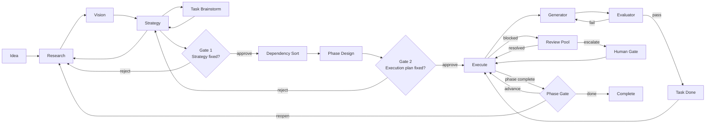

# Canonical sub-PJ Flow — authoritative graph spec

**status**: authoritative (akaghef 指定 2026-04-21, Mermaid 版に更新)
**origin**: `.claude/skills/sub-pj/protocol.md` + `.claude/skills/sub-pj/phase/escalation.md` を akaghef が graph 形に圧縮したもの
**使い方**: Plan 6 layout prototype の canonical sample。Plan 7 data model の validation 対象。Plan 8 compile MVP の reference graph。

## Authoritative source (Mermaid)

以下の Mermaid source が正本。競合時はこの source を優先する。
`projects/PJ03_SelfDrive/plan6/cycle2/canonical.mmd` と同期。



### Edge label 凡例 (Mermaid 版に統一)

- 無ラベル: 単純 next
- `reject` / `approve`: gate 判定
- `fail` / `pass`: evaluator verdict
- `blocked` / `resolved` / `escalate`: ambiguity / scope 系 (旧 spec の `scope_break` は `escalate` に統一)
- `phase complete` / `advance` / `reopen` / `done`: phase 遷移

### 以前の spec との差分

- `strategy --enough_to_commit--> gate1` → `strategy --> gate1` (無ラベル)
- `review_pool --scope_break--> human_gate` → `review_pool --escalate--> human_gate`
- `human_gate --decide--> execute` → `human_gate --> execute` (無ラベル)

以下のセクションは解釈注釈。正本は上記 Mermaid。

## Nodes (17)

| id | type | 属する phase |
|---|---|---|
| `idea` | action | explore |
| `research` | action | explore |
| `vision` | action | explore |
| `strategy` | action | explore |
| `task_brainstorm` | action | explore |
| `gate1` | human_gate | explore → plan 境界 |
| `dependency_sort` | action | plan |
| `phase_design` | action | plan |
| `gate2` | human_gate | plan → execute 境界 |
| `execute` | action (hub) | execute |
| `generator` | action | execute |
| `evaluator` | eval | execute |
| `task_done` | action | execute |
| `phase_gate` | human_gate | execute |
| `review_pool` | action (pool) | execute |
| `human_gate` | human_gate | execute (E3 相当) |
| `complete` | end | terminal |

## Edges (26)

```text
# explore chain
idea              -> research
research          -> vision
vision            -> strategy

# explore back-edges
research          -> vision          (※ 既出、整合のため確認)
strategy          -> research
strategy          -> task_brainstorm
task_brainstorm   -> strategy

# gate1
strategy          --enough_to_commit--> gate1
gate1             --reject-->   research
gate1             --approve-->  dependency_sort

# plan chain
dependency_sort   -> phase_design
phase_design      -> gate2

# gate2
gate2             --reject-->   strategy
gate2             --approve-->  execute

# execute inner loop
execute           -> generator
generator         -> evaluator
evaluator         --fail-->  generator
evaluator         --pass-->  task_done
task_done         -> execute

# phase transition
execute           --phase_complete--> phase_gate
phase_gate        --advance-->  execute
phase_gate        --reopen-->   research
phase_gate        --done-->     complete

# ambiguity / scope
execute           --blocked-->      review_pool
review_pool       --resolved-->    execute
review_pool       --scope_break--> human_gate
human_gate        --decide-->      execute
```

## Edge type まとめ

- 無ラベル: `next` (linear 遷移)
- `enough_to_commit`: 探索の収束、gate1 へ
- `reject` / `approve`: gate 判定
- `fail` / `pass`: evaluator verdict
- `phase_complete` / `advance` / `reopen` / `done`: phase 遷移
- `blocked` / `resolved` / `scope_break` / `decide`: ambiguity / E3 escalation

## 不変条件 (invariants)

1. `gate1` と `gate2` と `phase_gate` と `human_gate` は必ず human 判定
2. `evaluator` の verdict は `fail` / `pass` のどちらか必ず返す
3. `execute` は hub。`generator` / `phase_gate` / `review_pool` / `task_done` の接続点
4. `phase_gate --reopen-->` は `research` に戻る (深い rollback)。`strategy` ではない
5. `gate1 --reject-->` は `research` に戻る。`strategy` ではない
6. `gate2 --reject-->` は `strategy` に戻る。`vision` ではない
7. E1 は `phase_gate`、E3 は `human_gate` に対応。E2 (env break) はこの graph の外

## Plan 6 / 7 / 8 での使い方

- **Plan 6**: この topology を visual layout として描画する。Cycle 2 以降の正本
- **Plan 7**: この graph が schema で表現可能か検証する。data model gate の reference
- **Plan 8**: この graph を LangGraph runnable に compile する MVP 対象

## 原典

- `.claude/skills/sub-pj/protocol.md`
- `.claude/skills/sub-pj/references/overview.md`
- `.claude/skills/sub-pj/phase/escalation.md`
- akaghef 2026-04-21 の圧縮版 (このファイル)

競合時はこのファイルを authoritative とする。
