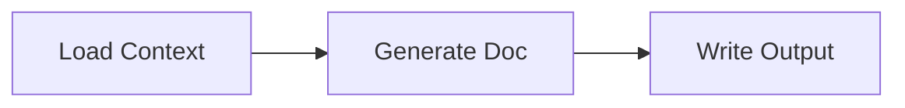
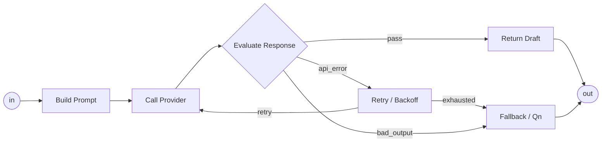

# PJ04 UI Handoff — Template Blocks / Subsystem Preview

## 背景

PJ04 の template track は **CLI-first** で進める。
CLI 側では Template System Spec から AppState / GraphSpec / Run trace を生成する。

UI 側の仕事は、template engine を再実装することではない。
CLI / shared code が生成した AppState / GraphSpec / trace を、M3E viewer 上で読める形にすること。

## UI の目的

最初の対象は PJv34 Weekly Review。

上位 diagram:



`Generate Doc` に入ると subsystem:



上位では retry / fallback loop を見せすぎず、subsystem の中で見せる。

## Scope

UI 側で詰めるべきこと:

1. **Template Block 表示**
   - node がどの `block_id` から作られたかを表示する
   - 例: `io.load_local_folder`, `llm.generate_doc.subsystem`, `io.write_artifact`
   - 表示は L2 以上でよい

2. **Subsystem Drill-down**
   - `Generate Doc` node から inner subsystem に入れる
   - 既存の `[` / `]` scope navigation を優先
   - 上位 node には「subsystem / internal loopあり」を示す小バッジを出す

3. **L2 Contract Summary**
   - `j/k` で L2 にした時、箱内または tooltip / side panel に最小 contract を出す
   - 表示候補:
     - `block_id`
     - `reads`
     - `writes`
     - `trace_step_id`
     - `provider/model` (LLM nodeのみ)

4. **Control Graph Trace Overlay**
   - `tmp/pjv34-template-run-latest.json` の `trace[].nodeId` を viewer で対応 node に重ねる
   - 最低限:
     - `ok` = neutral/green badge
     - `route` = branch label badge
     - `error` = red badge
   - map 本体は書き換えない。overlay / window state のみ

5. **Data View**
   - Runtime trace / artifact の存在を Data View として出す
   - 最小表示:
     - `finalReportPath`
     - trace count
     - last node id
   - State Channel の詳細編集はこの task の外

## Non-goals

- Template builder / runner の再実装
- Python bridge 実装
- DeepSeek API 呼び出し
- GraphSpec compile の仕様変更
- map への runtime trace 永続書き戻し
- full Runtime Board の完成

## Input Artifacts

UI agent が読むべき生成物:

```text
tmp/pjv34-template-system.json
tmp/pjv34-template-run-latest.json
tmp/pjv34-template-run-latest.md
```

`pjv34-template-system.json` には:

- `templates`
- `state` (AppState)
- `graphSpecs.root`
- `graphSpecs.generateDoc`
- `warnings`
- `validation`

`pjv34-template-run-latest.json` には:

- `trace`
- `contextPackage`
- `draftDocument`
- `route`
- `finalReportPath`

## Acceptance

UI task は次を満たせば完了。

1. PJv34 template-generated AppState を viewer で開くと、上位 diagram が `Load Context -> Generate Doc -> Write Output` として読める
2. `Generate Doc` の中に入ると retry / fallback loop が見える
3. L2 表示で `block_id`, `reads`, `writes`, `trace_step_id` が読める
4. run trace を読み込むと `call_provider -> evaluate_response -> return_draft` の成功経路が node 上に overlay 表示される
5. overlay は map を汚さない

## Suggested Task Split

### UI-TPL-1: Load template-generated AppState

- `tmp/pjv34-template-system.json` の `state` を viewer dev input として開けるようにする
- 既存 map DB 書き込みは不要。file input / dev command でよい

### UI-TPL-2: L2 contract badges

- `m3e:kernel-metadata` JSON から `block_id`, `reads`, `writes`, `trace_step_id` を読む
- L2 以上で表示

### UI-TPL-3: Subsystem badge + drill-down verification

- `m3e:kernel-node-kind=subgraph` / `m3e:kernel-subgraph-scope` を持つ node に subsystem badge を出す
- `[` / `]` navigation で `Generate Doc` scope に入れることを確認

### UI-TPL-4: Trace overlay

- `tmp/pjv34-template-run-latest.json` を読み、`trace[].nodeId` と viewer node を対応させる
- status badge / route label を overlay

## Notes

- CLI-first が正本。UI は CLI が作った contract を表示する。
- `Data Automaton` という語は使わない。data 側は State Contract / State Channel / Data View。
- runtime trace は map へ永続化しない。
