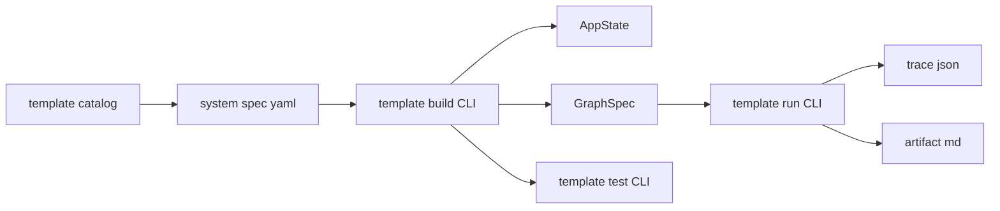
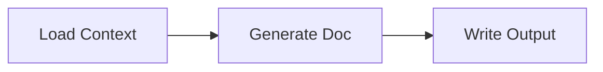

# PJ04 System Block Templates

System Block Template は、単なる図形 stencil ではない。
M3E の System Diagram に node / subsystem を置くと同時に、Contract Tree の初期値を生成するための template である。

当面の実装方針は **CLI-first**。
viewer UI は後回しにし、CLI だけで template catalog / system spec / build / run / test が完結する状態を先に作る。

```text
LangGraph pattern
  -> System Block Template
  -> Template System Spec (YAML/JSON)
  -> Contract Tree
  -> GraphSpec
  -> CLI Run
  -> Trace / Artifact
```

## CLI-first Goal

PJ04 の template 機能は、UI 実装前に CLI で閉じる。



CLI-first の完了条件:

- System Block Template catalog が全種類そろっている
- YAML/JSON の Template System Spec から AppState / GraphSpec を生成できる
- 生成された GraphSpec を local runner で実行できる
- DeepSeek 等の LLM call を含む smoke test が通る
- failure route / retry / fallback を test できる
- 出力 artifact / trace に secret が混ざらない

UI はこの CLI が安定してから、同じ template catalog / builder を呼ぶだけにする。

## Catalog Table Format

各 template は最低限この表で定義する。

| 項目 | 例 | 意味 |
|---|---|---|
| `block_id` | `llm.generate_doc.subsystem` | template の安定 ID |
| `label` | `Generate Doc` | System Diagram 上の初期表示名 |
| `kind` | `subsystem` | M3E node kind |
| `langgraph_pattern` | `StateGraph subgraph + add_conditional_edges` | 対応する LangGraph pattern |
| `reads` | `state.contextPackage` | 読む State Channel / resource |
| `writes` | `state.draftDocument` | 書く State Channel / resource |
| `ports` | `default`, `api_error`, `bad_output` | edge label / branch key |
| `failure_policy` | `retry: 1`, `on_error: fallback_qn` | 失敗時の扱い |
| `trace_step_id` | `generate_doc` | map node / runtime / trace を結ぶ ID |
| `ui_l2` | `kind + State Channel badges` | 具象度 L2 で表示する要約 |

## Implemented Shared Registry

`beta/src/shared/system_block_templates.ts` の shared registry には、authoring / contract layer で使う主要 LangGraph pattern を先に入れている。
ここでの目的は実行 engine を増やすことではなく、AI が Contract Tree を埋める時の語彙を固定すること。

| Template | LangGraph pattern | 用途 |
|---|---|---|
| `langgraph.subsystem.state_graph` | `StateGraph` | System Scope 全体、State Contract、entry、terminal を定義する |
| `langgraph.state.channel` | TypedDict field + reducer annotation | State Channel と reducer / Data View binding を定義する |
| `langgraph.node.process` | `add_node` | 通常の決定的処理 |
| `langgraph.node.llm` | `add_node` | LLM provider call |
| `langgraph.node.router` | `add_conditional_edges` | 条件分岐 |
| `langgraph.node.tool` | `ToolNode` | tool call 実行 |
| `langgraph.flow.retry` | conditional edge + back edge | retry / backoff |
| `langgraph.flow.human_gate` | `interrupt` | Qn / approval / human-in-the-loop |
| `langgraph.flow.parallel_send` | `Send` | fan-out / map |
| `langgraph.flow.command` | `Command` | state update + goto |
| `langgraph.edge.default` | `add_edge` | 通常 edge |
| `io.load_local_folder` | `add_node` | local folder input |
| `io.write_artifact` | `add_node` | artifact output |
| `llm.generate_doc.subsystem` | subgraph | 文書生成 subsystem |

## Initial Templates

初期実装済み:

### `io.load_local_folder`

| 項目 | 例 | 意味 |
|---|---|---|
| `block_id` | `io.load_local_folder` | local folder を読む template |
| `label` | `Load Context` | 表示名 |
| `kind` | `callable` | LangGraph 上は通常 node |
| `langgraph_pattern` | `add_node` | node 追加 |
| `reads` | `resource.projectsFolder` | 読む実体 |
| `writes` | `state.contextPackage` | 書く State Channel |
| `callable_ref` | `pjv34.load_context` | runtime registry ref |
| `trace_step_id` | `load_context` | trace ID |

### `llm.generate_doc.subsystem`

上位では 1 node として見せる。



内部では provider call / evaluate / retry / fallback を持つ。


| 項目 | 例 | 意味 |
|---|---|---|
| `block_id` | `llm.generate_doc.subsystem` | LLM 文書生成 subsystem |
| `label` | `Generate Doc` | 上位 System Diagram での表示名 |
| `kind` | `subsystem` | drill-down 可能な System Scope |
| `langgraph_pattern` | `StateGraph subgraph + add_node + add_conditional_edges` | 内部に Control Graph を持つ |
| `reads` | `state.contextPackage`, `state.docGoal` | prompt 生成に使う State Channel |
| `writes` | `state.draftDocument` | 生成する文書 channel |
| `provider` | `deepseek` | LLM provider |
| `model` | `deepseek-chat` | model |
| `failure_policy` | `retry: 1`, `on_error: fallback_qn` | fallback loop を内部に隠す |
| `trace_step_id` | `generate_doc` | 上位 node の trace ID |

### `io.write_artifact`

| 項目 | 例 | 意味 |
|---|---|---|
| `block_id` | `io.write_artifact` | State Channel を file / artifact へ書く template |
| `label` | `Write Output` | 表示名 |
| `kind` | `callable` | LangGraph 上は通常 node |
| `langgraph_pattern` | `add_node` | node 追加 |
| `reads` | `state.draftDocument` | 書き出す State Channel |
| `writes` | `resource.tmpWeeklyReview` | 書き出し先 resource |
| `callable_ref` | `pjv34.write_output` | runtime registry ref |
| `trace_step_id` | `write_output` | trace ID |

## PJv34 Acceptance

PJ04 の template-first acceptance は、AI が template から PJv34 Weekly Review system を再構築して Run すること。

最小上位 diagram:


成功条件:

- AI が node 属性をゼロから手書きせず、template を instantiate して slot を埋める
- `Generate Doc` の fallback loop は subsystem 内に閉じる
- root と `Generate Doc` subsystem の両方が GraphSpec へ compile できる
- trace の node id が Control Graph の node id と一致する

## Required Template Set

CLI-first でそろえる標準 template は次。

| Template | LangGraph pattern | 用途 |
|---|---|---|
| `langgraph.node.process` | `add_node` | 通常の決定的処理 |
| `langgraph.node.llm` | `add_node` | LLM provider call |
| `langgraph.node.router` | `add_conditional_edges` | 条件分岐 |
| `langgraph.node.tool` | `ToolNode` | tool call 実行 |
| `langgraph.flow.retry` | conditional edge + back edge | retry / backoff |
| `langgraph.flow.human_gate` | interrupt | Qn / approval |
| `langgraph.flow.parallel_send` | `Send` | fan-out / map |
| `langgraph.flow.command` | `Command` | state update + goto |
| `langgraph.subsystem.state_graph` | `StateGraph` | subsystem 全体 |
| `langgraph.state.channel` | reducer annotation | State Channel |
| `langgraph.edge.default` | `add_edge` | 通常 edge |
| `io.load_local_folder` | `add_node` | local folder input |
| `io.write_artifact` | `add_node` | artifact output |
| `llm.generate_doc.subsystem` | subgraph | 文書生成 subsystem |

## Template System Spec

AI が直接 AppState を手書きするのではなく、Template System Spec を書く。

```yaml
id: pjv34_weekly_review
label: PJv34 Weekly Review
channels:
  - name: contextPackage
    reducer: replace
    typeHint: json
  - name: draftDocument
    reducer: replace
    typeHint: markdown
nodes:
  - id: load_context
    template: io.load_local_folder
    slots:
      reads: resource.projectsFolder
      writes: state.contextPackage
      callable_ref: pjv34.load_context
  - id: generate_doc
    template: llm.generate_doc.subsystem
    slots:
      reads: [state.contextPackage, state.docGoal]
      writes: state.draftDocument
      provider: deepseek
      model: deepseek-chat
  - id: write_output
    template: io.write_artifact
    slots:
      reads: state.draftDocument
      writes: resource.tmpWeeklyReview
      callable_ref: pjv34.write_output
edges:
  - from: load_context
    to: generate_doc
  - from: generate_doc
    to: write_output
```

## CLI Surface

最終的に必要な CLI:

```powershell
npm run template:build -- --spec projects/PJ04_MermaidSystemLangGraph/templates/pjv34_weekly_review.yaml --out tmp/pjv34-template-system.json
npm run template:run -- --spec projects/PJ04_MermaidSystemLangGraph/templates/pjv34_weekly_review.yaml --out tmp/pjv34-template-run-latest.json
npm run template:test
```

現在の `npm run pjv34:template` / `npm run pjv34:template:run` は、上記 generic CLI に置き換えるまでの compatibility command とする。

## Test Requirements

CLI-first では test を先に揃える。

| Test | 目的 |
|---|---|
| catalog validation | 必須 field / duplicate block id / unsupported LangGraph pattern を検出 |
| spec validation | unknown template / missing required slot / invalid edge を検出 |
| build snapshot | spec から生成される AppState / GraphSpec の決定性を確認 |
| compile validation | root / subsystem GraphSpec が warnings なしで compile できる |
| run smoke | PJv34 spec が local runner で artifact / trace を出す |
| failure route | provider failure 時に retry / fallback_qn へ行く |
| no-secret-output | artifact / trace / generated system JSON に secret が出ない |
