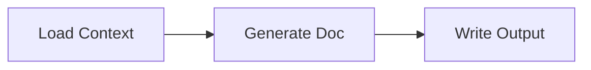
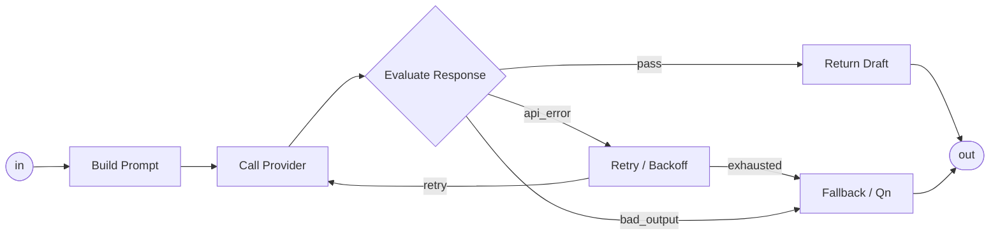

# PJ04 System Block Templates

System Block Template は、単なる図形 stencil ではない。
M3E の System Diagram に node / subsystem を置くと同時に、Contract Tree の初期値を生成するための template である。

```text
LangGraph pattern
  -> System Block Template
  -> Contract Tree
  -> GraphSpec
  -> Runtime Board / Data View
```

## Catalog Table Format

各 template は最低限この表で定義する。

| 項目 | 例 | 意味 |
|---|---|---|
| `block_id` | `llm.generate_doc.subsystem` | template の安定 ID |
| `label` | `Generate Doc` | System Diagram 上の初期表示名 |
| `kind` | `subsystem` | M3E node kind |
| `langgraph_pattern` | `StateGraph subgraph + add_conditional_edges` | 対応する LangGraph pattern |
| `reads` | `state.contextPackage` | 読む State Channel / resource |
| `writes` | `state.draftDocument` | 書く State Channel / resource |
| `ports` | `default`, `api_error`, `bad_output` | edge label / branch key |
| `failure_policy` | `retry: 1`, `on_error: fallback_qn` | 失敗時の扱い |
| `trace_step_id` | `generate_doc` | map node / runtime / trace を結ぶ ID |
| `ui_l2` | `kind + State Channel badges` | 具象度 L2 で表示する要約 |

## Initial Templates

### `io.load_local_folder`

| 項目 | 例 | 意味 |
|---|---|---|
| `block_id` | `io.load_local_folder` | local folder を読む template |
| `label` | `Load Context` | 表示名 |
| `kind` | `callable` | LangGraph 上は通常 node |
| `langgraph_pattern` | `add_node` | node 追加 |
| `reads` | `resource.projectsFolder` | 読む実体 |
| `writes` | `state.contextPackage` | 書く State Channel |
| `callable_ref` | `pjv34.load_context` | runtime registry ref |
| `trace_step_id` | `load_context` | trace ID |

### `llm.generate_doc.subsystem`

上位では 1 node として見せる。



内部では provider call / evaluate / retry / fallback を持つ。



| 項目 | 例 | 意味 |
|---|---|---|
| `block_id` | `llm.generate_doc.subsystem` | LLM 文書生成 subsystem |
| `label` | `Generate Doc` | 上位 System Diagram での表示名 |
| `kind` | `subsystem` | drill-down 可能な System Scope |
| `langgraph_pattern` | `StateGraph subgraph + add_node + add_conditional_edges` | 内部に Control Graph を持つ |
| `reads` | `state.contextPackage`, `state.docGoal` | prompt 生成に使う State Channel |
| `writes` | `state.draftDocument` | 生成する文書 channel |
| `provider` | `deepseek` | LLM provider |
| `model` | `deepseek-chat` | model |
| `failure_policy` | `retry: 1`, `on_error: fallback_qn` | fallback loop を内部に隠す |
| `trace_step_id` | `generate_doc` | 上位 node の trace ID |

### `io.write_artifact`

| 項目 | 例 | 意味 |
|---|---|---|
| `block_id` | `io.write_artifact` | State Channel を file / artifact へ書く template |
| `label` | `Write Output` | 表示名 |
| `kind` | `callable` | LangGraph 上は通常 node |
| `langgraph_pattern` | `add_node` | node 追加 |
| `reads` | `state.draftDocument` | 書き出す State Channel |
| `writes` | `resource.tmpWeeklyReview` | 書き出し先 resource |
| `callable_ref` | `pjv34.write_output` | runtime registry ref |
| `trace_step_id` | `write_output` | trace ID |

## PJv34 Acceptance

PJ04 の template-first acceptance は、AI が template から PJv34 Weekly Review system を再構築して Run すること。

最小上位 diagram:


成功条件:

- AI が node 属性をゼロから手書きせず、template を instantiate して slot を埋める
- `Generate Doc` の fallback loop は subsystem 内に閉じる
- root と `Generate Doc` subsystem の両方が GraphSpec へ compile できる
- trace の node id が Control Graph の node id と一致する
