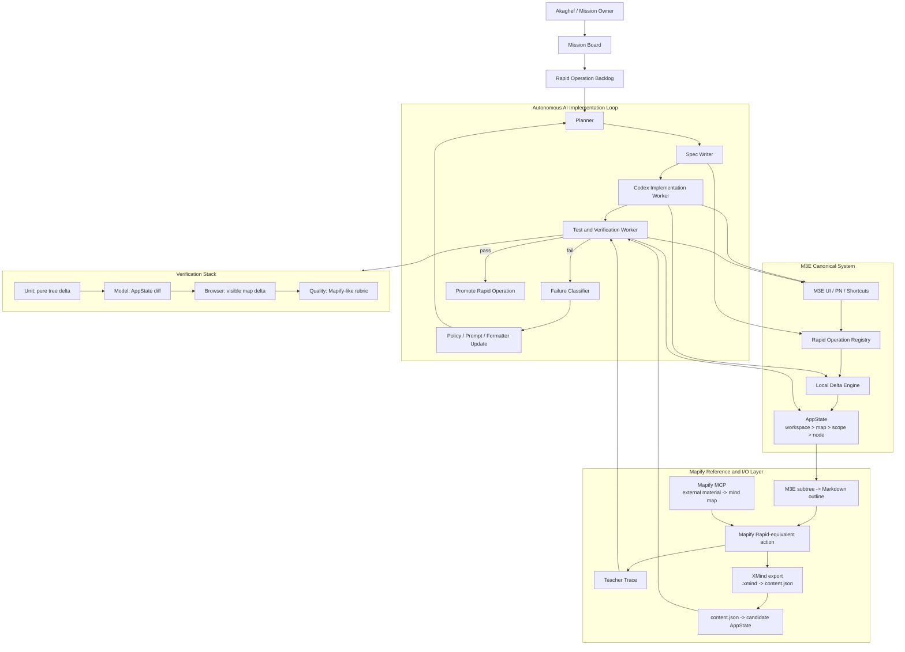

# M3E Rapid × Mapify Oracle System

## Purpose

This bundle is a **Codex-facing experimental substrate** for developing M3E Rapid generation. The working assumption is:

```text
Mapify action = provisional correct teacher trajectory
M3E AppState = canonical state
M3E Rapid = student policy to self-improve
```

The goal is not to implement Mapify I/O as the product. The goal is to make M3E Rapid produce **map-native local graph deltas**: short labels, clean hierarchy, sibling consistency, local controllability, and reviewable edits.

## First fixed benchmark

Use the biological classification map as the first benchmark:

```text
生物の分類1
├─ 動物
│  ├─ 哺乳類
│  ├─ 鳥類
│  └─ 魚類
├─ 植物
└─ 菌類
```

The first target operation is:

```text
RF1.expandSelectedNode
selectedNode = 動物
expected behavior = add missing classification branches locally under 動物
```

## System overview



## Bundle layout

```text
config/          Machine-readable loop policies, rubric, Rapid ops, failure taxonomy
schemas/         JSON schemas for AppState-lite, deltas, cases, reports
docs/            Architecture, Codex contract, I/O policy, rubric, benchmark notes
fixtures/        Biology benchmark: before tree, teacher delta, bad M3E delta, case file
scripts/         Offline evaluator, Markdown projection, XMind content parser, loop skeleton
matlab/          MATLAB evaluator for the same Rapid case format
templates/       Codex task prompt and run/grade templates
integrations/    Mapify and M3E boundary notes/stubs
```

## Quick offline check

From the extracted directory:

```bash
python3 scripts/evaluate_case.py fixtures/cases/biology_expand_animals.case.json
```

This evaluates the deliberately bad M3E candidate against the Mapify-style teacher delta and writes a grade report under `runs/`.

## How Codex should use this bundle

1. Copy this bundle into the M3E repo, preferably under `docs/tasks/rapid_mapify_oracle/` or `tools/rapid_mapify_oracle/`.
2. Read `templates/codex_task_prompt.md` first.
3. Implement only one Rapid slice at a time.
4. Keep all M3E mutations local to `AppState` selected node/subtree.
5. Use this bundle's rubric and failure taxonomy to generate the next patch.
6. Do not treat Mapify as canonical storage.
7. Do not extract Mapify cookies. Live Mapify access must remain inside a logged-in browser context.

## Design invariant

```text
M3E learns from Mapify action quality, but stores and edits only M3E-native AppState.
```
